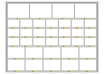
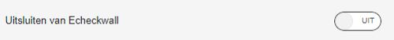
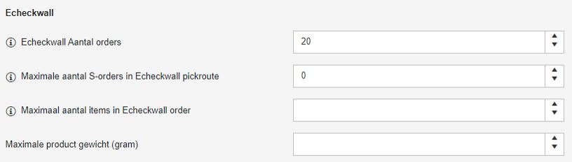
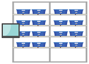
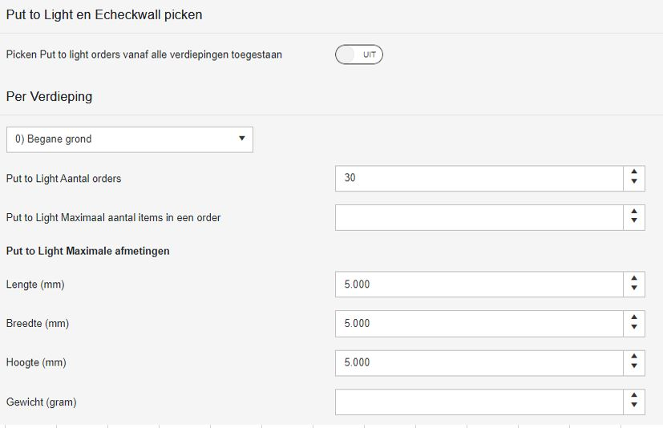
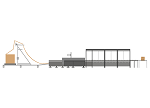
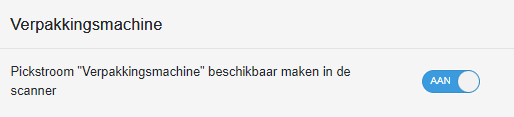
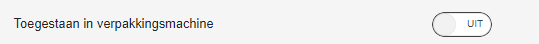
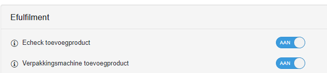
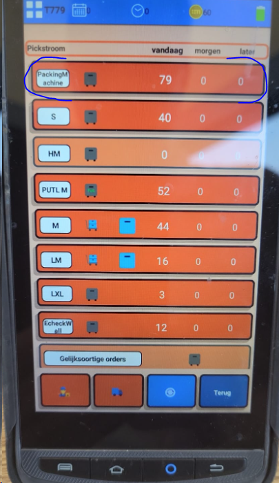

# Pickstromen op basis van specifieke Hardware

## Echeckwall pickstroom

Alleen orders die passen in de Echeckwall vakjes worden ingepland. Orders die daarbuiten vallen komen in de reguliere M, S of HM-order pickstroom. Orders die in de Echeckwall passen komen niet meer in de reguliere M-order pickstroom.

Het in-uitschakelen van de Echeckwall pickroute kan door IT gedaan worden in het veld tblMagazijnLocatieVerdieping.EcheckwallEnabled

Verder kan per relatie ingesteld worden dat een relatie NIET via de echeckwall gepickt moet worden (https://gomonta.montapacking.nl/Office/Relatie/Index)

Er kan worden gekozen of S-orders wel of niet meegenomen worden in de Echeckwall pickstroom. Dit omdat het niet in alle gevallen logistiek gezien handig is S-orders mee te picken.
Dit kan via het magazijn instellingen scherm in gomonta (https://gomonta.montapacking.nl/WMS/Shift/WarehouseSettings#PutToLightAndEcheckwall) onder het kopje 'Put to Light en Echeckwall picken'. Door het getal 0 in te vullen bij 'Maximale aantal S-orders in Echeckwall pickroute ', worden S-orders niet meer meegenomen in de Echeckwall pickroute

Wanneer M of HM orders veel items bevatten, is het soms raadzaam ze niet via de echeckwall te verwerken in verband met het grote aantal scans tijdens sorteren. Via de instelling  'Maximaal aantal items in Echeckwall order' kunnen orders met veel items uitgesloten worden van de Echeckwall pickroute.

## Echeckwall XL pickstroom

De Echeckwall XL pickstroom werkt vrijwel hetzelfde als de [Echeckwall pickstroom](https://vragen.monta.nl/Docs/Algemene-informatie/Outbound/Pickstromen-op-basis-van-specifieke-Hardware/#echeckwall-pickstroom) die hierboven beschreven is. Waarbij in de Echeckwall XL pickstroom de LM en HLM orders worden meegenomen. Een Echeckwall XL pickstroom is alleen beschikbaar op een verdieping als reguliere Echeckwall is ingeschakeld EN er is een EcheckwallXL (tblEcheckwallStelling.EcheckwallXL = true voor deze verdieping) dan komt de EcheckwallXL pickstroom beschikbaar Verder kan de beschrijving van de [Echeckwall Pickstroom](https://vragen.monta.nl/Docs/Algemene-informatie/Outbound/Pickstromen-op-basis-van-specifieke-Hardware/#echeckwall-pickstroom) gevolgd worden.

## Put To Light pickstroom

PutToLight is in te schakelen door een aantal hoger dan 0 in te vullen bij 'Put to Light Aantal orders' in het instellingen scherm per magazijn/verdieping (https://gomonta.montapacking.nl/WMS/Shift/WarehouseSettings#PutToLightAndEcheckwall)
PutToLight orders zijn ook zichtbaar in de reguliere M en HM pickstromen. (er is een wens om dit aan te passen)

Wanneer M of HM orders veel items bevatten, is het soms raadzaam ze niet via de Put To Light te verwerken in verband met het grote aantal scans tijdens sorteren.
M-orders of HM-orders met veel items kunnen worden uitgesloten door 'Maximaal aantal items in een order' in te stellen. Ook kan via 'Put to Light Maximale afmetingen' ingesteld worden dat orders met te grote producten niet in de Put To Light pickstroom gepland worden

## Monta Pac-man verpakkingsmachine

In de verify wordt via een stapelalgoritme bepaald of de producten van de order niet te groot zijn voor de maximale afmetingen die de Monta Pac-man machine aan kan. Ook wordt in de verify gekeken of de producten niet te klein zijn voor de minimale afmetingen van de Monta Pac-man.
Deze afmetingen van de monta pac man zijn door IT instelbaaar in tblMontapackerContainerSettings
Ook een totaal ordergewicht > 15 kg wordt uitgesloten. Dat is nu nog hardcoded.
Orders naar landen met proforma (tblCountryCodes.ProFormaInvoiceRequired) worden uitgesloten omdat het printen van douane documenten lastig is op de machine. Als aan alle voorwaarden voldaan is tijdens het verifieren van de order, krijgt de order dan ReadyToPickState Montapacker (nr19), dit is niet echt een pickstroom, maar een filtermogelijkheid over bestaande pickstromen.
Over het algemeen kunnen dan orders uit de volgende pickstromen onder dit filter vallen.

S

M

HM

Zie ook deze [pagina](https://vragen.monta.nl/Docs/Algemene-informatie/Apparaten/Monta-Pacman/#pickstroom-voor-monta-pacman) voor meer info.

## BVM verpakkingsmachine

De BVM verpakkingsmachine pickstroom is in te schakelen door bij de outbound magazijninstellingen de verpakkingmachine aan te zetten. (https://gomonta.montapacking.nl/WMS/Shift/WarehouseSettings#PickingSizes)

Een orders moet aan de volgende eisen voldoen om in de pickstroom te komen:
- De order moet een S-orders zijn.
- De afmetingen van order moeten groter zijn dan 140 bij 90 bij 1 mm.
- De afmetingen van order moeten kleiner zijn dan 500 bij 400 bij 100 mm.
- De klant moet toestaan dat de orders ingepakt mogen worden door de verpakkingsmachine. Dit is in te stellen in het relatie instellingenscherm.

- Als een order een toevoegproduct heeft, dan moet deze toegestaan zijn voor de verpakkingsmachine. Dit kan worden ingesteld in het product instellingenscherm.

Orders die geschikt zijn voor de BVM machine zijn te herkennen via onderstaande pickstroom op de scanner

