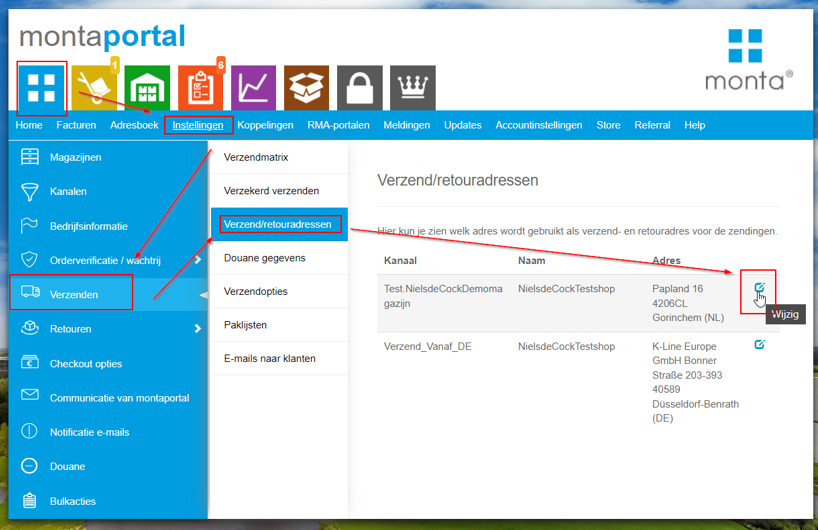
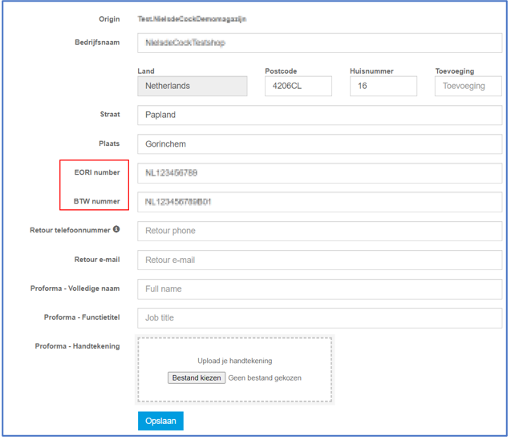
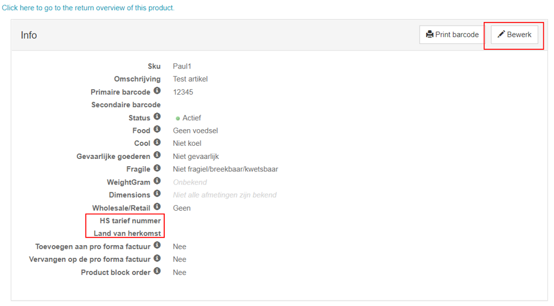
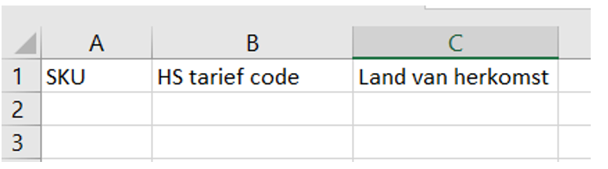
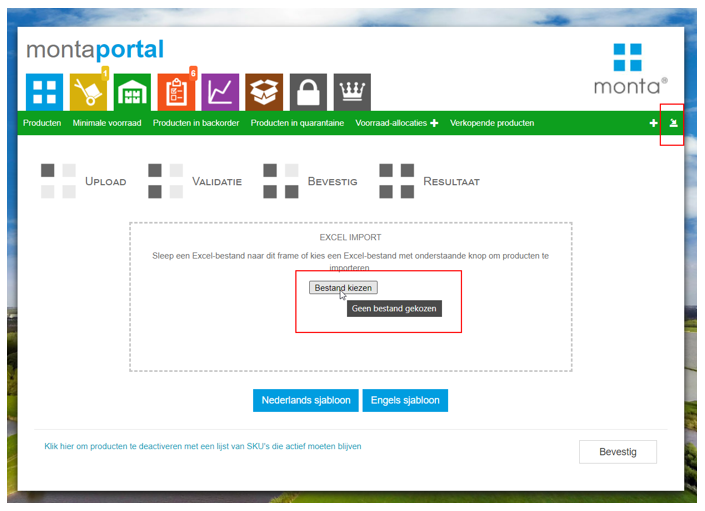
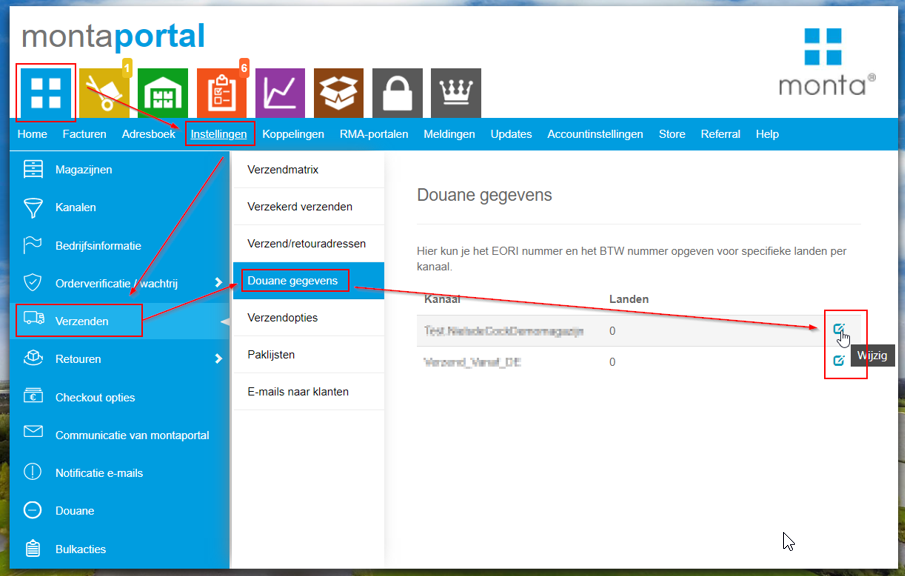
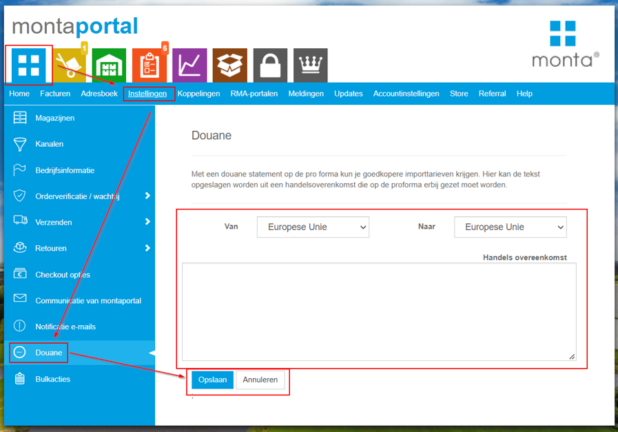

# Versturen buiten de EU

 
Vanaf 2020 is het voor alle pakketten die worden verstuurd buiten de EU verplicht om een Proforma (Douane document) mee te sturen met de pakketten. Monta vindt het belangrijk dat deze documenten correct en volledig worden meegestuurd. Daarom zullen wij bij alle orders buiten de EU een Proforma genereren. Waar mogelijk sturen we deze Proforma’s digitaal mee richting de vervoerder. In sommige gevallen zal deze proforma op papier worden meegestuurd.

Om een proforma te kunnen genereren hebben we een aantal gegevens nodig. Mist Monta één van deze gegevens, dan zullen we de order blokkeren, en is het niet mogelijk om de order naar dit land te versturen.
Voordat het mogelijk is om buiten de EU te versturen is het dus verplicht om een aantal instellingen te doen.

 
## Instellingen:
1.	EORI nummer en BTW nummer instellen (Verplicht):
Op de Proforma moeten we het EORI nummer en BTW nummer worden ingevuld. Deze moet per kanaal worden ingesteld via de volgende:

2.	HS-tariefcode en Land van Herkomst bij Producten (Verplicht).
Monta en de Douane moet weten wat voor producten het zijn, en waar ze origineel vandaan komen. Daarom is het verplicht om de HS-tariefcode en het land van herkomst in te vullen bij de producten.
Bij sommige koppelingen kan deze informatie worden geimporteerd uit de webshop. In de meeste gevallen moet er echter in de Montaportal de informatie worden ingeladen.
Dit is mogelijk op een aantal manieren:
-	Per product:
Op de product detailpagina is zijn de gegevens aan te passen:

-	Excel uploaden:
Het is ook mogelijk om de gegevens te updaten in bulk via een Excel import. Dit kan via de volgende stappen:
Upload een Excel met de volgende kolommen:

 Via:

3.	Overige douane gegevens invullen (Optioneel)
Hier kun je het EORI nummer en het BTW nummer opgeven voor specifieke landen per kanaal.

4.	Douane statement invullen (Optioneel)
Met een douane statement op de pro forma kun je goedkopere importtarieven krijgen. Hier kan de tekst opgeslagen worden uit een handelsovereenkomst die op de proforma erbij gezet moet worden.

