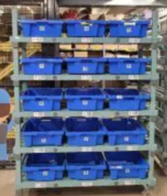
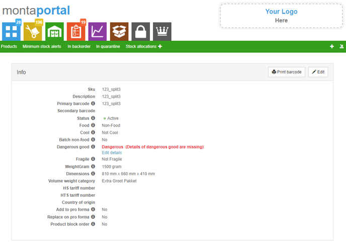
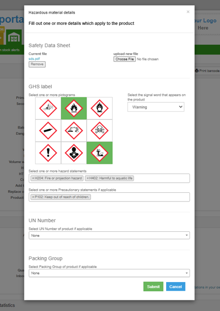
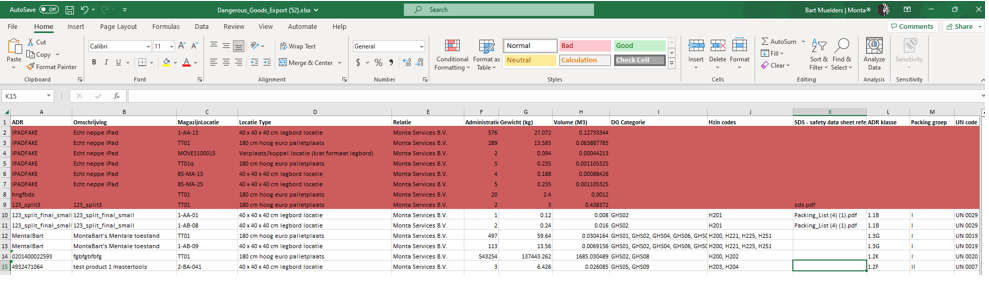

# Outbound

Outbound is het versturen van goederen vanuit het magazijn.

## Flowchart

graph TD;
place --> import
verify --> pick
ship --> collect
deliver --> receive
ship --> anonimise
subgraph Consument
place[Plaatst order]
receive[Ontvangt order]
end
subgraph Monta software
import[Importeert order in Monta] -->
verify[Verifieert order]
anonimise[Anonimiseren] -->
archive[Archiveren]
end
subgraph Magazijn
pick[Picken] -->
echeck["Inpakken (echecken)"] -->
ship[Verzenden]
end
subgraph Verzender
collect[Ophalen] -->
sort[Sorteren] -->
deliver[Afleveren]
end

## Order

Een order kan op de volgende manier ontstaan:
- Via een koppeling uit een webshop, marketplace of ander systeem van een klant
- Handmatig aangemaakt worden op Montaportal
- Uit een Excel bestand geimport worden op Montaportal
- In GoMonta bij het uitruimen van locaties

### Typen orders

<u>B2B</u> 
Een order kan als B2B (business to business) gemarkeerd worden. Bepaalde instellingen zoals de verzender matrix, pakbon layout kunnen anders zijn voor B2B orders. Ook kunnen aparte verkooptarieven ingesteld worden.

<u>Value added logistics</u> 
Ook wel verpakkingsorders genoemd. Voor voorraad die afgeboekt moet worden bijvoorbeeld om te verpakking/om te pakken. In de verkooptarieven kan ingesteld worden dat deze orders niet gefactureerd moeten worden.

<u>Quarantaine orders</u> 
Orders om quarantaine voorraad af te boeken.

### Order statussen

1. Verifying: een nieuwe order moet eerste geverifieerd worden.
2. Blocked: de order kan niet verwerkt worden omdat er iets mis mee is of omdat deze handmatig geblokkeerd is.
3. Backorder: de order kan niet verwerkt worden omdat er geen voorraad is.
4. Etransit: de order staat in de wacht om op een datum in de toekomst verwerkt te worden.
5. Queued: de order staat klaar om gepickt te worden.
6. Picking: de order wordt gepickt.
7. Picked/Packing: de order is gepickt en wordt ingepakt.
8. Packed/Shipping: de order ingepakt, het verzendlabel wordt geprint.
9. Shipped: het verzendlabel is geprint.

De volgende statussen zijn beschikbaar als er een koppeling is met de verzender om de status van de verzending op te halen. Zie [Verzenden - order afleverstatus](#order-afleverstatus).

10. EnRoute: de order is ingescand bij de verzender.
11. Delivered: de order is afgeleverd.
12. AvailablePickup: de order is gereed voor afhalen bij een afhaalpunt van de verzender.
13. Collected: de order is afgehaald bij een afhaalpunt van de verzender.
14. Delivery failed: het afleveren van de order is mislukt, de order komt retour.

Opmerkingen over de volgorde van de statussen die een order doorloopt:
- Een Picking order kan niet meer geblokkeerd worden. Om toch te voorkomen dat een order verzonden wordt kan de order op verzender "Cancelled" worden gezet. De producten worden dan via de retourverwerking weer op voorraad genomen.
- Een order kan van Picking en Packing teruggaan naar Backorder, als tijdens het picken blijkt dat de voorraad fysiek niet aanwezig is in het magazijn.

## Verifiëren

Bij het verifiëren van een order gebeuren een aantal dingen.

1. Dropship orders op verzonden zetten. Zie [dropshipment](../../Algemene-informatie/Dropshipment).
2. Controle dubbel ordernummer
3. Prepack instellen
4. [Adres normalisatie en -validatie](#adres-normalisatie-en--validatie)
5. E-mailadressen hashen
6. Geblokkeerde landen, postcodes, e-mailadressen, producten
7. Toevoeg- en splitsproducten instellen
8. Producten zoeken aan de hand van het SKU
9. Order omzetten naar magazijn van de supplier
10. Grote producten splitsen naar aparte order
11. Douane informatie (pro forma) controleren. Zie [pro forma invoice](#pro-forma-invoice).
12. Dangerous goods. Zie [verzenden - gevaarlijke goederen](#gevaarlijke-goederen).
13. Shipper opties ingesteld bij het kanaal voor alle orders toepassen. Zie [Verzender opties](#verzender-opties).
14. Order splitsen op prijs. Zie [Orders splitsen / deelverzendingen](#orders-splitsen--deelverzendingen).
15. Instelling 'verzekerd verzenden vanaf orderwaarde' toepassen. Zie [verzekerd verzenden](#verzekerd-verzenden).
16. Surprise pack per product. Bij een product kan ingesteld worden dat deze altijd een inpakinstructie moet krijgen. Zie [Surprise pack](#surprise-pack).
17. Backorder controle. Zie [backorder controle](#backorder-controle). Er wordt gekeken of alle producten op voorraad zijn. Is dit niet geval, dan krijgt de order de status Backorder. Er wordt nog wel een verzender bepaald, maar geen geplande verzenddatum en de order wordt ook niet klaargezet voor het pickproces.
18. Voorraad reserveren. Als een order geen backorder is wordt een voorraadreservering gemaakt. Bij backorders, [Etransit orders](#etransit) en geblokkeerde orders wordt standaard ook een voorraadreservering gemaakt, maar dit is uit te schakelen. Voorraadreserveringen zorgen ervoor dat orders in de juiste volgorde verwerkt worden. Zie [voorraadreserveringen](#voorraadreserveringen) voor meer informatie.
19. Verzender bepalen. Er wordt een verzender bepaald voor de order. Zie [verzender keuze](#verzender-keuze) voor meer informatie hierover.
20. Geplande verzenddatum bepalen. Zie [geplande verzenddatum](#geplande-verzenddatum).
21. Order klaarzetten voor het pickproces. De voorraad wordt afgeboekt en toegewezen aan de order. Zie ook [locatie keuze](#locatie-keuze).
- - Als een vertraging tussen koppelen en picken is ingesteld, wordt hier gecontroleerd wanneer voor het laatst gekoppeld is op de gekozen locaties. Als dit korter geleden is dan ingesteld, wordt de order in de wacht gezet. Vervolgens wordt elke drie minuten gecontroleerd of de order vrijgegeven kan worden.

### Adres normalisatie en -validatie

Bij het verifiëren van een order wordt eerst het genormaliseerd en daarna gevalideerd.

Afleveradres en factuuradres worden beide genormaliseerd. Het afleveradres wordt altijd geverifieerd, alleen bij zendingen naar een afhaalpunt wordt het factuuradres ook geverifieerd. Het factuuradres wordt namelijk doorgegeven bij afhaalpunten zendingen, hiermee controleert de verzender of ze het aan de juiste consument afgeven.

#### Adresnormalisatie

Bij het normaliseren gebeurd het volgende:
- Het land, wat bijvoorbeeld ook ingevuld kan zijn als "België", wordt omgezet naar de tweeletterige lancode
- De postcode wordt genormaliseerd: bij landen die een numerieke postcode hebben (bijv België en Duitsland) worden alle niet-numerieke tekens eruit gegooid. Bij landen die ook letters in de postcode hebben (bijv Nederland) wordt alle tekens die geen letter of cijfer zijn eruit gegooid.
- Bij Belgische en Nederlandse adressen:
- - Als er niet-numerieke tekens in het huisnummer staan worden die verplaatst naar de toevoeging
- - Als er geen huisnummer is ingevuld (bijv omdat het hele adres in de straat staat) wordt geprobeerd het huisnummer af te splitsen.

##### Huisnummer afsplitsen bij Nederland en België

Soms wordt het adres als één veld aangeleverd, dus straat + huisnummer (+ evt toevoeging) in één veld. Voor NL en BE proberen we het dan eerst te splitsen om te kunnen beoordelen of het huisnummer aanwezig en numeriek is is. Dit doen we volgens bepaalde regels van PostNL, die hier staan beschreven: https://www.postnl.nl/klantenservice/bestellen-en-downloaden/documentatie-downloaden/kix-code/ (ToolKIX Pro voor software-ontwikkelaars en dan de Word handleiding in de zip).

[[Doelgroep IT
De "RiskKIX-tabel" (hierin staan de postcodes die een nummer in straatnaam hebben) moet handmatig worden bijgewerkt. Hoe dit moet staat in de IT wiki.

#### Adresvalidatie

Na het normaliseren wordt het adres gevalideerd. Als het adres niet geldig is, wordt de order geblokkeerd.

- Naam, straat, plaats en landcode moeten ingevuld zijn
- Landcode moet een geldige landcode zijn
- Het <u>format</u> van de postcode moet goed zijn (bijv in Belgie 4 cijfers). [[Doelgroep IT Hiervoor staan reguliere expressies in de landentabel.]]
- In NL en BE moet een huisnummer aanwezig zijn en dit moet een nummer zijn
- Extra adresvalidaties van de verzender: bij sommige verzenders worden nog extra verzender specifieke controles gedaan. Zie de pagina van de betreffende verzender welke controles gedaan worden.

Bij het printen van het verzendlabel bij de [Echeck](#Echeck) kan het zijn dat de verzender ook nog controles doet. (Als het label wordt opgehaald uit het systeem van de verzender.) Het kan zijn dat de verzender "strenger" is dan onze controles (zoals hierboven beschreven). Dan kan het label niet gemaakt worden en wordt de order [joker](#Jokers). De melding van de joker bevat de foutmelding die de verzender geeft. Hiermee kan het adres gecorrigeerd worden en kan opnieuw geprobeerd worden het verzendlabel te printen.

##### Maximale lengte van de velden

De maximale lengte van de naam- en adresvelden bij Monta is 255 karakters. Meer karakters zullen afgekapt worden bij het importeren van de order of er zal een fout ontstaan bij het importeren.

Elke verzender heeft ook limitaties voor het aantal karakters in de naam- en adresvelden. Zie hiervoor de pagina van de betreffende verzender.

## Orders splitsen / deelverzendingen

Een order kan in meerdere delen verzonden worden. De order wordt dan gesplitst. Een order kan gesplitst worden op de volgende manieren:

1. Splitsen van backorders
2. Splitsen van backorders van specifieke suppliers
3. Splitsen op waarde
4. Splitsen over magazijnen
5. Afsplitsen grote producten
6. Handmatig op de montaportal

Hoe zit het met de terugkoppeling naar de webshop bij gesplitste orders?

### 1. Splitsen van backorders

Bij een kanaal kan worden ingeschakeld dat backorders gesplitst moeten worden. Dit kan ook bij een order worden meegegeven vanuit de koppeling.

Hiermee kan het deel wat op voorraad is al meteen verzonden worden. Het deel wat niet op vooraad is kan dan later verzonden worden.

Het splitsen wordt uitgevoerd bij de [backorder controle](#backorder-controle).

Let op bij het inschakelen van het automatisch splitsen van backorders. Dit kan zorgen voor veel losse orders. Elke 3 minuten worden namelijk de backorders van nieuwe voorraad gecontroleerd. Dus als je een backorder hebt met 50 regels, en elke 5 minuten wordt een product op locatie gekoppeld, ontstaan er 50 losse orders.

We zijn bezig om een knop te maken waarmee klanten op een zelf gekozen moment de backorders kunnen splitsen. Dit zit in scrum punt: #4291.

### 2. Splitsen van backorders van specifieke suppliers

Zie [backorder controle](#backorder-controle).

### 3. Splitsen op waarde

Om orders met hoge waarde te splitsen in meerdere orders met een lagere waarde. Om hoge importheffingen te voorkomen. Dit kan ingesteld worden in de Montaportal.

### 4. Splitsen over magazijnen
Zie [Verzenden vanuit meerdere magazijnen](#verzenden-vanuit-meerdere-magazijnen).

### 5. Afsplitsen grote producten

Het is mogelijk om automatisch grote producten af te splitsen naar losse orders. Omdat orders met één item (S orders) efficiënter verwerkt kunnen worden.

Dit moet per klant ingesteld worden. Per magazijn is in te stellen vanaf welke afmetingen producten afgesplitst moeten worden bij de klanten waarbij dit ingeschakeld is.

### 6. Handmatig op de montaportal

De klant kan op de Montaportal handmatig een backorder splitsen.

### Factuurinformatie meesplitsen

Om te voorkomen dat een afgesplitste order geen factuurinformatie meer heeft (wat nodig is voor douane zendingen), kan ingeschakeld worden dat de factuur ook wordt gesplitst. Dit kan ingeschakeld worden op de Montaportal.

Standaard staat dit uitgeschakeld omdat Monta niet zonder toestemming financiële informatie wil manipuleren.

## Backorder controle

Bij de backorder controle wordt gekeken of er voldoende beschikbare voorraad is om de order te verwerken.

Hierbij gebeurd ook het volgende:
- Toevoegproducten verwijderen die geen backorder mogen veroorzaken
- Als bij de order staat ingesteld dat deze geen backorder mag worden, worden de producten waarvan geen voorraad is verwijderd uit de order
- Order verplaatsen (en evt splitsen) naar ander magazijn als dit ingesteld staat bij de supplier. Zie [Verzenden vanuit meerdere magazijnen](#verzenden-vanuit-meerdere-magazijnen).
- Producten in backorder splitsen naar aparte order als dit ingesteld staat bij de supplier. De aparte order op verzonden (dropship) zetten als dit ingesteld staat bij de supplier.
- Order verplaatsen of splitsen naar magazijn met voorraad. Zie [Verzenden vanuit meerdere magazijnen](#verzenden-vanuit-meerdere-magazijnen).
- Voorraad omboeken vanaf de wholesaler
- Backorders splitsen: per kanaal en order kan ingesteld worden of backorders gesplitst moeten worden.

De backorder controle wordt uitgevoerd op de volgende momenten:
- Bij het verifiëren van een order
- Ongeveer 3 minuten nadat er nieuwe voorraad is ge-inbound van een product, worden alle backorders van dat product gecontroleerd
- Elke paar uur worden alle backorders gecontroleerd

### Voorraadreserveringen

De voorraadreserveringen zorgen ervoor dat orders in de juiste volgorde verstuurd worden als ze deels in backorder zijn.

Bijvoorbeeld:
- producten A en B hebben beide 1 stuks voorraad
- order 1 wordt geplaatst met 1x product A en 2x product B. Dus de order komt in backorder.
- order 2 wordt geplaatst met 1x product A. Deze order zou verstuurd kunnen worden omdat product A op voorraad is. Echter wordt de voorraad gereserveerd voor order 1.

Bij een backorder op Montaportal is te zien welke voorraadreserveringen ervoor zorgen dat de order in backorder blijft staan.

Het is ook mogelijk om een order te prioriteren. Zodat die toch verstuurd wordt ondanks dat een andere order de voorraad reserveert. Dit vanuit de lijst met reserveringen bij het gereserveerde product. Na het prioriteren zou de order binnen 5 minuten uit backorder moeten komen.

#### Voorraadallocatie

Het is ook mogelijk om voorraad te reserveren zonder order. Dit kan door het maken van een voorraadallocatie.

Met een voorraadallocatie is het ook mogelijk om voorraad beschikbaar te maken voor een specifiek kanaal. Door bij het aanmaken van de voorraadallocatie aan te geven dat één of meer kanalen de gealloceerde voorraad wél mogen gebruikt. Let op: om dit invloed te laten hebben op de voorraad die wordt doorgegeven in een voorraadkoppeling, moet het kanaal ook nog ingesteld worden in de voorraadkoppeling (full- en changed stock update).

Een voorraadallocaties kan ook gebruikt worden om een deel van de voorraad beschikbaar te maken voor een retailer. Zie [wholesale](../../Algemene-informatie/Voorraadbeheer/Wholesale).

## Verzenden vanuit meerdere magazijnen

Voorraad van een klant kan in meerdere magazijnen worden opgeslagen. Het is ook mogelijk om vanuit meerdere magazijnen orders te verzenden.

Hiervoor zijn twee opties die ingeschakeld kunnen worden bij een klant:
1. Orders omzetten naar magazijn waar de voorraad is
2. Orders splitsen naar magazijn waar de voorraad is

Bij optie 1 wordt de order bij elkaar gehouden. Bij optie 2 wordt de order gesplitst als producten in de order in verschillende magazijnen liggen.

Bij het controleren in welke magazijnen voorraad is wordt transit voorraad ook meegeteld. Omdat die snel beschikbaar komt.

Het is ook mogelijk om bij een leverancier in te stellen dat de orders worden omgezet naar een specifiek magazijn.

Om vanuit een magazijn te kunnen verzenden moet er een kanaal gemaakt zijn.

Het omzetten/splitsen wordt uitgevoerd bij de [backorder controle](#backorder-controle).

## Geplande verzenddatum

Een order die beschikbaar is om te verzenden krijgt een geplande verzenddatum toegewezen. Dit is het moment waarop de order uiterlijk verwerkt moet zijn.

Als start datum-tijd wordt gebruikt de datum dat de order is aangemaakt/binnengekomen in het systeem, dat deze uit backorder is gekomen of is gedeblokkeerd. Er kan ook een 'gewenste afleverdatum' worden meegeven in de order. Die wordt dan omgerekend naar een verzenddatum en gebruikt als start datum-tijd.

Dan wordt gekeken of de order nog voor de cutofftijd is binnengekomen. Zo ja, dan moet de order op de startdatum verwerkt worden, zo niet een dag later. Voor B2c en B2b orders kan een aparte cutofftijd worden ingesteld.

Als er extra verzenddagen staan ingesteld, wordt dit aantal dagen er bij op geteld. Extra verzenddagen kunnen meegegeven worden in de order vanuit de koppeling en/of ingesteld zijn bij het kanaal. Als beide het geval zijn, wint de waarde die is meegegeven in de order. Zie verder [Koppelingen - verzender keuze importeren](../../Algemene-informatie/Koppelingen/1.-Koppelingen-dataflow#verzenderkeuze-importeren).

Het tijdstip van de geplande verzenddatum is de afhaaltijd van de verzender. Als de afhaaltijd is verstreken en de verzender heeft het vinkje 'niet gebruiken na afhaaltijd' dan wordt een alternatieve verzender ingesteld.

### Feestdagen

Monta houd rekening met dagen waarop niet gewerkt wordt. Orders krijgen dan een geplande verzenddatum van een dag later. IT kan feestdagen toevoegen.

[[Doelgroep IT
De feestdagen staan in tabel tblShipperAdditionalTransitTimeNationalHoliday.
]]

### Etransit (uitgestelde verzending)

De order kan een verzenddatum in de toekomst hebben. Als daarbij is aangegeven dat de order niet eerder verzonden mag worden, komt deze in een wachtstatus. Deze wachtstatus noemen we Etransit.

### Geplande verzenddatum vanuit de koppeling of Montaportal

Het is ook mogelijk dat de geplande verzenddatum vanuit de koppeling wordt meegegeven. Ook kan de klant op de Montaportal bij een order een uitgestelde geplande verzenddatum invullen.

Hiervoor zijn twee opties bij een kanaal:
1. Altijd de geplande verzenddatum van de order gebruiken. Hiermee nemen we de geplande verzenddatum over die in de koppeling wordt meegegeven. Nadeel is dat de klant een geplande verzenddatum kan meegeven die niet realistisch is waardoor we overdues krijgen waar we niets aan kunnen doen.
2. De geplande verzenddatum van de order gebruiken als deze later is dan de geplande verzenddatum door ons berekend. Hiermee nemen we de geplande verzenddatum over die in de koppeling wordt meegegeven, alleen als die later is dan de geplande verzenddatum die we zelf zouden uitrekenen. Dit voorkomt dus dat er een onrealistische geplande verzenddatum wordt meegegeven in de order.

De tweede optie kan ook bij individuele orders worden ingeschakeld. Dit wordt gebruikt als de klant op de Montaportal bij een order een geplande verzenddatum in de toekomst invult.

## Picken

Picken is het ophalen van de producten voor een order uit het magazijn. Dit kan op de volgende manieren:
- Met de scanner
- Met een pick-to-light stelling
- Individuele pickbon voor order
- Pickbon voor meerdere orders

Bij het verifiëren van een order kiest het systeem van welke locaties een order gepickt moet worden.

### Locatie keuze

Als een product in een order op meerdere locaties ligt wordt als volgt de locatie gekozen.

- Als het een Food product betreft wordt de locatie met de eerste verstrijkende THT gekozen.
- Dan wordt er gekeken of er locaties zijn waarop meerdere orderregels gepickt kunnen worden. Deze locaties worden eerst gekozen over de andere locaties.
- Vervolgens wordt e​​erst van handmatig bereikbare locaties afgeboekt.
- Vervolgens wordt eerst van de locaties met de kleinste voorraad afgeboekt (zodat je die eerst leeg maakt). Tenzij de order in één keer gepickt kan worden van een grote locatie, dan wordt die gekozen om het aantal picks laag te houden.
- Er is een uitzondering voor pick-to-light: als één van de producten in een pick-to-light stelling ligt wordt geprobeerd alleen locaties in de pick to light stelling te kiezen (zodat de hele order in pick to light komt). Dit wint van kleinste locatie, maar *niet* van THT. Dus als ergens in het magazijn een oudere batch ligt komt de order niet op de pick to light.​
- Er is een uitzondering voor meerdere verdiepingen: als producten in een order op meerdere verdiepingen liggen, dan wordt geprobeerd de order op één verdieping te picken. Dit wint niet van handmatig bereikbaar, maar wel van locaties met de minste voorraad.

Er kan ook bij een klant, op kanaalniveau, in GoMonta een afwijkende pickvoorkeur opgegeven worden. Hier kan gekozen worden voor de volgende opties:
- FIFO: Dan krijgt niet eerst de handmatige locatie en de locatie met de minste voorraad de voorkeur, maar de locatie waar voorraad op staat die het langst geleden is geinbound. Dit wint ook van batch/tht bij food producten. **LET OP: als voorraad die later is geinbound wordt bijgeplaatst op een locatie met voorraad die eerder is geinbound, wordt vanaf dat moment de latere inbounddatum aangehouden. Dit geld ook inbounds vanuit retouren.**
- Bulk: Hierdoor krijgt altijd de locatie met genoeg voorraad de voorkeur, ongeacht bereikbaarheid, THT datum of batch. Als een normale locatie dus niet genoeg voorraad heeft krijgt de bulklocatie/grote locatie de voorkeur. Op deze manier blijft het aantal picks laag en hoeven er minder locaties bijgevuld te worden.
- Bulk dan FIFO: deze optie combineert de twee opties, door eerst te kijken naar de beschikbaarheid van producten en dan op tht-datum.

### Picken met de scanner

Met de scanner kunnen de orders efficiënt en papierloos gepickt worden. Dit werkt als volgt:
- De orderpicker kiest een verdieping en [pickstroom](#pickstromen). Per verdieping in pickstroom zijn te zien hoeveel orders er vandaag nog gedaan moeten worden.
- De orderpicker scant een krat of kar.
- Er worden orders toegewezen. Zie [volgorde van orders picken](#volgorde-van-orders-picken) voor meer informatie hierover.
- De scanner geeft aan naar welke locatie de orderpicker moet gaan en hoeveel producten daar gepakt moeten worden. Zie [voorraadbeheer - looproute](../../Algemene-informatie/Voorraadbeheer#looproute) voor meer informatie over de volgorde waarin van de locaties gepickt moet worden.
- De orderpicker scant de barcode van het product ter bevestiging. Zie [pickactie bevestigen](#pickactie-bevestigen) voor meer informatie hierover.
- Als meerdere orders tegelijk gepickt worden met meerdere kratten op een kar, wordt aangegeven hoeveel producten er in welke krat gelegd moeten worden. Ter bevestiging moet de krat gescand worden.
- Als alle producten gepickt zijn is de pickronde klaar. Afhankelijk van de pickstroom moeten de gepickte orders afgeleverd worden bij de [Echeck](#echeck), [Put-to-light](#put-to-light) of [Echeck wall](#echeck-wall).

#### Pickstromen

In een pickstroom worden orders verzameld die op een bepaalde manier gepickt moeten worden.

|S (Bulk)|HM (Bulk)| M |
|--|--|--|
| || |

|LM| L | Pallets|
|--|--|--|
| || |

|BulkXL (In development) (Bulk)|
|--|
| |

* In bovenstaande afbeelding representeert het fruit het aantal orderlines in een order.

<u>S orders</u> 
Orders die bestaan uit één item van één product (en evt [echeck toevoegproducten](#echeck-toevoegproducten)). Het maakt niet uit hoe groot het product is. Er kunnen meerdere S orders van verschillende producten [in bulk gepickt worden](#bulkpicken) in een grote krat. Bij de [Echeck](#echeck) kan een willekeurig product uit de krat gepakt worden om te versturen.

Omdat S orders het meeste efficiënt verwerkt kunnen worden zijn er mogelijkheden om meer S orders te creeëren:
- Producten die in veel orders zitten kunnen bij de echeck gelegd worden zodat ze niet meegepickt hoeven te worden. Zie [echeck toevoegproducten](#echeck-toevoegproducten).
- Grote producten kunnen afgesplitst worden naar aparte orders. Zie [Afsplitsen grote producten](#5-afsplitsen-grote-producten).

<u>HM orders</u> 
Orders die bestaan uit meer dan één item van één product (en evt [echeck toevoegproducten](#echeck-toevoegproducten)). Er kunnen meerdere orders tegelijk [in bulk gepickt worden](#bulkpicken) in een grote krat. Hierbij kunnen ook S orders van dat product meegepickt worden. Bij de echeck kan een willekeurig product uit de krat gepakt worden om te versturen. De [Echeck](#echeck) geeft dan aan hoeveel producten er nog bij gepakt moeten worden.

<u>M orders</u> 
Orders die bestaan uit meerdere producten. Ze kunnen op de volgende manieren gepickt worden.
- Meerdere tegelijk in een pickronde met meerdere kratten op een kar
- Meerdere tegelijk in één krat en daarna uitsorteren met [Put-to-light](#put-to-light)
- Meerdere tegelijk in één krat en daarna uitsorteren met een [Echeck wall](#echeck-wall)

Als een order te grote producten bevat, wordt deze LM of L order. Hiervoor worden bij het magazijn maximale afmetingen van een M order ingesteld. Het volume van de producten wordt ook gecontroleerd met het volume van de ingestelde afmetingen.

<u>LM orders</u> 
Orders die bestaan uit meerdere producten waarvan een product groter is dan bepaalde afmetingen. Het proces verloopt verder hetzelfde als bij M orders.

<u>L orders</u> 
Orders met grote of veel producten. Deze worden per order gepickt.

<u>Gelijksoortige orders</u> 
Orders met dezelfde samenstelling van producten. Aangezien ze makkelijk uit te sorteren zijn kunnen ze ook in bulk gepickt en bij de echeck uitgesorteerd worden.

<u>Pallets picken</u> 
De scanner bied de optie om hele pallets te picken. Orders komen beschikbaar voor pallet picken als:
- Alle orders die van de locatie gepickt moeten worden S, HM, HL orders zijn.
- Een locatie helemaal wordt leeg gepickt OF het aantal bestelde producten op de locatie is hoger dan de instelling "Gedeeltelijke pallet drempelwaarde",
- De locatie het type palletlocatie heeft,
- De locatie zich bevind in een pallet zone.

<u>B2B orders</u> 
Er kan ingesteld worden dat orders per stuk gepickt kunnen worden door ze op de scanner te kiezen uit een lijst. Er kan ingesteld worden aan welke criteria een order moet voldoen om in deze pickstroom te komen. Dit kan op volume, aantal producten, aantal regels en alleen voor bepaalde klanten.

<u>BulkXL</u>

In deze pickstroom worden de verzendlabels geplakt tijdens het picken. Op deze manier wordt het picken en Echecken samengevoegd.
Deze pickstroom is ingericht voor orders met grote artikelen (XL orders), met artikelen die zijn gemarkeerd als `eigen verpakking drager`.

Zie voor meer informatie: [BulkXL pickstroom](../../Algemene-informatie/Outbound/BulkXL-pickstroom).
 
 

#### Pickstromen op basis van specifieke Hardware
Bij het gebruik van specifieke hardware, zijn soms aparte pickstromen of filters mogelijk om maximaal gebruik te kunnen maken van deze hardware. Voorbeelden zijn sorteeroplossingen zoals [Echeckwall](https://vragen.monta.nl/Docs/Algemene-informatie/Apparaten/Echeckwall/), [PutToLight](https://vragen.monta.nl/Docs/Algemene-informatie/Apparaten/Echeckwall/) en verpakkingsmachines zoals de  [Monta Pac-Man](https://vragen.monta.nl/Docs/Algemene-informatie/Apparaten/Monta-Pacman/) en de [BVM machine](https://vragen.monta.nl/Docs/Algemene-informatie/Apparaten/BVM/).

<u>Echeckwall pickstroom en Echeckwall XL pickstroom</u> 
Gedetailleerder info over de Echeckwall pickstroom  is te vinden op deze [pagina](https://vragen.monta.nl/Docs/Algemene-informatie/Outbound/Pickstromen-op-basis-van-specifieke-Hardware/#echeckwall-pickstroom)
En de informatie over de Echeckwall XL pickstroom is te vinden op deze [pagina](https://vragen.monta.nl/Docs/Algemene-informatie/Outbound/Pickstromen-op-basis-van-specifieke-Hardware/#echeckwall-xl-pickstroom). In grote lijnen vormen de Echeckwall en Echeckwall XL aparte pickstromen die bestaan naast de bestaande pickstromen.

<u>Put To Light pickstroom</u> 
Gedetailleerder info over de Echeckwall pickstroom  is te vinden op deze [pagina]

<u>Inpakmachines Monta Pac-man en BVM </u> 
Om te picken specifiek voor de Monta Pac-man en de BVM machine zijn geen aparte pickstromen, maar het zijn meer filters over bestaande pickstromen. Meer details over picken voor de Monta Pac-man is te vinden op deze [pagina](https://vragen.monta.nl/Docs/Algemene-informatie/Outbound/Pickstromen-op-basis-van-specifieke-Hardware/#monta-pac-man-verpakkingsmachine).
En meer informatie over picken voor de BVM machine is te vinden op deze [pagina](https://vragen.monta.nl/Docs/Algemene-informatie/Outbound/Pickstromen-op-basis-van-specifieke-Hardware/#bvm-verpakkingsmachine).

#### Orders die niet via de scanner gepickt worden

+Er zijn ook orders die niet via de scanner gepickt worden.
- Echeck only orders: zie [Echeck toevoegproducten](#echeck-toevoegproducten) en evt de pagina [Echeck only](../../Algemene-informatie/Outbound/Echeck-only)
- Prepack orders die al ingepakt zijn: zie [Prepack](#prepack).

#### Filters

Het is mogelijk om in de scanner te filteren om alleen bepaalde orders te picken. Dit kan op:
- Verzender
- Klant
- Runners
- Highcare
- Pick-to-light. Als backup voor als de pick-to-light stelling niet gebruikt kan worden.

#### Highcare

Orders met producten die van highcare locaties gepickt moeten worden kunnen gepickt worden met een optie in de scanner.

#### Picken van niet handmatige locaties

Standaard kan er niet gepickt worden van niet-handmatig bereikbare locaties. De voorraad moet eerst gereplenisht worden naar handmatig bereikbare locaties om de orders te kunnen picken. Zie [Voorraadbeheer - niet handmatig bereikbaar](../../Algemene-informatie/Voorraadbeheer#niet-handmatig-bereikbaar).

Bij de instellingen van het magazijn kan ingeschakeld worden dat er gepickt mag worden van niet-handmatige locaties. Er hoeft dan niet ge-replenisht te worden om orders te versturen die van niet-handmatige bereikbare locaties gepickt moeten worden.

Als dit ingeschakeld is kunnen de order gepickt worden met een optie in de scanner.

Er kan ook ingesteld worden dat de niet-handmatig bereikbare orders mee-gepickt worden met de handmatig bereikbare orders.

#### Pickactie bevestigen

Om een pickactie te bevestigen moet de barcode van het product gescand worden. Bij sommige producten is dit niet mogelijk. Hiervoor kan bij een product ingesteld worden dat een pickacties bevestigd kan worden door de locatie te scannen. Er kan ook bij de klant ingesteld worden dat alle producten gepickt mogen worden door de locatie te scannen.

Als een product niet gescand kan worden, of als er niet voldoende aanwezig is, moet een joker gemaakt worden. Zie [Jokers](../../Algemene-informatie/Outbound/Jokers) voor meer informatie.

#### Bevestiging lege locatie

Het is mogelijk dat bij het leegpicken van een locatie om een bevestiging gevraagd wordt of de locatie inderdaad leeg is. Dit kan ingesteld worden bij de instellingen van het magazijn.

Er kan ingesteld worden dat een notificatie gestuurd wordt als de orderpicker aangeeft dat de locatie leeg is, terwijl er administratief nog voorraad op staat.

Er wordt geen cycle count gemaakt oid, het sturen van de notificatie is het enige wat er mee gedaan wordt.

#### Volgorde van orders picken

Het picken via de scanner start met het kiezen van een verdieping en pickstroom. Het kan zijn dat er bij een verdieping en pickstroom meer orders open staan dan in één pickronde gepickt kunnen worden. Het systeem maakt dan een keuze welke orders als eerste gepickt worden.

In GoMonta kan ingesteld worden welke volgorde hierbij wordt gehanteerd.

In de verschillende volgordes kunnen de volgende facturen worden meegenomen. Afhankelijk van de ingestelde volgorde heeft de ene of de andere factor meer invloed.

- Geplande verzenddatum: de geplande verzenddatum van de order geeft aan wanneer deze uiterlijk verwerkt moet zijn.
- Dichtsbijzijnde locatie: orders die dicht bij elkaar liggen eerst picken. Dit zorgt voor korte pickrondes
- Kanaal pickvolgorde: per kanaal kan een prio voor picken worden ingesteld.
- Aantal orders van een klant: de orders van klanten waarvoor de meeste orders open staan worden eerste gepickt.
- In pickproces gekomen datum en tijd: om de orders die het langste open staan als eerste te picken.

### Pickkratten

Bij het picken wordt een krat gescand waarmee artikelen door het magazijn verplaatst kunnen worden en waarmee het systeem deze kan herkennen. Op deze manier blijven de orders toegewezen aan die krat altijd traceerbaar.

De Pick kratten worden gebruikt om individuele orders te lopen. Afhankelijk van het type orders en de afmetingen van de artikelen kan Monta® adviseren in het aantal en type kratten die de klant kan aanschaffen.

### Pickkarren

In het monta systeem kan je werken met drie verschillende pickkarren:

| Bulkpickkar (Krat)  | Multi order kar | Vaste krat Multi order kar* |
|--|--|--|
|  ||   |
|Deze karren worden gebruikt voor het verwerken van bulkPickroutes als bijvoorbeeld de S-orders. |Dit is een kar waarop de bovenstaande kratten kunnen worden geplaatst. Deze karren worden gebruikt voor het verwerken van Multi order pickroutes als de M-orders.| Dit zijn karren waarbij de kratten/ kratcodes vastzitten op de karlocaties. |

#### Nadere toelichting Vaste krat Multi order kar*

Er zijn situaties waarbij de kratjes vast op de Multi order kar zitten. Bijvoorbeeld als er heel veel kratjes op de Multi order kar zijn, of bijvoorbeeld bij afwijkende Multi order karren zoals bij vloerbedekking picks.
Als het voor de logistieke operatie niet bezwaarlijk is de hele kar bij de Echeck neer te zetten voor het Echecken van orders, dan is een Vaste krat Multi order kar een mogelijkheid. Door de kratten fysiek vast te zetten op de kar kunnen we er zeker van zijn dat de kratjes altijd bij de kar blijven. Vervolgens kan worden ingesteld welke kratbarcodes bij welke kar positie barcodes horen. Dan zal bij het starten van een pickronde de vraag om kratjes te koppelen aan karlocaties worden overgeslagen.

Voordelen: Het koppelen van kratjes aan karlocaties is niet meer nodig, dit scheelt tijd

Nadelen: Er zijn totaal gezien iets meer pickkarren nodig, omdat de kar pas opnieuw voor picken gebruikt kan worden als het Echecken klaar is.

Als er een joker is op een van de kratjes, is alleen dat kratje niet langer beschikbaar voor nieuwe picks. Dit blokkeert dus niet de andere kratjes op de pickkar.
Vooralsnog is er geen scherm voor het configureren van de Vaste krat Multi order kar. Zo lang kan een mailtje worden gestuurd naar techniek@monta.nl met een daarin de karlocatiecodes en de kratbarcodes die aan elkaar gekoppeld kunnen worden.

Onderstaand enkele mogelijke toepassingen:

   

  

### Pick-to-light

Een pick-to-light is een stelling waarbij elke locatie is voorzien van een klein display. Hierbij geeft het display aan hoeveel producten er gepickt moeten worden.

Pick to light is handig voor kleine producten waarvan er veel in een stelling kunnen.

Voor meer informatie zie [Apparaten - Pick to light](../../Algemene-informatie/Apparaten/Pick-To-Light).

### Runner orders

Orders kunnen als runner gemarkeerd worden. Dit betekend dat ze snel verwerkt moeten worden. De runner orders moeten apart gepickt worden, zodat hier een medewerker op gezet kan worden.

Orders kunnen op de volgende manier runner worden:
- Specifieke orders kunnen in GoMonta als runner gemarkeerd worden.
- Er kan ingesteld worden dat orders die x minuten voor de afhaaltijd binnenkomen automatisch runner worden.

### Bulkpicken

Bij bepaalde pickstromen is het mogelijk meerdere orders tegelijk te picken. Zie [pickstromen](#pickstromen) voor meer informatie.

Alleen orders met dezelfde geplande verzenddatum komen in een bulkpick. Hierbij kunnen wel orders van verschillende afhaaltijden in één bulkpick komen. Met een instelling in GoMonta kan dit voorkomen worden, evt een x aantal minuten voor de afhaaltijd.

## Put-to-light en echeck wall

Met Put-to-light en een echeck wall kunnen in bulk gepickte producten uitgesorteerd worden naar individuele orders.

Voor meer informatie zie [Apparaten - Put to light](../../Algemene-informatie/Apparaten/Put-To-Light) en [Apparaten - Echeck wall](../../Algemene-informatie/Apparaten/Echeckwall).

## Echeck

Bij de echeck (inpakstation) gebeurd het volgende.
- Een order wordt geopend door een krat te scannen waar orders op gepickt zijn of een papieren pickbon te scannen.
- De producten worden gescand om te controleren dat de order compleet is.
-    - Aantikken/klikken ipv scannen is ook mogelijk: zie [Product aanklikken ipv scannen](#product-aanklikken-ipv-scannen)
- De dragers (verpakkingsmateriaal / dozen) worden gescand. Hierbij wordt ook bijgehouden welk product in welke collo gaat.
- De verzender wordt opnieuw bepaald omdat de afmetingen en gewichten van de colli definitief bekend zijn. Zie [verzender keuze](#verzender-keuze) voor meer informatie hierover.
- Het verzendlabel wordt geprint.
- Eventuele extra dingen worden geprint (pakbon, retourlabel, etc).

Als er iets mis gaat wordt de order een [Joker](#Jokers).

### Dragers

Bij het echecken van een order moet ook een drager (doos) gescand worden. Bij het kanaal van de order staat ingesteld welke dragers mogelijk zijn.

Door elke doos te scannen wordt aangegeven uit hoeveel colli de order bestaat. Een drager heeft afmetingen en gewicht ingesteld. Hiermee wordt per collo het definitieve gewicht en de afmetingen van de order bepaald. Dit wordt weer gebruikt om de juiste verzender te kiezen.

Het magazijn kan in GoMonta dragers toevoegen en de eigenschappen van dragers aanpassen.

#### Past door de brievenbus

De afmetingen van de drager zijn leidend voor de afmetingen van de colli. Deze afmetingen bepalen of een order door de brievenbus kan. Als een order door de brievenbus kan, zorgt dit voor lagere verzendkosten.

Omdat niet altijd automatisch te bepalen is of alle colli van een zending wel of niet door de brievenbus passen, wordt dit gevraagd bij de echeck. De vraag wordt alleen gesteld als het nodig is:

* Als bij de drager van alle colli het vinkje 'Is flexibele drager' staat **uit**geschakeld, wordt de vraag niet gesteld. De check kan dan bepalen a.h.v. de maten van de drager of het door de brievenbus past of niet.

* Als bij de drager van alle colli het vinkje 'Is flexibele drager' staat **in**geschakeld, wordt naar de inhoud van de drager gekeken (productmaten). Als er maar één product in de drager zit, kan de maat van dat product gebruikt worden om te bepalen of een drager door de brievenbus past. Als er meerdere producten in een drager zitten, kan dit niet betrouwbaar berekend worden. de echeck zal dit dan vragen middels een dialoog venster.

-6558d6d2-002a-4e21-b074-9e12e6341bdc.png)

Zie ook [Verzender keuze - mogelijke verzenders](#1-mogelijke-verzenders).

Bij een kanaal kan ook ingesteld worden dat als een order uit één product bestaat (S order) én het product past door de brievenbus, het verplicht is om een drager te kiezen die door de brievenbus past. Zodat zoveel mogelijk geprofiteerd wordt van de lagere verzendkosten voor buspost.

#### Voorraadbeheer

Bij een drager kan ingesteld worden dat éen of meerdere producten afgeboekt moeten worden als een drager gescand wordt.

De voorraadafboeking van de drager wordt toegevoegd aan de pickbon van de order. Zodat als de pickbon van de order wordt teruggeboekt (bijvoorbeeld bij het annuleren van een order), de drager ook weer wordt teruggeboekt op voorraad.

##### Dragerlocaties per Echeck station
Bij een Echeck station moet ingesteld worden van welke dragerlocaties voorraad afgeboekt moet worden als er een order verwerkt wordt.
Na het scannen van een drager tijdens het Echecken zal gecontroleerd of er op de betreffende dragerlocaties voorraad beschikbaar is. Dit heeft twee mogelijke resultaten:

- Er is voorraad van de gescande drager op een gekoppelde drager locatie

De drager kan gebruikt worden en wordt afgeboekt van de gekoppelde drager locatie met de laagste voorraad
-	Er is geen voorraad van de gescande drager op een gekoppelde drager locatie

Na het scannen van de drager wordt er een melding getoond dat de gescande drager niet op voorraad is op aan het Echeck station gekoppelde dragerlocaties

**Instellingen**

In GoMonta moet bij een Echeck station ingesteld worden welke dragerlocaties bij dat Echeck station horen. Dit kan door naar “Admin Dashboard” te gaan, vervolgens kan het gewenste Echeck station op te zoeken en kunnen de locaties toegevoegd worden.
1.	Selecteer het juiste magazijn
2.	Zoek het gewenste Echeck station op
3.	Bewerk het gewenste Echeck station
4.	Voeg de gewenste dragerlocaties toe

Per magazijn kan dit in- en uitgeschakeld worden door een Toggle-feature, neem contact met servicedesk om dit in te schakelen.

### Pallets

Een pallet is een speciaal type drager die ook gescand kan worden bij de echeck. Op een pallet worden geen producten geplaats, maar andere dragers. Op die manier wordt bijgehouden welke producten in welke doos zitten en welke doos op welke pallet staat.

Of een order pallet dragers heeft is ook van invloed op de verzender die gekozen wordt.

### Pakbon

Bij het echecken van de order wordt een pakbon gegenereerd en opgeslagen bij de order. Als dit bij het kanaal staat ingeschakeld wordt de pakbon ook uitgeprint.

Het is ook mogelijk om een pakbon per doos en per pallet te maken. Dit kan ingeschakeld worden in het echeck scherm.

### Dooslabels

Het is ook mogelijk om aan het eind van het echecken automatisch dooslabels te laten printen met de tekst "Doos 1 van 20". Dit kan ingeschakeld worden bij het kanaal.

### Echeck toevoegproducten

Producten die in veel orders voorkomen kunnen bij de echeck gelegd worden. Ze hoeven dan niet gepickt te worden waardoor meer S en HM orders ontstaan die efficiënter (in bulk) gepickt kunnen worden.

Zie [Voorraadbeheer - Echeck locaties](../../Algemene-informatie/Voorraadbeheer#echeck-locaties).

Als producten op echeck locaties worden gelegd, kan het ook gebeuren dat er orders komen van producten die alleen op echeck locaties liggen. Deze hoeven dan niet via de scanner gepickt te worden. We noemen dit 'echeck only' orders. Op het hoofdscherm van de echeck staat een knop waarmee deze orders te vinden zijn. De knop gaat knipperen als er 'echeck only' orders beschikbaar zijn.

### Echeck Only
Op dit concept van 'Echeck only' is een concept gebaseerd dat het voor klanten met weinig SKUs en redelijk veel orders mogelijk maakt om alle producten op Echecklocaties te leggen, waardoor de hele stap van orderpicken wordt overgeslagen. Dit concept kan leiden tot hoge productiviteit, omdat een complete processtap wordt overgeslagen. Een 'echeck only' order wordt gestart in het Echeck scherm, de producten worden gepakt vanuit een 'echeck only' locatie en gescand, waarbij de scan direct de echeck scan is. Voorbeelden van 'echeck only' zijn hier te vinden; [Echeck only](../../Algemene-informatie/Outbound/Echeck-only).

### Surprise pack

Bij een order kunnen extra inpakopties meegegeven worden. Bijvoorbeeld "inpakken in Kerst inpakpapier" of een persoonlijke tekst op een kaartje.

Monta breed zijn een aantal inpakopties gedefinieerd [[Doelgroep IT (in tblSurprisePackTypen)]]. Zo'n optie kan per kanaal beschikbaar worden gemaakt en hierbij kunnen een instructie en een code ingesteld worden. Per optie wordt ook het tarief ingesteld in de verkooptarieven.

De surprise pack optie kan op twee manieren bij een order meegegeven worden:
* Vanuit de koppeling. Aan de hand van de code die bij het kanaal bij de surprise pack optie staat ingesteld.
* Bij het kanaal kan ook ingesteld worden dat een surprise pack optie aan alle orders toegevoegd moet worden.

Bij het meegeven van de surprise pack optie kan ook een tekst meegegeven worden. Dit is dan bijvoorbeeld de persoonlijk tekst die op een kaartje geprint moet worden.

De surprise pack bij een order kan ook aan een specifieke orderregel gekoppeld worden. Voor het geval er bijv. twee dezelfde parfumfles één in cadeaupapier voor mannen en één in cadeaupapier voor vrouwen ingepakt moet worden.

Als een order met surprise pack geopend wordt in de Echeck, wordt een label geprint met de instructie en de tekst. Voordat het verzendlabel geprint wordt, wordt nog een popup getoond met de waarschuwing dat het een surprise pack order betreft. Deze melding moet weggeklikt worden, pas dan worden de verzendlabels geprint.

#### Tekst printen op kaartje

De surprise pack tekst kan op een kaartje geprint worden met inpakoptie "Tekst op kaartje op Echeck documentprinter".

Als deze optie gekozen is bij een order, wordt bij het echecken een melding getoond dat het kaartje in de printer gelegd moet worden. Dit moet in de 'manuele invoer' van de printer. De printer pakt deze automatisch ipv de papierlade als er iets in ligt. Als op OK geklikt wordt, wordt de tekst op het kaartje geprint.

Hiervoor moet bij het kanaal een Word template ingesteld staan waarvan de bestandsnaam begint met: "SurprisePack".

Het template moet in A4 zijn. Als het kaartje kleiner is, moet dit verticaal in het midden bovenaan geplaatst worden. Zie plaatje hieronder.

### Retourlabel meesturen

Zie [Retouren - Retour label](../../Algemene-informatie/Retouren#retour-label).

### Bulk echecken

Als bij de echeck een krat gescand wordt waar meerdere orders op gepickt zijn (zie bulkpicken), worden drie lijstjes getoond: orders nog te echecken, orders ge-echeckt en orders die joker zijn.

Er kan een willekeurig product uit de krat gepakt en gescand worden. Het systeem zoekt dan een order uit het lijstje nog te echecken en opent het scherm om deze order te echecken.

### Fastlane

Bij bulk echecken is er de mogelijkheid om de verzendlabels van alle orders in één keer te printen. Dit kan als voldaan is aan de volgende voorwaarden.
- Alle orders moeten dezelfde samenstelling hebben
- De gebruiker moet shiftleader zijn
- Het moet ingeschakeld staat voor het echeck station

### Skip echeck

In de echeck app is ook een optie om het echecken over te slaan. Dan hoeft alleen het aantal dozen ingevuld te worden.

Hoe stel je deze optie in?

### Samenstelling gesplitste producten

De echeck heeft ook de optie om te laten zien welke producten bij elkaar horen vanuit de splits en toevoegproducten.

### Product aanklikken ipv scannen

Er is ook de mogelijkheid dat producten aangetikt kunnen worden ipv gescand om ze te echecken.

Dit kan voor alle producten ingeschakeld worder door bij de klant de instelling in te schakelen dat alle producten gepickt moeten worden door de locatie te scannen.
Het is ook mogelijk om dit voor specifieke producten in te stellen. Dan moet er per product ingesteld worden dat een product aan te klikken is in de echeck.
Dit is ook te doen via de product import. De naam van het veld is hier "IsClickableInEcheck".

### Serienummer registratie

Het is mogelijk om bij een product in te stellen dat bij het echecken om een serienummer gevraagd wordt.

Bij het scannen van een serienummer mogen niet de SKU of de barcodes gescand worden.

De klant kan een lijst uploaden met toegestane serienummers, om te voorkomen dat het verkeerde wordt gescand als serienummer.

## Jokers

Worden gemaakt als er iets mis gaat bij het picken of echecken.

Zie [Jokers](../../Algemene-informatie/Outbound/Jokers).

## Prepack

Met prepack kunnen gepickte en ingepakte orders vastgehouden worden voor verzenden. Een order kan op vier manier gemarkeerd worden als prepack:
- Per order met een knop in GoMonta
- Alle orders van een bepaald afleveradres via het adresboek op de Montaportal.
- Per order in Montaportal
- Via de REST Api in de Order endpoint

Als een order gemarkeerd is als prepack wordt er geen verzendlabel geprint maar een prepacklabel.

Op Montaportal moet de order vrijgegeven worden voor verzending. Hierbij moet ook een datum aangegeven worden. Op deze datum wordt de order zichtbaar onder de knop 'Prepack' in het echeck hoofdscherm en kan het verzendlabel geprint worden.

Als een Etransit order wordt gemarkeerd als  een Prepack order dan wordt de order van Etransit afgehaald. De originele Etransit datum kan teruggevonden worden in de logs van de order.

## Verzenden

Bij de echeck wordt het verzendlabel van de order geprint.

### Verzender keuze

Op twee momenten in het proces wordt voor een order een verzender gekozen. Bij het verifiëren en bij het echecken. De keuze die bij het verifiëren wordt gemaakt is een inschatting. De definitieve afmetingen en gewicht van de colli zijn namelijk pas bekend na het kiezen van de drages bij de echeck.

Het kiezen van een verzender bestaat uit twee stappen.
1. Eerst wordt bepaald welke verzenders mogelijk zijn
2. Uit de mogelijke verzenders wordt de voorkeursverzender gekozen.

Hieronder worden deze stappen verder uitgelegd.

Bij een order wordt in een attachment beschreven hoe de keuze voor een verzender tot stand is gekomen.

#### 1. Mogelijke verzenders

De volgende controles worden gedaan om te bepalen of een verzender mogelijk is voor een order.

- Mag een verzender automatisch gekozen worden. Een verzender heeft de eigenschap of deze automatisch gekozen mag worden. Dit kan ook per verzender per klant ingesteld worden. Als de verzender deze eigenschap heeft, zal de verzender niet gekozen worden voor de order als dit niet expliciet is aangegeven vanuit de koppeling of op Montaportal.
- Keuze vanuit de koppeling/Montaportal. Het kan dat de consument in de webshop al een verzender heeft gekozen. Of dat in de Montaportal bij de order een verzender is aangegeven. Andere verzenders mogen dan niet gekozen worden.
- Mag een eenmaal gekozen verzender worden aangepast. Bepaalde verzenders (zoals pickup points) mogen niet meer aangepast worden als ze eenmaal gekozen zijn.
- Minimale verzekerde waarde. Bij een order kan een minimale verzekerde waarde ingesteld worden. Alleen de verzenders die dit kunnen bieden zijn dan mogelijk.
- Past door brievenbus. Een buspost verzender is alleen mogelijk als de zending door de brievenbus past. Dit wordt als volgt gecontroleerd:
- - van alle dragers wordt gecontroleerd of ze wel of niet flexibel zijn, een drager zoals een zak wordt als flexibel gezien, een doos niet
- - is een drager flexibel dan worden alle producten gecontroleerd of de afmetingen binnen de buspost afmetingen vallen [drager wordt niet gecontroleerd]
- - is een drager niet flexibel dan wordt de drager gecontroleerd of het binnen de buspost afmetingen valt [producten worden niet gecontroleerd]
- - bij geen van de gekozen dragers mag het vinkje 'past nooit door de brievenbus' ingeschakeld staan
- - bij de echeck mag niet op "nee" geklikt zijn bij de vraag "past het door de brievenbus?". Zie [Echeck - past door de brievenbus](#past-door-de-brievenbus).
- Max afmetingen. Een verzender kan maximale afmetingen hebben. Alle dragers en producten in de order moeten binnen deze afmetingen vallen. Een product kan afwijkende afmetingen hebben speciaal voor de verzending. Bijvoorbeeld een hondenmand die uitgevouwen op voorraad ligt, maar opgevouwen kan worden voor de verzending.
- Max volume. Een verzender kan een maximaal volume hebben. Het volume van elke collo moet binnen dit volume vallen. In de shipping matrix (dus per kanaal) kan ook per verzender per land een max volume ingesteld zijn.
- Max gewicht. Een verzender kan een maximaal gewicht hebben. Het gewicht van alle collo en producten moet hier binnen vallen. Bij de mogelijke verzenders van een kanaal kan ook een maximaal gewicht ingesteld zijn.
- Max lengte. Bij de mogelijke verzenders van een kanaal kan ook een maximale lengte ingesteld zijn.
- Min gewicht. Een verzender kan een minimaal gewicht hebben. De collo moet dan zwaarder zijn.
- Max omvang (2xH + 2xB + 1xL). Een verzender kan een maximale omvang hebben. Alle collo en producten moeten dan binnen deze omvang vallen.
- Pallets. Als de order pallets heeft mag alleen met een pallet verzender verzonden worden. Als een order geen pallets heeft, mag niet met een palletverzender verzonden worden.
- Postbus. Verzenden naar postbussen is alleen mogelijk met PostNL.
- Mogelijke landen. Per verzender staat ingesteld welke landen mogelijk zijn.
- Big/small. Van sommige verzender is er een grotere variant: de maximale afmetingen en/of gewicht zijn groter, maar de verzending is ook duurder. Deze grotere variant is alleen mogelijk als de kleine variant niet mogelijk is.

#### 2. Voorkeursverzender kiezen

Uit de mogelijke verzenders wordt een voorkeursverzender gekozen. Het kiezen van een voorkeursverzender gaat met de volgende stappen. De volgorde is hierbij van belang.

1. Shipper per materiaal. Er kan ingesteld worden dat bepaalde producten met een bepaalde verzender verzonden moeten worden. Als dit ingesteld staat voor een product in de order, krijgt die verzender de voorkeur.
2. Niet gebruiken na afhaaltijd. Bij een verzender bij een kanaal kan ingesteld worden dat de verzender niet gebruikt moet worden na de afhaaltijd. Zodat een andere verzender die nog wel afhaalt de voorkeur krijgt, zodat de order dezelfde dag nog verstuurd kan worden. Dit kan er dus voor zorgen dat een order die wel door de brievenbus past, toch met pakketpost verstuurd wordt, omdat de afhaaltijd van buspost al is verstreken.
3. Niet gebruiken bij geen levering volgende werkdag. Bij een verzender bij een kanaal kan ingesteld worden dat de verzender niet de voorkeur moet krijgen als deze niet de volgende dag levert. Wordt vaak gebruikt om op vrijdag een andere verzender te kiezen als de voorkeursverzender niet op zaterdag levert. Of er de volgende dag geleverd kan worden met een bepaalde verzender, wordt uitgerekend met de [Afleverdag berekening](#Aflevermoment).
4. Buspost. Buspost verzenders krijgen de voorkeur omdat die goedkoper zijn.
5. Shipping matrix. Per kanaal kan ingesteld worden welke verzender de voorkeur heeft voor een land. Deze instelling kan anders zijn voor B2b en B2c orders.
6. Default shipper. Per kanaal staat een standaard verzender ingesteld.

### Verzenders

Voor elke verzender die is aangesloten is een subpagina met informatie over die verzender.

Zie de pagina [Verzenders](../../Algemene-informatie/Outbound/Verzenders) voor een lijst met de verzenders die zijn aangesloten.

#### Verzender opties

Extra opties zoals 'niet bij de buren leveren'.

Verzender opties kunnen als volgt worden toegevoegd bij een order:
- Vanuit de koppeling
- Door bij een kanaal in te stellen dat een shipper optie bij alle orders moet worden toegevoegd, of bij orders die voldoen aan bepaalde voorwaarden.

#### Verzekerd verzenden

Bij een order kan een verzekerd bedrag ingesteld worden. Het systeem kiest dan een verzender die voor dit bedrag verzekerd kan verzenden.

#### Gevaarlijke goederen

Bij het verifiëren van een order wordt gekeken of een product in de order gemarkeerd staat als 'dangerous good'. Als ook het vinkje 'dangerous goods doorgeven aan verzender' staat ingeschakeld, dan wordt de PostNL shipper optie 'ADR' toegevoegd aan de order.

Meer toelichting: 

##### Wat is een ‘dangerous good’?
Dangerous goods zijn goederen met o.a. een GHS label of UN number. Het komt op uiteenlopende producten voor, bijvoorbeeld schoonmaakartikelen en powerbanks.

Binnen Monta moeten de gegevens van gevaarlijke goederen geregistreerd gaan worden. Daarvoor zijn de volgende wijzigingen in onze applicaties gemaakt:

##### Inbound

In de inbound is een knopje ‘dangerous product’ gemaakt. Dit knopje kan ingeschakeld worden als de inboundmedewerker een gevaarlijk product aan het inbounden is (product met GHS-label of UN-number). De medewerker hoeft hierbij geen details op te geven, deze knop is bedoeld om aan te geven dat een product gevaarlijk is. Vervolgens moeten de details in een ander proces opgegeven worden (verderop meer hierover).

Overigens zal de klant (koppeling van webshop) in de meeste gevallen ervoor zorgen dat een gevaarlijk product al gemarkeerd wordt voordat het geleverd wordt. Dit knopje zal dan al aan staan bij het inbounden. Als een product eenmaal als gevaarlijk gemarkeerd is, kan de markeren niet meer via de inbound eraf gehaald worden.

##### Montaportal

Op de product detail pagina van Montaportal is een nieuw knopje beschikbaar wanneer een product als gevaarlijk gemarkeerd is. Ook is er een melding zichtbaar wanneer het systeem detecteert dat gegevens missen.

Wanneer er op ‘details’ geklikt wordt, opent een venster waarin de gegevens van het product ingevoerd kunnen worden. De gegevens kunnen overgenomen worden van het product, of van de Safety Data Sheet (SDS) welke eveneens opgegeven moet worden.

De ingevoerde gegevens zijn goed wanneer:

GHS label opgegeven is -of- UN-number

Maar het natuurlijk ook mogelijk om alle velden in te vullen. Echter, meestal bevat een product slechts één van de classificaties.

##### GoMonta

Voor de vestigingen is in GoMonta een export functionaliteit toegevoegd om inzicht te geven in de gevaarlijke goederen in een magazijn.

Allereerste zal het opvallen dat er een nieuw Montamannetje zichtbaar is in GoMonta. Dit mannatje zal op de homepage tevoorschijn komen wanneer er in het magazijn materialen liggen met ontbrekende gegevens. Door op de tekstwolk te klikken zal er een export gedownload worden. De export is ook te downloaden door te navigeren naar ‘Voorraadbeheer => Materialen => knopje opties => Export Dangerous Goods’.

In de export zijn diverse gegevens van dangerous goods te zien:
-	Materiaal gegevens
-	Locaties waar de materialen liggen + type locatie + voorraad/totaal gewicht/totaal volume op locatie
-	GHS, SDS, ADR, Packing Group en UN-number gegevens

Mateiralen met ontbrekende gegevens zijn rood gemarkeerd.

### Order afleverstatus

Met veel verzenders is er een koppeling om de status van de verzending te importeren als orderstatus. Zie [order statussen](#order-statussen).

Elke verzender heeft een eigen lijst van statussen. Elke status van een verzender is gekoppeld aan een order status.

Er zijn twee soorten koppelingen voor de statuskoppeling. De verzender kan de status naar Monta sturen en Monta kan de status ophalen bij de verzender. Bij tweede type (Monta haalt de status op bij de verzender) moeten we voorkomen dat we eindelijk de statussen van een order blijven opvragen. Daarom stoppen we met het ophalen als we de status DeliveryFailed, Delivered of Collected hebben opgehaald.

Soms blijft een order hangen in de EnRoute of AvailablePickup. Om dit op te schonen worden orders die 14 dagen op EnRoute staan of 30 dagen op AvailablePickup, op "Delivered (?)" gezet.

[De afleverstatus kan ook geimporteerd worden voor retourlabels.](../../Algemene-informatie/Retouren#retourlabel-afleverstatus)

### Aflevermoment

Bij een order wordt ook een aflevermoment berekend en getoond op Montaportal. Dit aflevermoment wordt als volgt berekend:
1. Eerst wordt de afleverdag bepaald. Monta houd hiervoor zelf een tabel[[Doelgroep IT: (tblShipperTransitTimeCountryPostcode)]] bij met per verzender, bestemming land en evt postcode range het aantal transit dagen. Ook houd Monta een tabel met feestdagen bij per land[[Doelgroep IT: (tblShipperAdditionalTransitTimeNationalHoliday)]]. Per verzender/land verschilt het of er op zaterdag/zondag geleverd wordt, dit staat in de programmacode.
2. Het aflevertijdstip op die dag wordt opgehaald uit het systeem van de verzender als die koppeling gemaakt is.

### Pro forma invoice

Bij een order naar een niet-EU land wordt automatisch de benodigde douane documentatie (pro forma invoice) in orde gemaakt. Daarnaast wordt de informatie digitaal doorgegeven aan de verzender bij het maken van het label.

De benodigde informatie moet hiervoor wel aanwezig zijn in het systeem. Is dat niet het geval, dan wordt de order geblokkeerd. De melding geeft aan welke informatie ontbreekt.

Benodigd zijn bij elk product: de HS-tarief codes, de country of origin en een verkooprijs en valuta. De verkoopprijzen en valuta worden geïmporteerd uit de webshop. Kortingsregels op de factuur worden verwerkt in de verkoopprijzen van de producten op de pro forma invoice.

Bij gesplitste producten bestaat de optie om het originele product te vermelden op de pro forma invoice.

Het template van de pro forma invoice is vast. Verzenders willen deze namelijk in een gestandaardiseerd format ontvangen.

Zie ook [versturen buiten de EU](../../Algemene-informatie/Outbound/Versturen-buiten-de-EU).

#### Ontbrekende prijzen

Om een pro forma invoice te maken moet van elk product in de order de prijs bekend zijn. Voor de meeste orders importeren we de factuur uit de webshop, dus is de prijs bekend. Maar als er producten toegevoegd worden aan de order, is er geen prijs bekend. Dit kan bijvoorbeeld het geval zijn bij splits- en toevoegproducten.

Om dit op te lossen zijn er twee opties:
* Bij een product splitsing kan worden ingesteld dat het originele product op de pro forma moet staan, ipv de onderliggende producten. De prijs van het originele product is dan bekend omdat die wel verkocht is in de webshop.
* Bij een product kan ingesteld worden dat deze met een bepaalde prijs automatisch moet worden toegevoegd op de pro forma invoice.

Het is ook mogelijk om bij een product in te stellen dat de prijs die vanuit de webshop is meegekomen moet worden vervangen door een andere prijs.

#### Douane statements

Het is mogelijk douane statements op de pro forma invoice te plaatsen. Dit kan zorgen voor lage importtarieven. Bijvoorbeeld voor als een handelsovereenkomst aanwezig is. De douane statements kunnen ingesteld worden op de Montaportal.

## Anonimiseren

Een periode nadat de order verzonden is wordt deze geanonimiseerd. Deze periode is standaard 90 dagen, klanten kunnen ervoor kiezen dit langer of korter te zetten.

Bij het anonimiseren worden de persoonsgegevens van de order verwijderd. Dit zijn naam, straat, huisnummer, huisnummer toevoeging, e-mailadres en telefoonnummer.

De beveiligde (gehashte) versie van het e-mailadres wordt wel bewaard. Omdat hetzelfde e-mailadres altijd hetzelfde gehashte e-mailadres oplevert, kan toch na het anonimiseren nog gevonden worden welke orders vanuit hetzelfde e-mailadres besteld zijn.

## Archiveren

Een bepaalde periode nadat de order verzonden is wordt deze gearchiveerd. Deze periode is 90 dagen. Bepaalde informatie van de order zoals bijlagen en logs worden dan verwijderd. Dit om de hoeveelheid dataopslag beperkt te houden.

Zoekwoorden:
,o
,ou
,out
,outb
,outbo
,outbou
,outboun
,outbound
