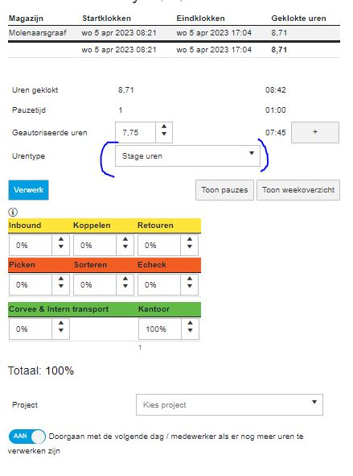
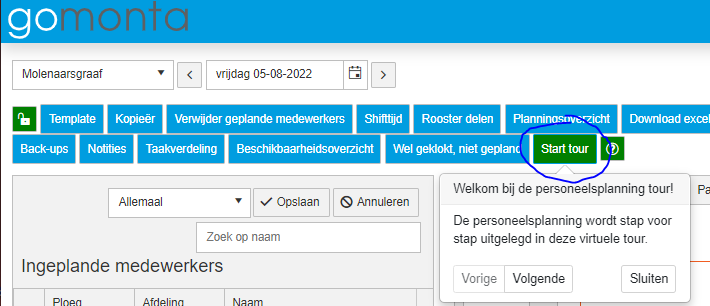
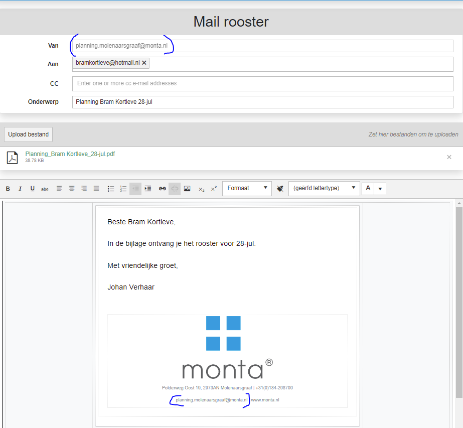
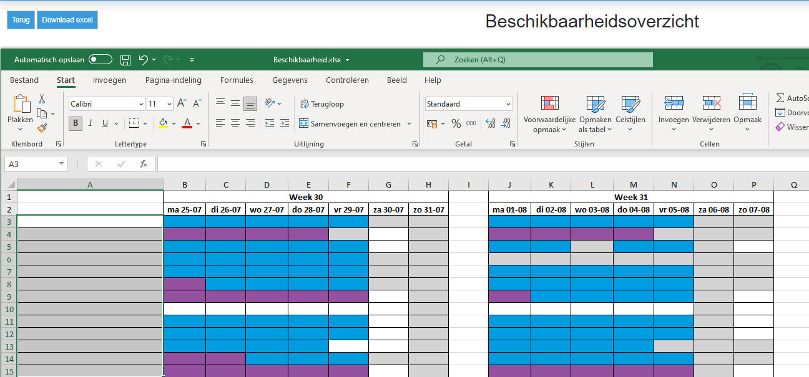

# Personeelsplanning Updates

Binnen GoMonta is er de mogelijkheid personeel in te plannen. Onderstaand zijn updates aan dit systeem weergegeven.

## update 7-4-2023

Het is mogelijk gemaakt dat medewerkers met contract type 'Stagiair' bij het uren verwerken de uren op uren type 'Stage uren' krijgen. Die uren tellen dan niet mee met de productiviteit. Dit omdat Monta graag Stagiaires de kans geeft stage te lopen, maar dat voorheen ten laste van de productiviteit ging. Standaard wordt het uren type op 'Stage uren' gezet, maar er kan van worden afgeweken door het uren type op 'Gewerkt' te zetten, da kan bijvoorbeeld zijn bij mensen die naast hun stage ook als bijbaan werken bij Monta.

## Update 6-4-2023: Week op zondag laten beginnen tbv excel export

Omdat er in 2023 voor gekozen is de week op zondag te laten starten administratief, is dit ook doorgevoerd in de personeelsplanning.

## Update 6-4-2022: Leidinggevenden die uren kunnen goedkeuren van elkaars medewerkers.

Soms werken leidinggevenden in duo diensten (zoals in molenaarsgraaf). Hiervoor is een mogelijkheid gemaakt dat leidinggevenden ook uren kunnen goedkeuren van medewerkers die bij de andere leidinggevende horen. Er komt dan een mogelijkheid de andere leidinggevende te kiezen.

Er is nog geen mooi instellingen scherm voor, maar instellen kan in deze tabel: tblUrenRegistratieKoppelLeidinggevendeLeidinggevende

## Update 5-8-2022: Bij ploegen wissel mogelijkheid filteren op afdeling

Bij kopiëren van planning, de mogelijkheid de dag en avond ploegen te wisselen. Hieraan is nu toegevoegd dat er gefilterd kan worden op afdeling. Zo kun je onderscheid maken tussen afdelingen die met wisselende ploegen werken en afdelingen waar dit niet het geval is.

## Update 5-8-2022: Knopje naar uitleg in vragen.monta
Via dit knopje kun je vanuit de personeelsplanning naar de vragen.monta pagina met uitleg.

## Update 5-8-2022: Toevoegingen aan de Tour

De 'Tour' is een functie waarbij uitleg gegeven wordt over de werking van verschillende delen van de personeelsplanning. Bij deze tour zijn nu uitbreidingen gedaan, zodat nieuwere functies er ook in staan.

## Update 27-7-2022: Updates emailadressen bij rooster delen
Wanneer je de het rooster deelt met een uitzendburo, wordt het email adres van het uitzendburo onthouden voor de volgende keer dat je een rooster wilt delen.

Wanneer je het rooster deelt met medewerkers, is het mogelijk dit vanuit een centraal email adres als afzender te laten komen. Als voorbeeld: planning.molenaarsgraaf@monta.nl. Zodat antwoorden op deze emails op een centrale plek binnenkomen.  (Wanneer je dit ook wilt voor je vestiging, kun je dit aanvragen via techniek@monta.nl)

## Update 27-7-2022: Beschikbaarheids overzicht.
Bij het beschikbaarheids overzicht is de knop naar het hoofdscherm gekomen.

En bij het beschikbaarheids overzicht is de mogelijkheid gekomen om te filteren op afdeling.

Ook is er een Excel export mogelijkheid gebouwd bij het beschikbaarheids overzicht

## Update 27-7-2022: Bij kopiëren van planning, de mogelijkheid de dag en avond ploegen te wisselen

## update 27-7-2022: Extra filtermogelijkheden in planning scherm

