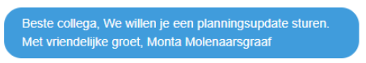
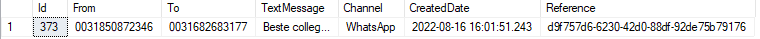
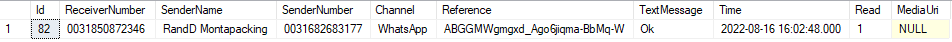

# Whatsapp personeelsplanning

Binnen GoMonta is er de mogelijkheid personeel in te plannen. Een van de mogelijkheden om roosters te delen of om met medewerkers te communiceren over het opvullen van diensten is via whatsapp.

Hiervoor wordt gebruikt gemaakt van een business account van whatsapp. Daaraan zijn wat regels verbonden vanuit whatsapp, om te voorkomen dat bedrijven whatsapp als reclame platform gaan gebruiken.

Zo moet je een chat altijd starten met een standaard bericht vanuit een template en zodra een medewerker daarop reageert, kun je vrije berichten sturen. Daarom zal aan het begin van een chat altijd onderstaand bericht worden gebruikt. Dat ziet er ongeveer uit zoals onderstaand. Dit bericht is in het Nederlands of Engels beschikbaar.

Zodra de whatsapp integratie live is voor Molenaarsgraaf, zullen we onderstaand nog wat meer details beschrijven.

********** De informatie hieronder is meer van technische aard **********

## Technische informatie bij de whatsapp integratie

## CM.com
De whatsapp integratie is geregeld via het platform cm.com. Wanneer een andere vestiging ook whatsapp wil, kan dit binnen het cm.com platform geregeld worden. Hier zijn abonnementskosten aan verbonden.

De tabellen voor de whatst staan gewoon in de Monta_Backend database.
## Tabelstructuur
Een tabel voor verzonden berichten
tblSenderMessages

En een tabel voor binnenkomende berichten
tblReceivedMessages

