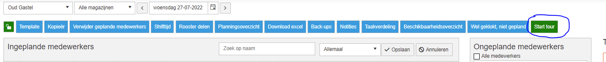

# Personeelsplanning

Binnen GoMonta is er de mogelijkheid personeel in te plannen. Onderstaand zijn enkele mogelijkheden van de personeelsplanning weergegeven.

## Inschatten planning
::: video
<iframe width="560" height="315" src="https://www.youtube-nocookie.com/embed/FPDUsLgoktQ" title="Personeelsplanning- Inschatting plannen" frameborder="0" allow="accelerometer; autoplay; clipboard-write; encrypted-media; gyroscope; picture-in-picture" allowfullscreen></iframe>
:::

## Templates
::: video
<iframe width="560" height="315" src="https://www.youtube-nocookie.com/embed/VJGE8rY7esw" title="YouTube video player" frameborder="0" allow="accelerometer; autoplay; clipboard-write; encrypted-media; gyroscope; picture-in-picture" allowfullscreen></iframe>
:::

## Handigheidjes
::: video
<iframe width="560" height="315" src="https://www.youtube-nocookie.com/embed/GIN6R7at8Sw" title="YouTube video player" frameborder="0" allow="accelerometer; autoplay; clipboard-write; encrypted-media; gyroscope; picture-in-picture" allowfullscreen></iframe>
:::

## Tour
Als je benieuwd bent welke dingen er mogelijk zijn met de personeelsplanning, kun je via de 'tour' daar een indruk van krijgen.

