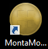

# montamoney uitzendburo

Montamoney is de tool waarin o.a. uren verwerkt kunnen worden. Veel van de functionaliteit uit montamoney wordt omgebouwd naar tools zoals gomonta en montaportal. Maar zolang zaken nog in montamoney zitten, is op deze pagina het e.e.a. te vinden over de werking van montamoney.

## Uitzendburo toevoegen
In onderstaand filmpje is te zien hoe een uitzendburo kan worden toegevoegd. De collega's van finance hebben rechten om dit uit te voeren. Dit omdat nieuwe relaties zoals uitzendburo's eerst in Exact worden aangemaakt.

::: video

<iframe src="https://www.loom.com/embed/06051147aabf4cf39b7e387598bfd49e" frameborder="0" webkitallowfullscreen mozallowfullscreen allowfullscreen style="position: absolute; top: 0; left: 0; width: 100%; height: 100%;"></iframe>

:::
