# Smart stock

Smart stock is een functionaliteit in de Montaportal. De Smart stock pagina is te vinden onder het tabblad Business Intelligence.

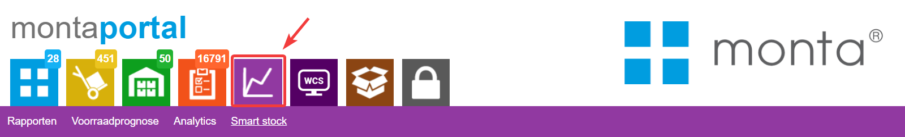
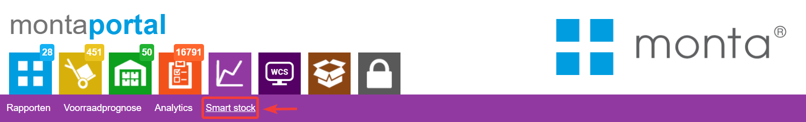

[Monta Smartstock op YouTube](https://www.youtube.com/watch?v=90jZ_VraQls)

### Categorieën

Smart stock kan helpen met het optimaliseren van je voorraadmanagement en zo voorraadkosten besparen.
Het doel van Smart stock is het besparen op gefactureerde voorraadkosten door voorraad van niet of weinig verkopende artikelen af te bouwen.
Smart stock is verdeeld in drie verschillende categorieën:
•	[Incourante voorraad](#incourante-voorraad), [Slow movers](#slow-movers) en [Dure voorraad](#dure-voorraad).

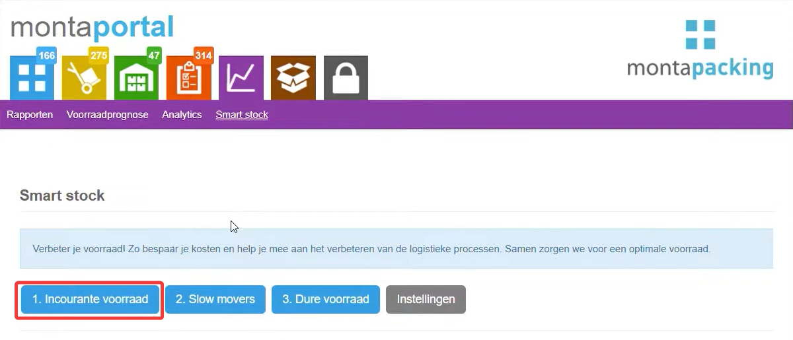
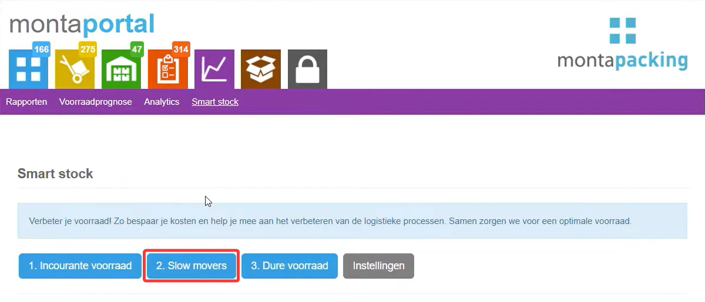
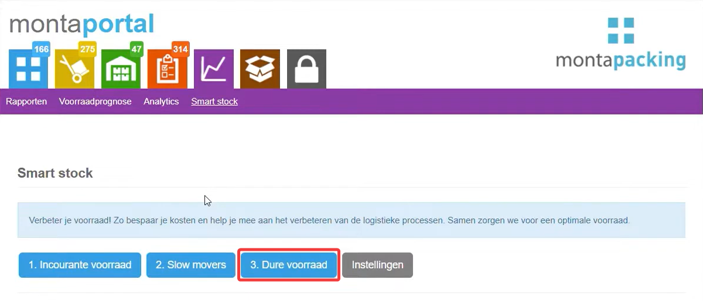

### Incourante voorraad
In de tabel "incourante voorraad" worden artikelen getoond die meer dan 90 dagen niet verkocht zijn.
In de tabel is er per artikel te zien hoeveel stuks er op voorraad liggen, en wat de verwachte voorraadkosten per week zullen zijn.
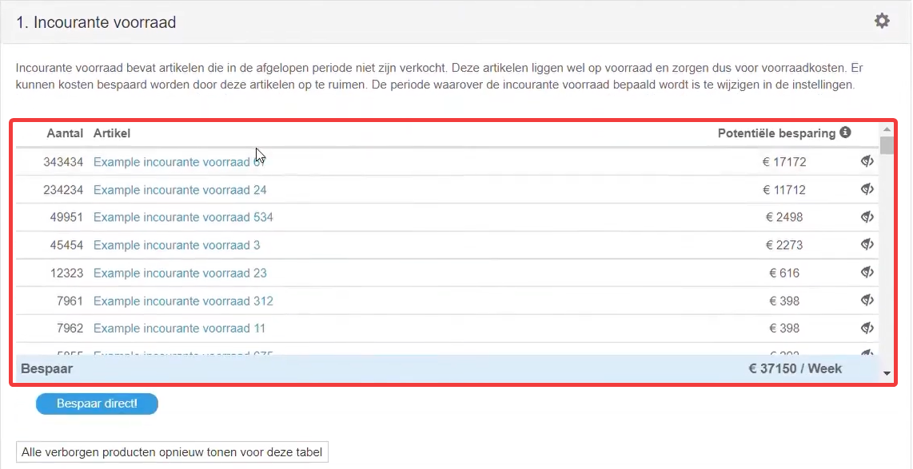

#### Opslagvolume
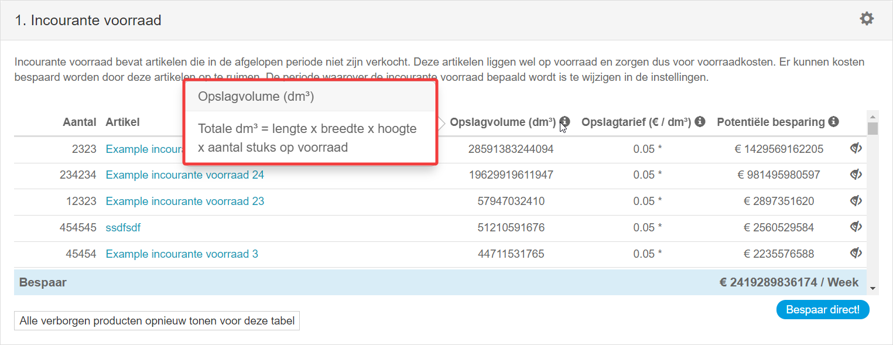

#### Opslagtarief
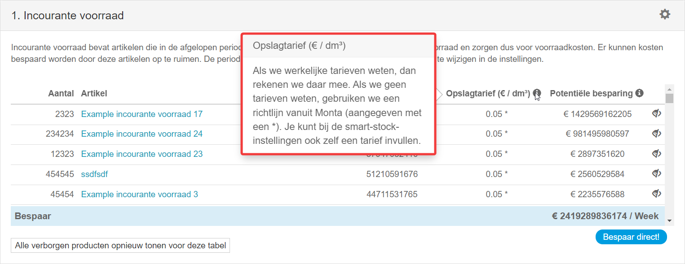

#### Potentiële besparing
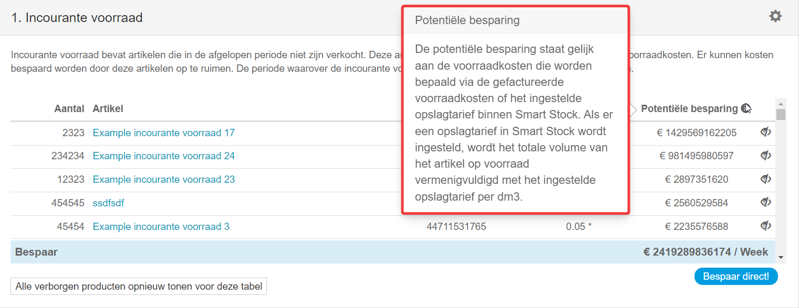

### Slow Movers
In de tweede tabel, genaamd "Slow movers", zijn er artikelen te zien die meer voorraadkosten, dan verwachte omzet per week, hebben.
Houd hierbij rekening dat de verwachte omzet is gebaseerd op basis van het aantal verkopen uit het verleden, waarbij de laatste vier weken het zwaarst wegen.
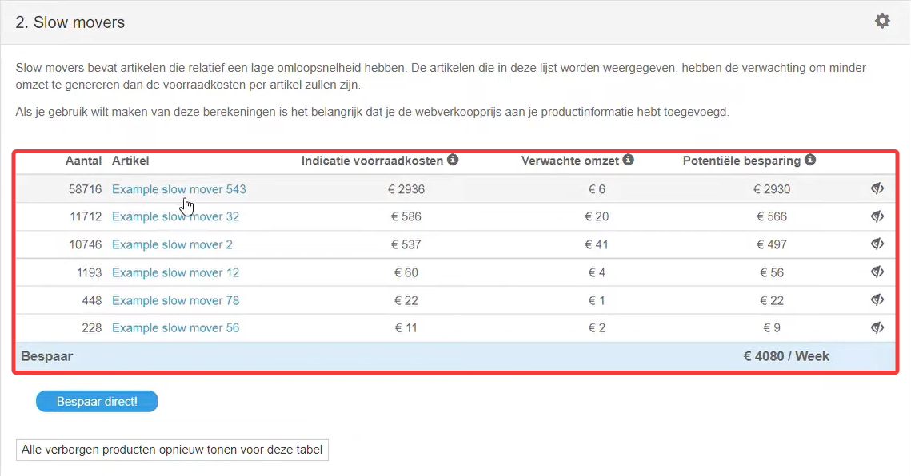

#### Indicatie voorraadkosten
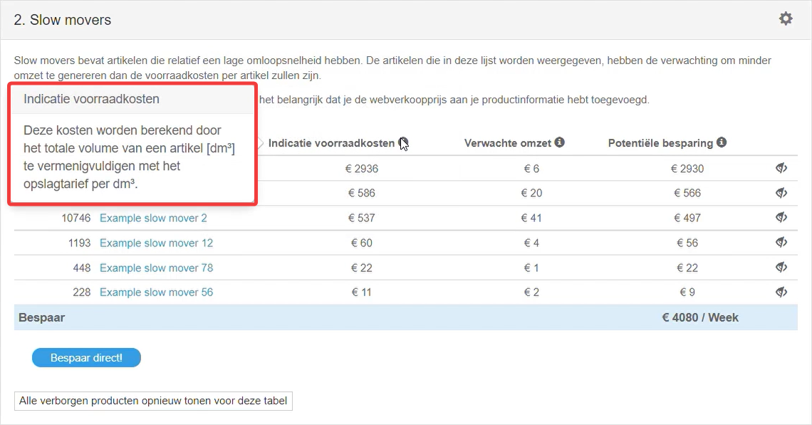

#### Verwachte omzet
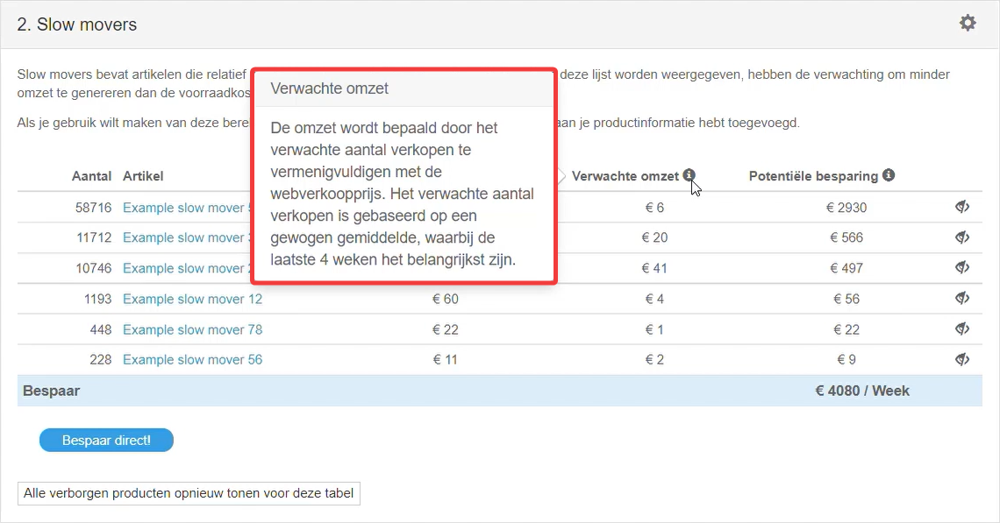
#### Potentiële besparing

### Dure voorraad
Ten slotte staan in de derde tabel "Dure voorraad" artikelen weergegeven die relatief de hoogste Voorraadwaarde hebben ten opzichte van de verwachte omzet.
Bij deze tabel worden de ingevulde inkoopprijzen en verkoopprijzen gebruikt per artikel. Ook hier geldt dat de verwachte omzet is gebaseerd op basis van het aantal verkopen uit het verleden, waarbij de laatste vier weken het zwaarst wegen.

#### Verwachte omzet
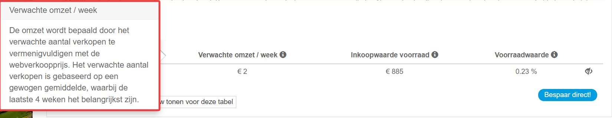

#### Inkoopwaarde voorraad
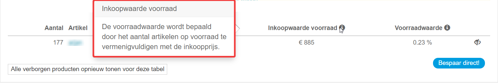

#### Voorraadwaarde
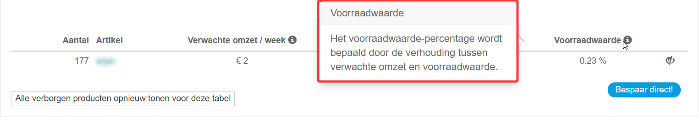

### Besparen op voorraadkosten
Zodra je wilt besparen op de voorraadkosten, kan je gemakkelijk een uitgaande order maken van de artikelen die je uit de opslag wilt verwijderen.
Je druk om te beginnen op de blauwe knop waarop staat , Bespaar Direct.

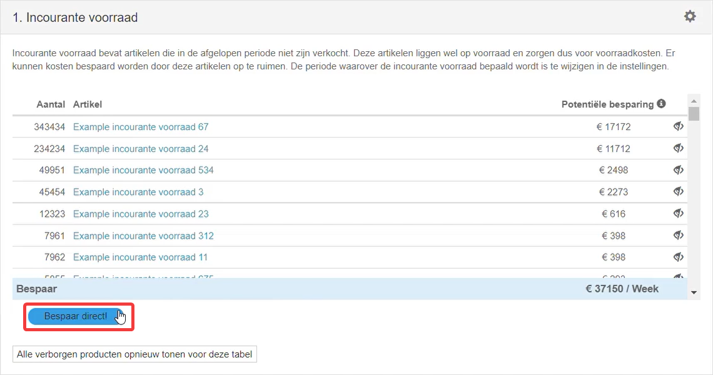

Vervolgens selecteer je de artikelen die je in de order wilt verwerken.

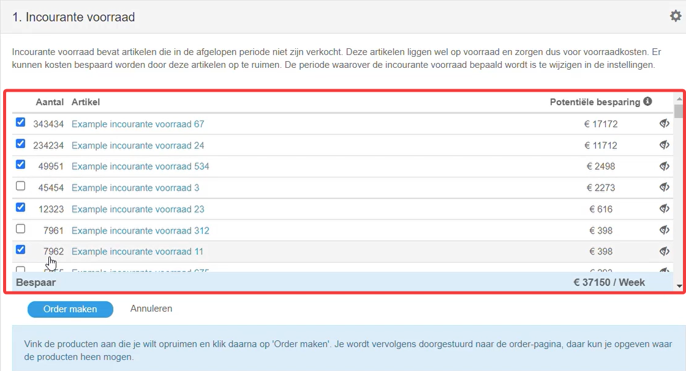

Rond de uitgaande order af door een bestaand adres uit het adressenboek te kiezen of voeg een nieuw adres toe.
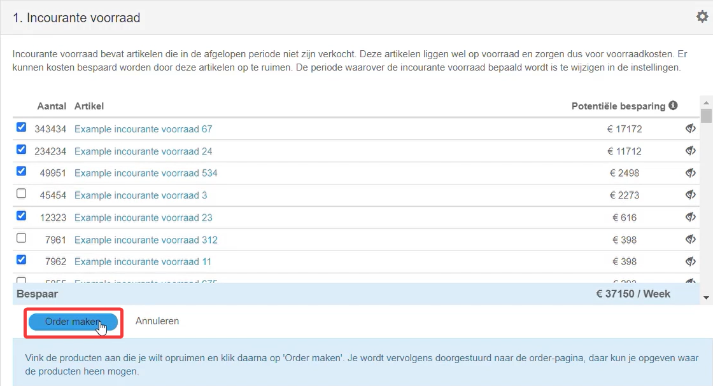
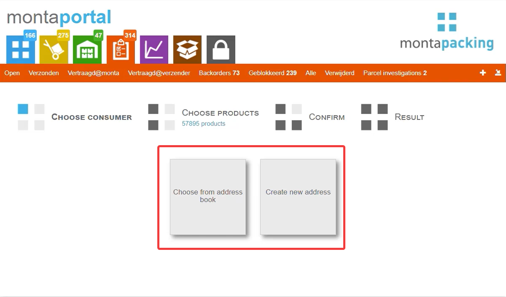

### Artikel onzichtbaar in tabel
Stel dat je een artikel onzichtbaar wilt maken in een tabel, kan dit gemakkelijk door het verberg icoontje te selecteren.

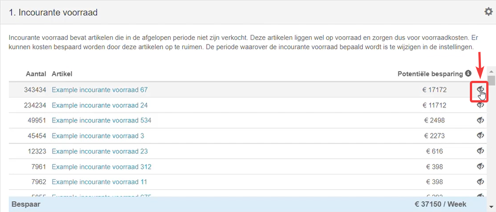

Je kan vervolgens aangeven na hoeveel dagen het artikel terug mag komen in de tabellen.

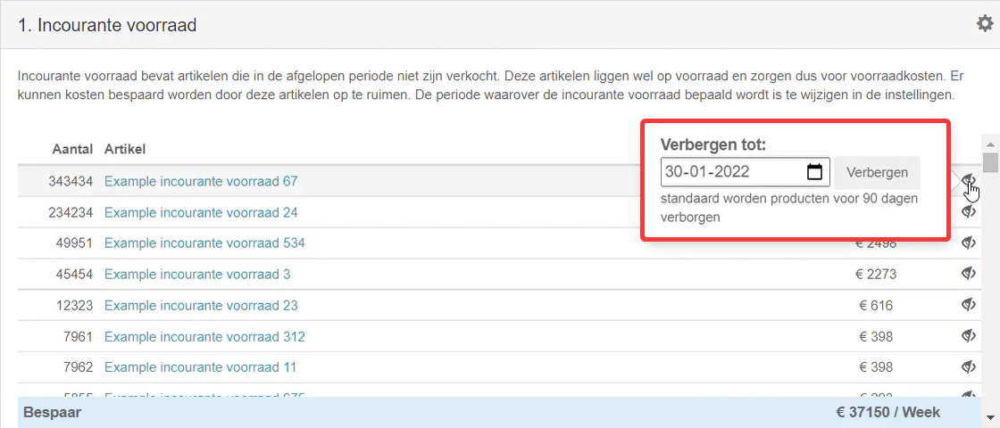

