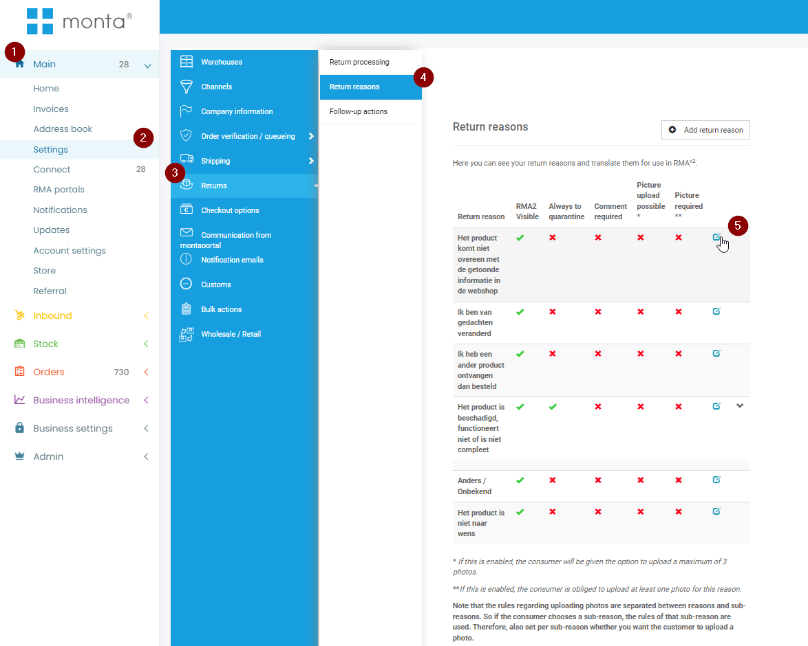
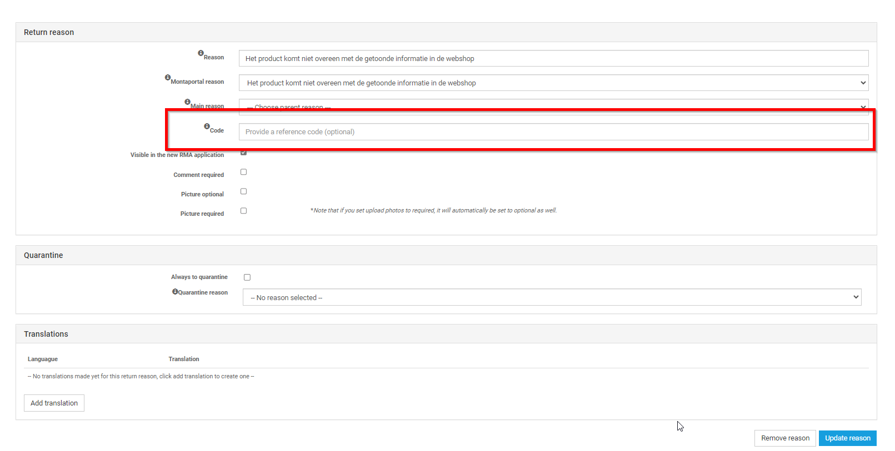

# Externe Retour integraties

Monta biedt zijn RMA module aan. Sommige klanten kiezen er echter voor om gebruik te maken van andere Retour platformen. Voorbeelden hiervan zijn Returnista; Returnless en LOOP.

Monta heeft zelf geen active koppelingen met deze platformen, maar vereist wel dat de retouren worden vooraangemeld, en dat de verzendlabels van Monta worden gebruikt.

Om die reden hebben sommige platformen een koppeling gebouwd met Monta. Hieronder is een overzicht te zijen van deze platformen met uitleg en functionaliteiten.

## Returnista:
Returnista heeft een koppeling ontwikkeld met Monta. (De returnista koppeling is in beheer van Returnista, en niet in beheer van Monta).  Deze koppeling bevat de volgende functionaliteiten:

1. Vooraanmelding van de retouren
2. Gebruik monta Verzendlabels.

Om de koppeling te maken met Returnista moeten er RestAPI credentials aan returnista worden gegeven. Returnista maakt gebruik van de Externe Api van monta. (Belangrijk: bij het aanmaken van het RestAPI Account moet er worden aangezet dat dit account verzendlabels mag genereren).

Returnista ondersteund momenteel de volgende vervoerder:
- DPD
- PostNL
- UPS
- DHL Parcel
- DHL Parcel Connect
- PostNL Buspakje

Deze vervoerders, en de prijzen die de consument betaald, zijn in te stellen in de Portal van Returnista.
Wel moeten deze vervoerder bij het kanaal in monta zijn toegevoegd.

#### Retourredenen:
Om het mogelijk te maken dat returnista de retourredenen mee inschiet in de montaportal moeten de retourcodes worden gemapt in Monta en Returnista. Deze codes gebruikt returnista tijdens het aanmaken van de vooraanmelding.
 

 

## Bijzonderheden:

- Returnista kan geen orders aanmaken in het systeem van Monta. De ruilorders worden aangemaakt in het webshopplatform waaruit monta importeert. Neem contact op met returnista om te kijken welke platformen ze ondersteunen.
- Returnista haalt de status van de retour niet op. De status van de retouren moet worden bijgehouden in de montaportal.

  

## Returnless
Returnless heeft een relatief simpele koppeling met monta.

## LOOP
Er is geen actieve koppeling tussen LOOP en Monta.

