# RMA Module

De klant kan ervoor kiezen dat ze de RMA module gebruiken.

## Wat is de RMA?
De RMA module is een toevoeging aan de Monta diensten. Deze module is erop gericht om de consument zo goed mogelijk te kunnen bedienen en het retourproces zo soepel mogelijk te kunnen laten verlopen.
De  RMA module is een scherm waarop de consument hun retouren kunnen aanmelden; retourredenen aangeven en verzend labels vanaf kunnen downloaden.

### Voordelen RMA

- Retour redenen: De consument kan voorafgaan aan het retour zenden de reden hiervan aangeven. Deze zijn voor de webshop eigenaar vooraf instelbaar.
- Consument krijgt rechtstreeks een verzendlabel: De consument kan een gewenste vervoerder kiezen uit de vooraf ingestelde opties. En krijgt direct een verzendlabel.
- Retourkosten de consument betaald instelbaar: De consument rekent in de module de (door jullie bepaalde) kosten af direct af. De retourkosten die de consument moet afrekenen kan de webshopeigenaar zelf bepalen. Nemen jullie het retour voor eigen rekening? Of willen jullie dat de consument zelf de retourkosten betaald? Het is nu allemaal instelbaar.
- Lay-out en achtergrond zelf instellen: Het design is iets aangepast. Je kunt nu zelf het logo en de achtergrond wijzigen.

 

## RMA module talen

Onze RMA-module beschikt over de volgende talen:
- English
- Dutch
- French
- German
- Swedish
- Danish
- Spanish

Op basis van de taal die is ingesteld in de browser bepaalt Monta welke taal de consument te zien krijgt. Eventueel kan de Consument ook zelf nog wisselen van taal in de RMA-module.

Als de Consument de RMA-module in een `X`-taal heeft doorgelopen krijgen ze ook een email (met het retourlabel) in deze `X`-taal. De talen hoeven dus niet per land worden ingesteld, maar worden veranderd op basis van de klantgegevens. Als er geen mail template is ingesteld voor de betreffende taal, dan wordt het default template gestuurd.

## Retourkosten

Bij de instellingen van de RMA pagina kan de webshop aangeven of er kosten gerekend moeten worden aan de consument.

Als dit het geval is wordt voor het afrekenen gebruik gemaakt van de betaalprovider Mollie.
Standaard wordt hiervoor het Mollie account van Monta gebruikt waarbij het ontvangen bedrag gecrediteerd wordt op de eerstvolgende factuur aan de klant.

Nadelen van het Monta Mollie account:
- De betaalmogelijkheden worden door Monta beheerd (het veelgebruikte Paypal is hierbij bijv. niet beschikbaar)
- De naamgeving van de Mollie pagina bevat de naam Monta

Naast het standaard Mollie account van Monta heeft de klant de mogelijkheid een eigen Mollie account in te stellen. Dit heeft als voordeel dat zij zelf kunnen beheren welke betaalmogelijkheden aangeboden worden en ook de naamgeving naar eigen wens aan te passen is voor de klant.

Het instellen van een eigen Mollie account doen klanten op de RMA instellingen pagina in de Montaportal.

De credentials kunnen ingesteld worden op de RMA settings pagina:
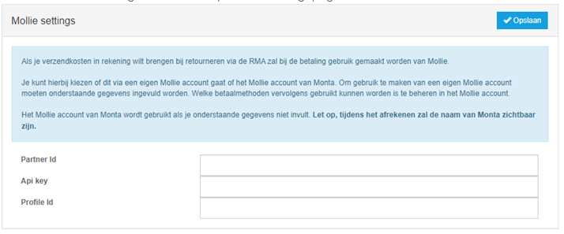

Deze gegeven zijn in Mollie te vinden onder de developers tab:
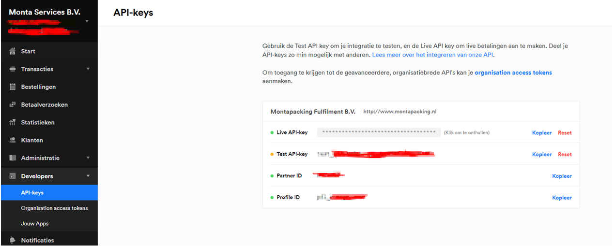

## Controle Max afmetingen in de RMA

Monta berekend in de RMA module de maximale afmetingen per vervoerder, zodat er geen retour kan worden aangemeld bij een vervoerder die deze afmetingen van het artikel niet kunnen vervoeren. De manier waarop we dit berekenen verschilt op basis van het aantal colli dat in een order zit.
Het aantal colli wat wordt gebruikt is het aantal colli in de heenzending.

**Geen multi Colli:**
Checken we op het grootste afmeting LBH van ieder artikel in de retour.
CHecken op gewicht van de Artikelen op basis van de gewichten per artikel in de montaportal

**Bij een Multi colli:**
Checken we op het grootste afmeting LBH van ieder artikel in de retour.
Gewicht wordt niet gecontrolleerd, omdat we niet weten welk artikel in welke doos gaat.

## RMA instellen

Om de RMA in gebruik te nemen is het van belang dat er een aantal instellingen worden gedaan. Hieronder is te vinden welke instellingen er allemaal moeten worden gedaan.

In het RMA-menu (2) kan je aangeven voor welke kanalen(aanvinken bij 3) je de RMA in wilt stellen
Vervolgens klik je op de Plus (4)

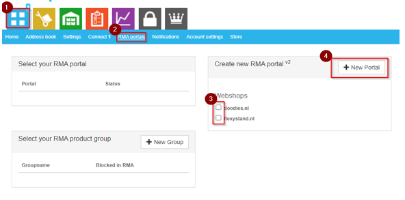

De RMAlink (5) voor de consumentportal kan op de webshop geplaatst worden.

De returnperiod (6) geeft aan hoeveel dagen een consument heeft voor het retourneren van goederen.

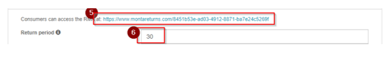

Als je op de Plus (7) drukt kun je per land (8) de vervoerder (9) en de kosten voor de consument aangeven (10)

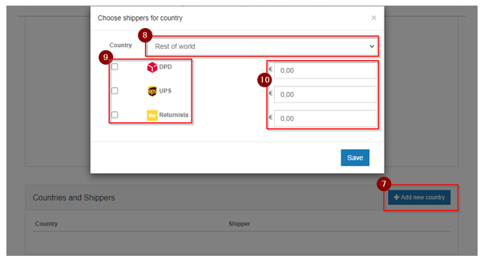

#### Huisstyle

Via onderstaand deel kan de portal enigszins naar eigen huisstijl aangepast worden.

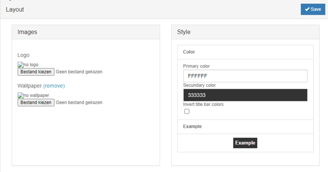

#### Settings

Het is ook mogelijk om de volgende velden in te stellen:
- Retourperiode: de tijd (in dagen) waarin de consument zijn retour mag aanmelden;
- Sub domain: om te gebruiken in plaats van de GUID in de URL;
- Order prefix: voor het gebruik van een prefix in een ordernummer;
- Order suffix: voor het gebruiken van een suffix in een ordernummer;
- Inloggen met referentie toegestaan: of consumenten via order-referentie mogen inloggen;
- Login met postcode: of consumenten in moeten loggen via postcode (of via email);
- Product-afbeeldingen tonen in de RMA: of in de RMA pagina's de afbeeldingen van producten getoond worden, als deze beschikbaar zijn;
- SKU tonen in de RMA: zorgt ervoor dat de SKU achter de omschrijving van het product getoond wordt tussen haakjes;
- Valuta: de valuta van het RMA portaal;
- Gebruik verzenderafmetingen product: of de verzenderafmetingen van een product gebruikt moeten worden bij het bepalen welke verzenders de consument kan kiezen;
- Producten alleen tonen op ruilpagina als er voorraad is: toon de producten alleen op de ruilpagina als er voorraad beschikbaar is. Als deze uit staat wordt het bericht 'Uitverkocht, levering duurt langer' getoond. Deze optie staat standaard uit;
- Bericht tonen bij product over voorraadstand: toon bij de producten een bericht over de voorraad op de ruilpagina. Als deze aan staat wordt het bericht 'Op voorraad' of 'Bijna uitverkocht' getoond. Welk bericht wordt getoond, wordt bepaald op basis van de beschikbare en minimale voorraad. Als de minimale voorraad niet is ingesteld bij het product, wordt alleen het bericht 'Op voorraad' getoond. Deze optie staat standaard uit.

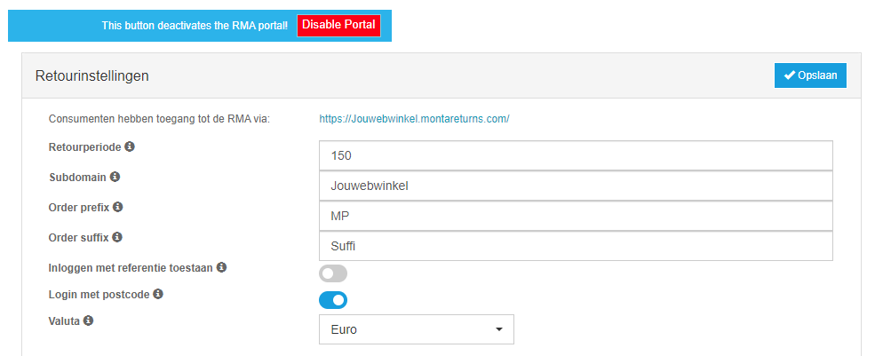

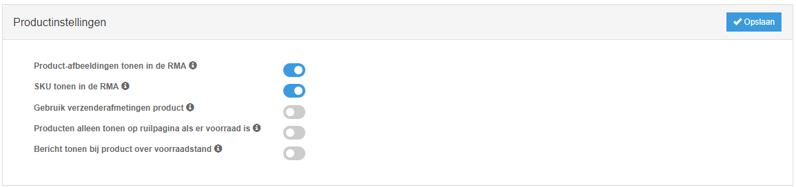

## Retourredenen

De retourredenen dienen van te voren te worden ingesteld. Dit kan worden ingesteld via de Montaportal.

Voorbeelden:
-	Product is beschadigd/functioneert niet
-	Product is anders dan besteld
-	Product is niet zoals verwacht

In de montaportal kan je onder de retourredenen bepaalde manieren van verwerken hangen:

1. Altijd naar Quarantaine
2. Opmerking verplicht.
3. Afbeelding verplicht:
In de RMA wordt de consument bij het kiezen van die reden verplicht een foto te uploaden. De consument kan maximaal 3 foto's uploaden. Deze foto's zijn terug te vinden in MontaPortal, onder Received -> Returns. Zie de afbeeldingen hieronder:

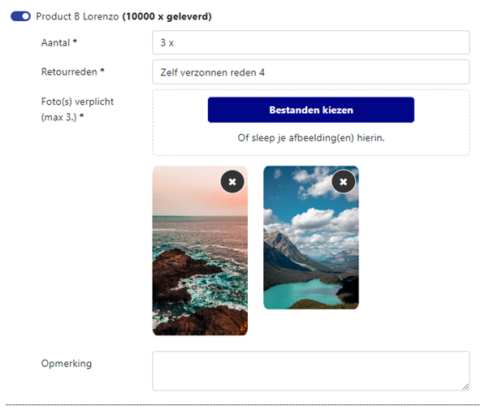
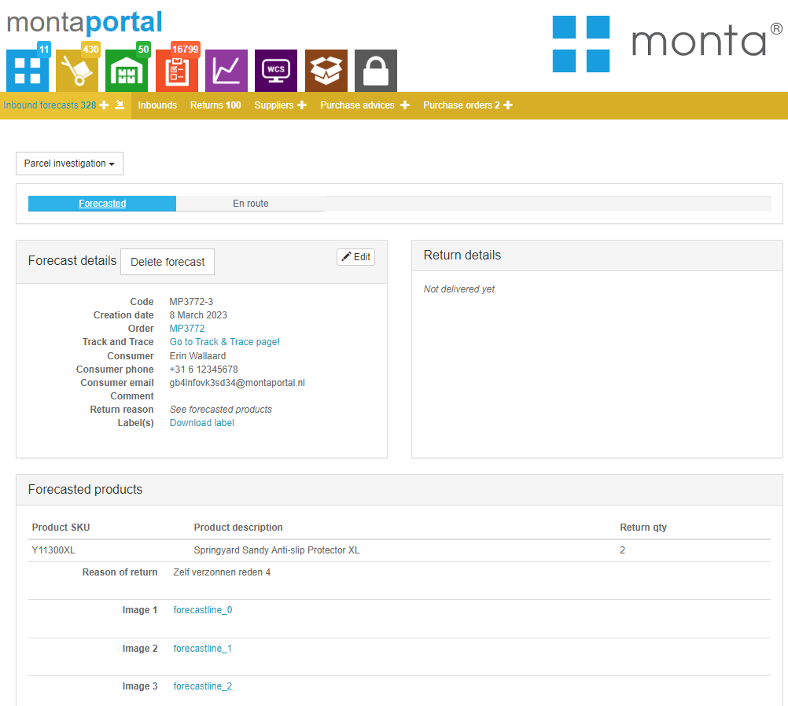

Je kunt ook per RMA Portaal retourredenen in en uitschakelen.

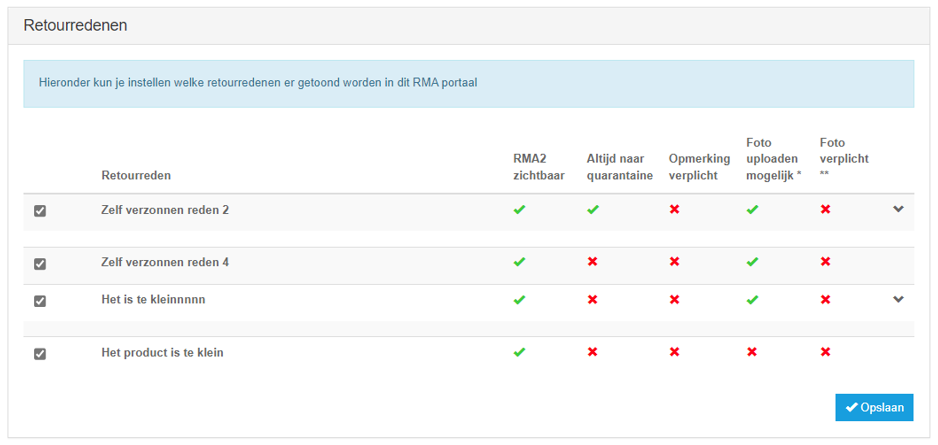

## Opties per product

Het is mogelijk het retourneren van bepaalde producten te blokkeren of te verplichten dat een comment ingevuld wordt. Dit kan door productgroepen te maken op de RMA portals pagina.

## RMA Verzenders

In de RMA heb je twee soorten verzenders. Afgeef verzenders, waar de consument zelf het pakket naar een afhaalpunt moet brengen; en ophaal verzenders, waarbij de bezorger het pakket op komt halen bij de consument. Daarnaast zijn er ook twee alternatieve manieren voor consumenten om hun product retour te sturen/brengen.

**Afgeef verzenders**

| **Verzenders** | **Landen** | **Max afmetingen (LxBxH), omvang, gewicht** |
|--|--|--|
| DHL For You (eCom) | Nederland | (90 cm, 60 cm), n.v.t., 20kg|
| DHL Parcel Connect Return | Bulgarije, Denemarken, Duitsland, Estland, Finland, Griekenland, Ierland, Letland, Litouwen, Oostenrijk, Polen, Portugal, Roemenië, Zweden, Slowakije, Spanje, Tsjechië | n.v.t.
| * DHL For You Buspakje | Nederland | (38 cm x 26 cm x 3 cm), n.v.t., 2kg|
| DHL For You Pakket | Belgie, Nederland | (80cm x 60 cm x 50 cm), n.v.t., 23kg|
| DPD | Oostenrijk, Belgie, Tsjechië, Duitsland, Denemarken, Estland, Finland, Frankrijk, Hongarije, Litouwen, Luxemburg, Letland, Nederland, Portugal, Zweden, Slowakije | (175 cm), 300 cm, 31kg|
| PostNL Pakket | Nederland | (176 cm x 78 cm x 58 cm), n.v.t., 23kg |
| PostNL paperless | Nederland | ( 100 cm x 70 cm x 58 cm), n.v.t., 30kg|
| * PostNL Buspakje | Nederland | (38 cm x 26.5 cm x 3.2 cm), n.v.t., 2kg |
| UPS | Alle landen | (274 cm), 400 cm, 70kg|

\* Buspakje verzenders kunnen alleen gekozen worden als deze ook met buspakje verzonden zijn.

**Ophaal verzenders**

| **Verzenders** | **Landen** | **Max afmetingen (LxBxH), omvang, gewicht** |
|--|--|--|
| DHL Pickup | Nederland | (90 cm x 60 cm), n.v.t., 20kg |
| Extra at Home Pickup | Nederland | n.v.t. |
| DynaLogic | Nederland, Belgie | n.v.t. |
| Swift | Nederland | n.v.t. |

**Alternatieve verzendmethoden**

Er zijn twee alternatieve methoden die de consument kan kiezen om te versturen:
- "Consumer Own Shipment": de consument verstuurd zelf zijn pakket terug naar het ingestelde adres. De consument kan elke verzender kiezen die hij wilt, handig als hij bijvoorbeeld verzekerd wilt verzenden. Dit is in te stellen bij de instellingenpagina van een RMA Portaal, onder verzenders:

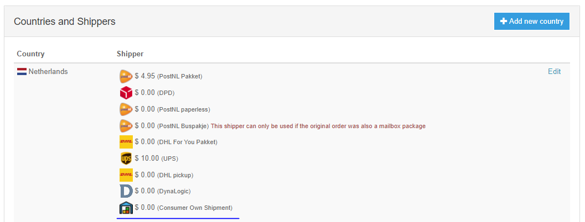

- Showrooms: voor als een klant wilt dat de consument ook bij een eigen winkel/showroom zijn retourbestelling mag komen brengen. Deze zijn in te stellen bij de instellingenpagina van een RMA Portaal, onder afleverpunt/winkel adressen:

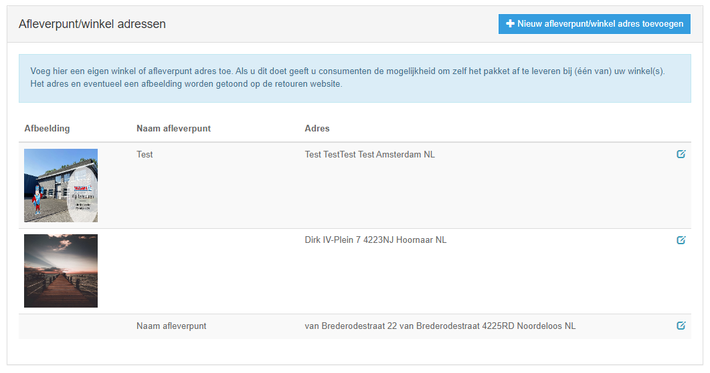
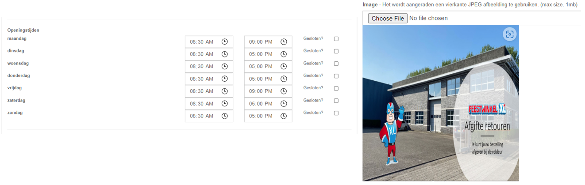

De consument kan deze dan kiezen in de RMA. Afleverpunten worden alleen getoond in een straal van 25km rondom het adres van de originele bestelling:

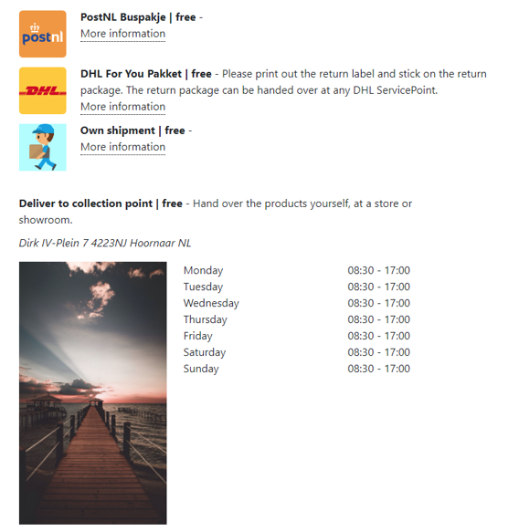

## Tekst aanpassen

Het is mogelijk om op de retour pagina de sub header tekst te veranderen. 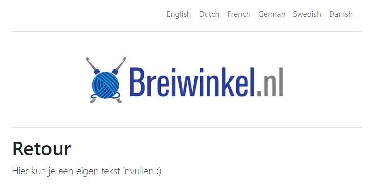

Op de settings pagina van het RMA portal kan een language setting aangemaakt, verandert en/of verwijdert worden.
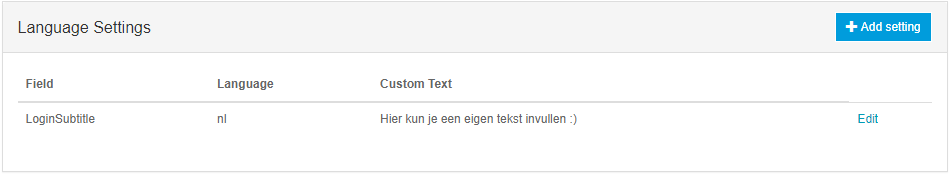

Om een language setting te verwijderen, moet op de edit knop worden geklikt. Op de edit pagina staat een verwijder knop.
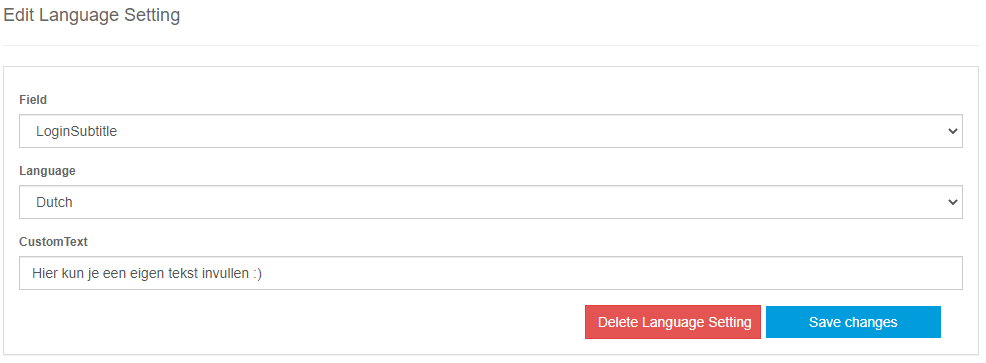

## BCC E-mail Settings

In de instellingen is mogelijk om e-mailadressen in te stellen die als BCC toegevoegd worden aan alle e-mails die naar klanten verstuurd worden door de RMA.

## Integratie

### Iframe

Het is mogelijk om de RMA module in een iframe te plaatsen zodat klanten niet de site hoeven te verlaten. Dit is echter alleen mogelijk als de retouren gratis zijn. Wanneer de retouren niet gratis zijn dan moeten de klanten op een externe module van Molly betalen. Deze module werkt niet in samenwerking met een Iframe.

### Deeplink login

Het is mogelijk om een "deeplink" te maken naar de RMA. Zodat de consument meteen bij de juiste order uitkomt. Bijvoorbeeld vanuit een "mijn bestellingen" overzicht in een webshop.

Hiervoor moet een login aangemaakt worden via de RMA api: https://api.montapacking.nl/rma/v0/index.html#tag/Login

Het aanmaken van een login geeft een Id terug. Met deze Id kan de deeplink opgebouwd worden: https://www.montareturns.com/{rmaGuid}/{loginGuid} of als gebruik wordt gemaakt van een subdomein: https://{subdomein}.montareturns.com/{loginGuid}.

