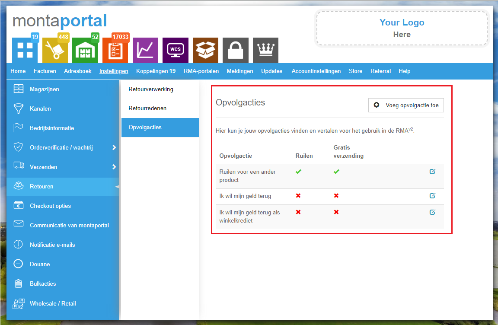
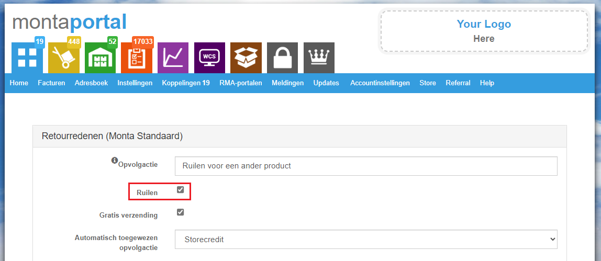
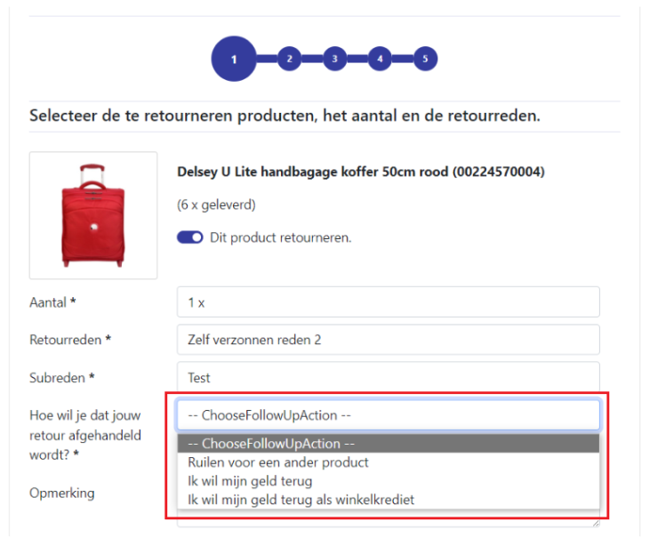
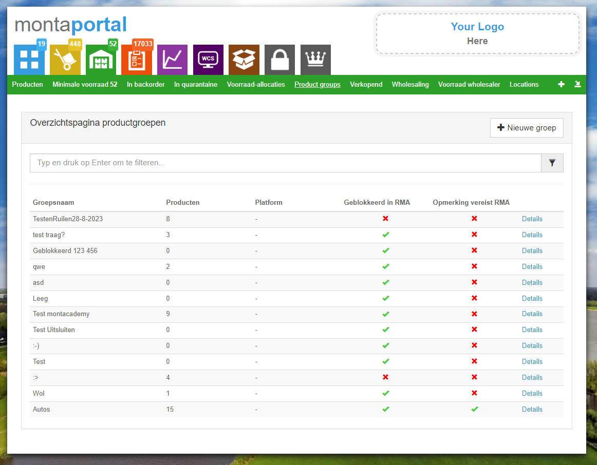
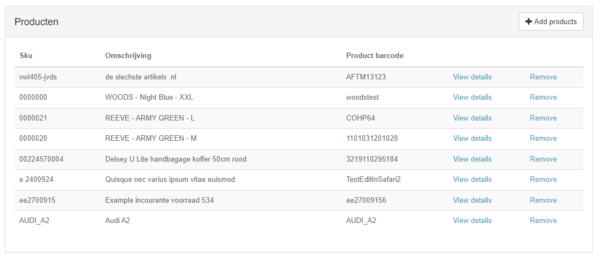
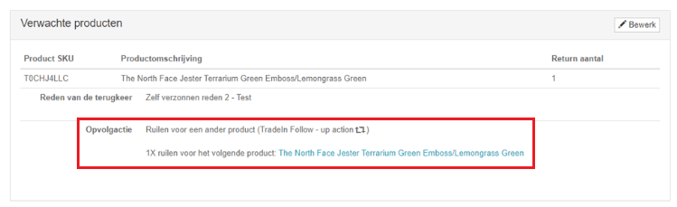
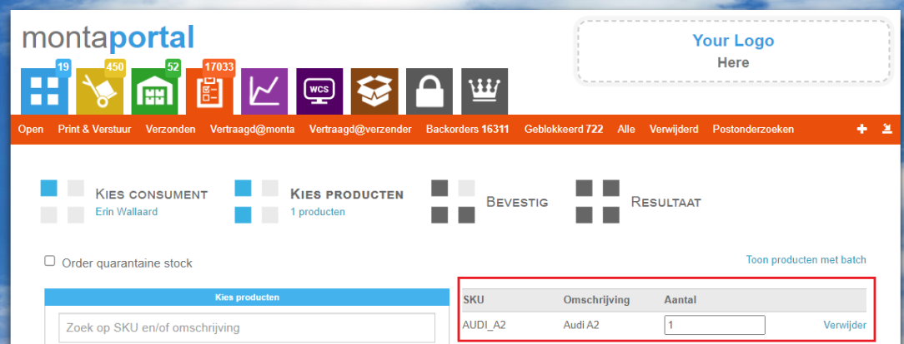
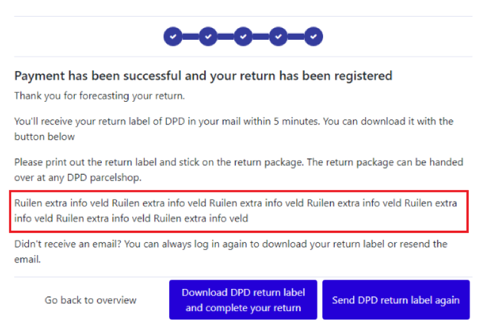

# RMA Ruilen

De RMA kan ook gebruikt worden om consumenten hun producten te laten ruilen.

## Hoe werkt ruilen?
Ruilen is een nieuw onderdeel van de RMA, waar consumenten kunnen kiezen om een product te ruilen voor een ander, vergelijkbaar product. Denk hier bijvoorbeeld aan een kledingstuk die de consument een maat te klein heeft besteld, of in een verkeerde kleur.

Bepaalde instellingen zijn nodig om ruilen aan te zetten in de RMA. Die worden hieronder beschreven:
 

## Opvolgacties
Opvolgacties zijn een nieuw onderdeel van de RMA. Consumenten kunnen via deze opvolgacties aangeven wat ze willen dat er gebeurd aan de hand van hun retour, zoals hieronder aangegeven:

Deze opvolgacties zijn in te stellen in MontaPortal, zoals je hieronder kunt zien:

_In het voorbeeld hierboven heeft de consument aangegven zijn product te willen ruilen._

Om ruilen mogelijk te maken moet je één opvolgactie aanmaken waarvan ruilen aan staat, zoals bijvoorbeeld hieronder:

We raden vanuit Monta aan meerdere opvolgacties aan te maken, zoals bijvoorbeeld "Geld terug" of "Winkel krediet". Zo kan de consument ook naast ruilen kiezen wat hij wilt dat er na zijn retouraanmelding gebeurd.

Je kunt ook bepaalde opvolgacties gratis maken om te verzenden. Zo kun je bijvoorbeeld de consument aanmoedigen om "Winkel krediet" of "Ruilen" te kiezen:

Na het aanmaken van de opvolgactie moet die ook nog gekoppeld worden aan een retourreden. Opvolgacties kunnen alleen gekozen worden onder die retourreden. Op de detailpagina van retourreden kan dit (_hier kom je via Instellingen -> Retouren -> Retourredenen -> klik op de "wijzigen" knop van een van de retourredenen_):

We raden aan alle opvolgacties aan al je retourredenen te koppelen, tenzij je een goede reden hebt dit niet te doen.

Zodra je opgvolgacties (waarvan een "ruilen") hebt, en deze zijn gekoppeld aan retourredenen, komen deze te verschijnen in de RMA:

## Productgroepen
Productgroepen worden gebruikt om te bepalen met welke producten de consument kan ruilen. Denk bij een groep aan bijvoorbeeld een shirt, die meerdere kleuren heeft. In de groep zitten die verschillende kleuren als losse producten in de groep. Een consument kan ruilen tussen producten binnen de groep. Bijvoorbeeld:
- In een groep zit een rood, wit en geel shirt.
- De consument wil zijn rode shirt ruilen.
- Dit kan voor de producten in die groep.

Groepen kun je bekijken en ook aanmaken/wijzigen via MontaPortal:

Een groep bestaat uit meerdere producten:

En een groep heeft ook meerdere instellingen:

Verder gaan wij via de product imports van verschillende koppelingen deze ophalen. Dit gebeurd al via Magento koppelingen.

We raden aan de naam van groepen die automatisch zijn aangemaakt (via koppelingen), niet aan te passen, omdat die gebruikt worden om de groepen up te daten.

## De ruilenpagina in de RMA
Als een consument één of meerdere “ruil” opvolgacties kiest komt hij vervolgens op de nieuwe ruilpagina, om specifiek dat product te ruilen voor een ander product:

In de RMA kan een consument kiezen uit producten die in dezelfde groep zitten als het product wat hij wil ruilen:

Als een consument een vervangend product heeft gekozen kan hij verder. De rest van de RMA loopt zoals vanouds.

## Opvolgen van ruilen vooraanmeldingen
In de eerste fase van RMA ruilen gebeurd het aanmaken van nieuwe ruilbestellingen nog niet automatisch. Via MontaPortal kunnen handmatig nieuwe bestellingen aangemaakt worden.

Dit kan ten eerste via de detailpagina van een retour vooraanmelding. Daar wordt getoond welke product de consument gekozen heeft om te ontvangen:

Via een knop bovenaan de pagina kan een nieuwe bestelling gestart worden:

Vanaf daar kom je op de standaard plek waar op MontaPortal nieuwe orders aangemaakt worden. De producten en het aantal wat de consument heeft bepaald wordt automatisch gezet:

Je kunt ook in bulk meerdere nieuwe bestellingen aanmaken, via de retouren overzichts pagina. De gegevens van de originele Eorder worden gebruikt, waarvan onder andere de verzender en het adres.

Achter de schermen worden de vooraanmelding gekoppeld aan de nieuwe ruilbestelling. Ook te zien op de retour detailpagina:

## Andere ruil-gerelateerde instellingen
Hieronder worden enkele andere ruilen-gerelateerd instellingen uitgelicht:

- Custom velden in de RMA omtrent ruilen.

Via de instellingen van je RMA Portaal in MontaPortal kun je zelf stukken tekst toe voegen in de RMA. Voor ruilen zijn hier twee mogelijkheden voor: TradeInInfoOnTradePage en TradeInInfoFieldAtEndOfProcess:

Je kunt de taal ook instellen:

Je kunt dit gebruiken om de gebruiker toe te lichten betreft ruilbestellingen in de RMA. In de RMA worden deze custom velden op de volgende twee plekken getoond, namelijk op de ruilenpagina:

En ook aan het eind van de retouraanmelding:

