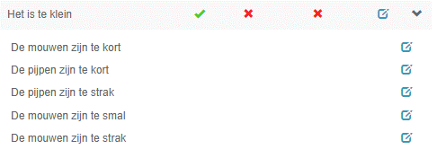
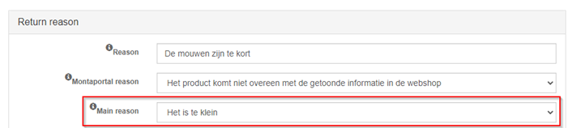
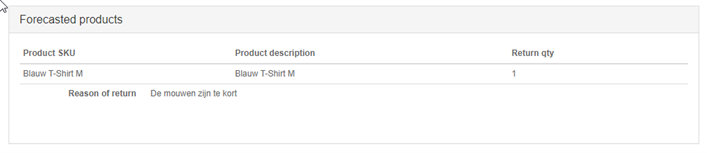
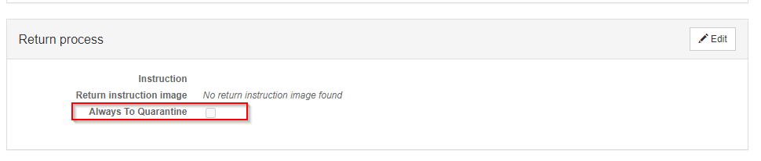

# Retouren

Orders die retour komen kunnen aangemeld worden.

Ontvangen retouren kunnen geregisteerd en opgevolgd worden.

## Retour vooraanmeldingen

Een retour kan aangemeld worden. Op de volgende manieren:
* Handmatig op de Montaportal
* Door de consument door een retour aanmelding via de RMA. Zie [RMA Module](../../Algemene-informatie/Retouren/RMA-Module).

## Retour label

Met retour label bedoelen we een verzendlabel waarmee de consument de order retour kan sturen naar de webshop.

Een retour label kan op de volgende manier gemaakt worden:
* Op de Montaportal bij een order
* Op de Montaportal bij een retour vooraanmelding
* Door de consument bij het aanmelden van de retour via de RMA. Zie [RMA Module](../../Algemene-informatie/Retouren/RMA-Module).
* Monta kan een retourlabel meesturen met de order

Als adres op het retourlabel wordt het [retouradres](#retour-adres) gebruikt.

Het kan zijn dat de gebruiker op de Montaportal een retour label wil maken terwijl de oorspronkelijke order niet beschikbaar is, of dat de oorspronkelijke order inmiddels geanonimiseerd is. Hier kan de gebruiker omheen werken door een 'retour order' te maken. Dit is een order die als verzonden in de portal staat zonder producten. Een retour order maken kan vanuit het adresboek, of vanuit het maken van een nieuwe order, in het scherm waar de gegevens van de consument ingevuld kunnen worden.

### Retourlabel meesturen met de order

Bij een kanaal kan ingesteld worden dat bij elke order een retourlabel moet worden meegestuurd. Hierbij wordt ingesteld van welke verzender een retourlabel gemaakt moet worden.

Het retourlabel wordt gemaakt bij het verifiëren van de order.

Bij de echeck wordt het retourlabel geprint. Het retourlabel wordt op een A4 geprint, zodat het voor de gebruiker bij de echeck duidelijk is wat het verzendlabel en wat het retourlabel is.

### Afwijkend adres bij een order voor retourlabels

Het kan zijn dat het oorspronkelijke adres van de order niet geschikt is als afzender adres voor het maken van een retourlabel.

Om dit op te lossen is het mogelijk op de Montaportal een retouradres toe te voegen bij de order.

### Retourlabel afleverstatus

Het is mogelijk om van retourlabels van de meeste verzenders de afleverstatus (onderweg, afgeleverd, etc) te importeren. [Net als bij verzendingen.](../../Algemene-informatie/Outbound#order-afleverstatus).

Hiermee kan de transit tijd van retouren van bepaalde verzenders/landen gemeten worden. Ook kan gemeten worden hoe lang het magazijn nodig heeft om de retouren in te boeken.

Als een er een retour vooraanmelding gemaakt is wordt de afleverstatus automatisch geïmporteerd.

Bij retourlabels die worden meegestuurd met de order is er echter geen retour vooraanmelding. Voor deze labels kan per klant en verzender ingeschakeld worden dat de afleverstatus geïmporteerd wordt. Dit moet door IT gedaan worden in de programmacode. De afleverstatus blijft 200 dagen lang opgehaald worden, want tot zo lang kan er bij sommige webshops geretourneerd worden.

De afleverstatus van het retourlabel is op de volgende plaatsen terug te zien:
- Als er een retour vooraanmelding is in de statusbalk van de retour vooraanmelding op Montaportal,
- In de Montaportal Excel rapportages "Ontvangen retouren" (175) en "Retourvooraanmeldingen met productdetails" (179),
- In de externe REST api van Monta.

## Retour adres

Het afzender/retour adres staat ingesteld bij het kanaal.

Dit adres wordt als afzender adres op de verzendlabels geprint. Als de order niet afgeleverd kan worden komt hij naar dat adres retour.

Dit adres wordt ook gebruikt als ontvangeradres op [retour labels](#retour-label).

## Retouren registereren

Met de retour applicatie kunnen retouren registreert worden.

Dit proces bestaat uit de volgende stappen:
- Order identificeren. Dit kan door:
-  - De barcode te scannen van het oorspronkelijke verzendlabel
-  - De barcode te scannen van het retour verzendlabel als deze is aangemaakt via de [RMA Module](../../Algemene-informatie/Retouren/RMA-Module).
-  - Te zoeken op ordernummer, postcode, naam
- Product(en) scannen. Per product:
-  - Retour reden kiezen
-  - Bepalen of een product naar verkoopbare, [outlet](#outlet) of [quarantaine](#quarantaine) voorraad moet
-  - Een foto maken als dit ingesteld staat bij de klant
-  - Er wordt een koppellabel geprint waarmee de producten weer in het magazijn geplaatst kunnen worden. Zie [Inbound - Koppelen](../../Algemene-informatie/Inbound#Koppelen).

## Retour redenen

Een klant kan zijn eigen set van retour redenen aanmaken. Dit kan op de Montaportal.

Als een klant geen eigen redenen heeft worden de standaard retour redenen van Monta gebruikt.

De retour redenen van de klant worden alleen gebruikt bij retouren die door de ontvanger retour gestuurd zijn. Bij 'onbestelbare' retouren wordt altijd de Monta retour redenen gebruikt. Dit zijn:
- Onbekend adres
- Geweigerd door bewoner
- Niet thuis / niet afgehaald
- Verhuisd
- Beschadigde verzendverpakking
- Geweigerd bij douane
- Anders / Onbekend

### Sub redenen

Het is mogelijk om in de Montaportal een retourreden aan te maken en deze vervolgens als sub reden aan een retourreden te koppelen.

Je kunt dus bijv. een retourreden aanmaken dat het product te klein is met als sub redenen een verdere specificatie.
Onderstaande is als voorbeeld, ik heb als hoofd reden “Het product is te klein” aangemaakt, met een aantal sub redenen.

Bij het aanmaken of bewerken van een retourreden kan de “Main reason” opgegeven worden.
Zodra dit gedaan wordt is de retourreden die je bewerkt een sub reden van de geselecteerde main reason

  

Als dit aangemaakt is krijgt de consument in de RMA in eerste instantie de hoofdredenen te zien, met vervolgens een extra keuze voor de sub reden. Dit ziet er als volgt uit:
  

  

  

De sub reden is de reden die je vervolgens terugziet in de retouraanmelding.
  

## Outlet

Als een product een klein beetje beschadigd is (2de kans) kan dit als outlet opgeboekt worden.

Deze optie moet per klant ingeschakeld worden.

Zie [Voorraadbeheer - Outlet voorraad](../../Algemene-informatie/Voorraadbeheer#outlet-voorraad).

## Quarantaine

Als de medewerker die de retouren verwerkt constateert dat een product beschadigd is kan het product naar de quarantaine voorraad geboekt worden.

In de Montaportal kan per product aangegeven worden dat het betreffende product altijd naar quarantaine geboekt moet worden als het retour komt.

Bij een retourreden kan ook ingesteld worden dat producten die met die retour reden worden ingeboekt altijd naar quarantaine moeten.

Zie [Voorraadbeheer - Quarantaine voorraad](../../Algemene-informatie/Voorraadbeheer#Quarantaine-voorraad).

## Reconditioneren

Het is ook mogelijk om aanvullende acties zoals strijken en wassen te registreren bij het verwerken van een retour. Deze worden dan op de factuur gezet (zie [Facturatie](../../Algemene-informatie/Facturatie)).

## Retouren opvolgen

Een geregistreerde retour wordt getoond op de Montaportal met de status dat deze nog opgevolgd moet worden. De consument moet namelijk een vervangend product krijgen, zijn of haar geld terugkrijgen, of iets dergelijks.

Het opvolgen van retouren kan per stuk of voor meerdere retouren tegelijk (bulk).

### Automatisch refunden

Het is ook mogelijk om de refund (het aankoopbedrag terugstorten naar de consument) automatisch te doen als de klant de retour op opvolgstatus "Please refund" zet. Dit kan alleen voor de platforms waarmee we een refund koppeling hebben. Zie [koppelingen - refunds](../../Algemene-informatie/Koppelingen/1.-Koppelingen-dataflow#refunds).
