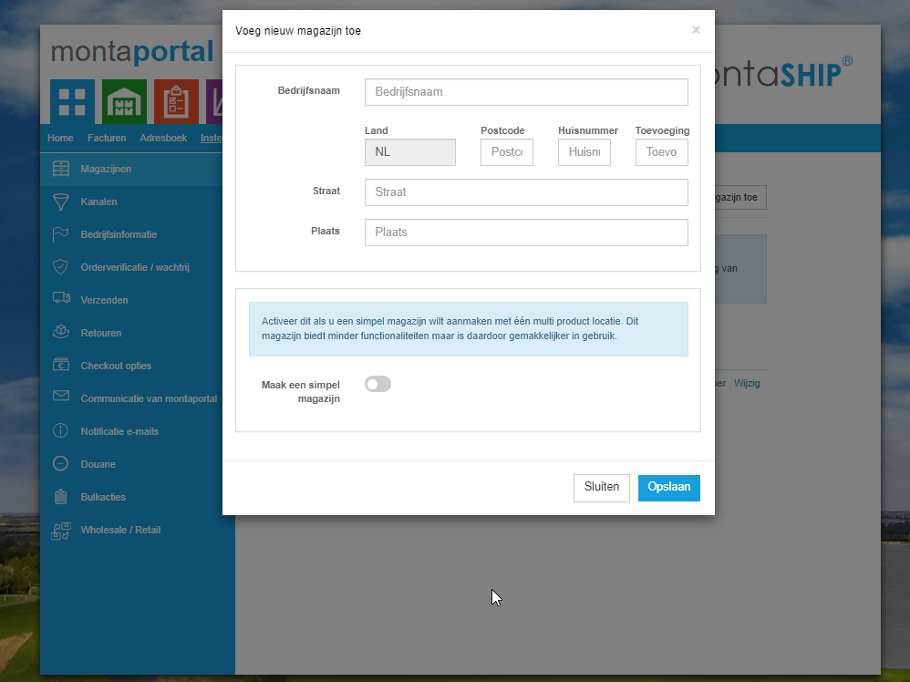
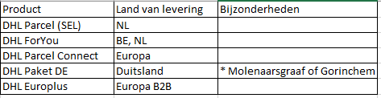

# MontaShip aanmaken

## Aanmaken Standaard MontaShip klant:

1. Maak een account aan in de montaportal  https://www.montaportal.nl/Admin/CreateNewCustomer
2. Vervolgens maak je via de montaportal een `simpel magazijn` aan.



3. Zoek in `tblmagazijnen` de vestiging op waar de klant onder komt en noteer dit ID.

4. Zoek in `tblmagazijnen` je nieuwe magazijn op. Zet hier `MagazijnRapportage` aan, en zet onder `vestiging` het ID van de vestiging; zodat het magazijn gekoppeld is aan de vestiging waar hij bij hoort.

5. Zoek in `tblShipperCredentialsLink` de contracten op van de vestiging waar de klant onder komt:
```
select * from tblShipperCredentialsLink
where MagazijnID = <Magazijn ID van de vestiging>
```
En noteer de ID's van de vervoerders `tblShipper` die je wilt gebruiken. Ga je ook SEL gebruiken? Kijk dan onderaan deze pagina voor het instellen van de vooraanmelding.
Maak vervolgens een nieuwe record aan voor je eigen magazijn met deze ID's.

6. Zoek de tabel `tblShipperAfhaaltijden`. Maak hier nieuwe records voor elke vervoerder die je in het nieuwe magazijn wilt activeren. Noteer hier de ShipperID, MagazijnID en afhaaltijd.,

Veel gebruikte codes zijn:
- 15 SEL
- 30 SEL buspakje
- 151 DHLFYPakket
- 101 DHLParcelConnect
- 2 PostNL
- 88	PostNlBuspakje

<br>

7. Maak een esetting/kanaal aan in GoMonta, zoals je normaal ook zou doen. Controleer hier of je aangemaakte magazijn inderdaad onder de juiste vestiging valt.

8. Pas de Pakbon van de klant aan via: \\montapacking.nl\dfs\Appdata\EsettingsAttachments\ `[esettingsID]`.
Een voorbeeld van de pakbon die je kan toevoegen is:
[pakbon.docx](../../../Attachments/pakbon-f1e5d52b-4214-4740-afa6-66ee2d6959f3.docx).

9. Maak de Print&Verstuur pagina actief en deactiveer de gele (inkoop) knop. Houd van geel de retouren pagina aan.

10. Voeg een Eigen Verpakking Drager toe aan het magazijn en de Esettings

11. Postonderzoeken toevoegen aan het account:
- Rechten activeren in de Montaportal
- In de database: Tbl.Magazijnen in kolom ParcelInvestigationEmail het emailadres support@montaship.nl
- Notification emails instellen voor klant: Notification Emails - Montaportal


12. Voeg de dimensies en gewichten toe aan de producten voor het berekenen van de vervoerder en aanvragen van de labels.

13. Indien fictieve voorraad: Verhoog de limieten van het magazijn en boek de voorraad op in GoMonta


<br>



## DHL Parcel

Voor DHL Parcel moet er een vooraanmelder ingesteld worden. Dit kan door in de tabel  `tblMagazijnenShipperCredentialsDhlParcel` een entry toe te voegen voor je nieuwe magazijn.

1) Zoek je magazijn ID Op
2) Ga naar de tabel `tblMagazijnenShipperCredentialsDhlParcel`
3) Zoek het magazijn van afleveren en kopieer deze gegevens
4) maak een nieuwe entry met deze gegevens en het nieuwe magazijn ID
## Bijlagen
- Standaard pakbon: [pakbon.docx](../../../Attachments/pakbon-58a2d354-9b62-483a-a937-9c66cf5359da.docx)
- Standaard shippermatrix MontaShip: [MontaShip_Shippermatrix.xlsx](../../../Attachments/MontaShip_Shippermatrix-bb693133-35fa-4fe9-9f3c-b9cd1df0cb41.xlsx)
