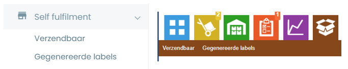
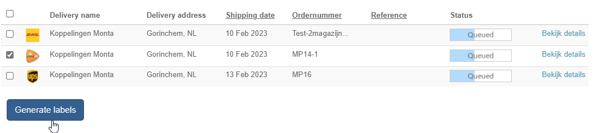
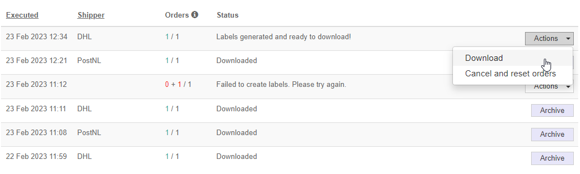
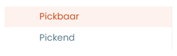
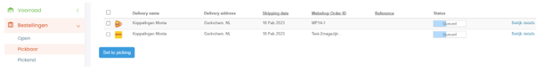
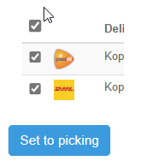
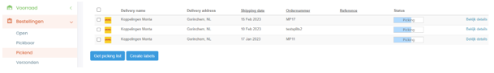
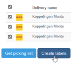
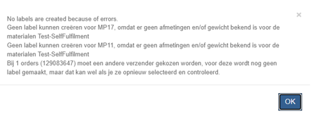

# Selffulfilment

Selffulfilment is voor als klanten bepaalde orders zelf willen versturen. De labels kunnen ze maken via de Montaportal.

De bedoeling is wel dat de zendingen worden aangeleverd op één van de Monta DC's. Aangezien onze volumecontracten met de verzenders vereisen dat de zendingen ook in Monta DC's worden aangeboden.

Als een klant de zendingen wil aanbieden aan bijvoorbeeld pickup points van de vervoerders, moet hier een ander contract (of zelfs een andere verzender) voor ingesteld worden.
Uitwerking Functionaliteiten Labels uit Montaportal

Dit document is opgesteld om meer duidelijkheid te verschaffen over de twee functionaliteiten binnen de Montaportal die labels kunnen printen, namelijk de bruine knop en Pickend/Pickbaar. Er bestaat veel onduidelijkheid over deze functionaliteiten en er is steeds meer interesse vanuit zowel interne als externe partijen.
In dit document zullen de verschillen tussen de twee functionaliteiten worden besproken, zodat het voor gebruikers duidelijker wordt welke functionaliteit in welke situatie het meest geschikt is. Daarnaast zal er ook worden gekeken naar mogelijke verbeteringen van deze functionaliteiten in de toekomst.

 

## Varianten

### 1. Self Fulfilment / Bruine knop

De bruine knop kan zichtbaar gemaakt worden in de Montaportal en is de meest eenvoudige uitvoering. Hij bestaat uit de ‘Verzendbaar’ en ‘Gegenereerde labels’ pagina en je kunt gemakkelijk orders selecteren en labels uitprinten.

### 2. Pickend / Pickbaar

De pickend/pickbaar knop is beschikbaar te maken onder ‘bestellingen’ en werkt iets gecompliceerder, maar is daardoor ook meer uitgebreid. De functionaliteit bestaat uit twee pagina’s, de ‘Pickbaar’ pagina en de ‘Pickend’ pagina. Zo is deze functionaliteit ook in te zetten met bijvoorbeeld voorraadbeheer.

 
 

## Self Fulfilment / Bruine knop

### Voorwaarden

De order kan alleen met de bruine knop worden verzonden als hij de status ‘in wachtrij’ of backorder heeft.

### Algemene werking

Orders die in de wachtrij staan en in backorder komen in het kopje ‘verzendbaar’. Hier kun je alle orders waar je labels voor wilt aanmaken selecteren en de knop ‘Generate labels’ aanklikken.

Vervolgens kun je naar de ‘gegenereerde labels’ pagina en kun je de labels downloaden.

### Instellen

- De knop moet worden aangezet via de Admin instellingen.

### Functionaliteiten

De Bruine knop heeft beperkte functionaliteiten. Je kunt labels genereren en deze eenmalig downloaden bij gegenereerde labels. Daarna komt de order bij ‘verzonden’, hier kun je het label ook nog raadplegen.

### Ondersteunde vervoerders

- DHL Parcel Ecom
- DHL For You (Ook Buspakje)
- PostNL (Geen Buspakjes en Pickuppoints)
- DPD
- UPS
- Trunkrs
- GLS

### Voordelen

- Je hoeft geen voorraad te houden
- Je kunt gemakkelijk backorders en open orders versturen

### Nadelen

- Pakketten moeten bij een Monta Vestiging worden aangeleverd.
- Orders die bij een Monta vestiging in de wachtrij staan kunnen worden verzonden via de Bruine knop. Zo kun je orders van een vestiging ‘wegpikken’
- Printen van labels kan alleen via PDF
- Label verdwijnt na 3 dagen uit de Montaportal
- Orders moeten wel door de verify heen komen, geblokkeerde orders kunnen dus niet worden verzonden
- Alleen orders die backorder staan met een geschikte vervoerder komen in ‘verzendbaar’ tevoorschijn.

  

## Pickend / Pickbaar

### Voorwaarden
Voor deze functionaliteit zijn een aantal vereisten om de werking te garanderen. De vereisten zijn hier genoteerd:
- Orders moeten worden ingeschoten op een apart kanaal
- Het kanaal waar de order op binnen komt moet een (simpel) magazijn hebben, wat niet een Montamagazijn is.
- Alle materialen in de order moeten voorraad hebben op het magazijn van het kanaal
- Alle materialen in de order moeten alle benodigde informatie hebben die we ook vereisen in ons normale proces. Denk hierbij aan dimensies en gewicht.

### Algemene werking
De algemene werking van deze functie is het beheren van voorraad, mogelijk maken van picken van orders en uitprinten van labels. Het is perfect voor klanten die naast fulfilment bij Monta ook gebruik willen maken van eigen voorraadbeheer en de mogelijkheid van het orders picken en verzenden in een klein fysiek magazijn.
De eerste pagina, ‘Pickbaar’, ziet er als volgt uit:

Alle open orders die aangemaakt zijn op een kanaal dat is gekoppeld aan een (simpel)magazijn komen hier te staan en hebben de status in wachtrij, zoals wij deze kennen. Orders kunnen nog geblokkeerd en aangepast worden. Wanneer je een order wilt gaan picken en versturen, kun je de status aanpassen door deze orders te selecteren en op ‘set to picking’ te klikken.
Vervolgens komen de orders in de lijst ‘pickend’. Hier kun je een picklijst uitprinten zodat je de orders kunt opzoeken in je magazijn.

Hier kun je per order of in bulk een picking list genereren. Met de picking list kun je de producten picken in je magazijn. Wanneer alles gereed is voor verzending kun je de orders waar je labels voor wilt selecteren en op ‘create labels’ klikken.
Vervolgens krijg je een keuzemenu hoe je de labels wilt printen. Dit kan op 3 manieren:

- PDF Bestand (A4 met startpositie of A6)
- Zebra Printer met printclient (ZPL)
- Dymo Printer (PDF)

Daarnaast krijg je wat informatie over de verzender en de vereisten voor deze verzender. Wanneer er een SKU is die niet verzonden kan worden is dit het moment dat je een foutmelding krijgt. Bijvoorbeeld:

 

### Instellen
Voor een klant die gebruik wilt maken van de pickend/pickbaar moet het volgende worden ingesteld, naast de normale stappen voor een montaportal:
- 	(Simpel) Magazijn aanmaken
-	Kanaal, gekoppeld aan magazijn
-	Knoppen beschikbaar maken in Admin settings
Vervolgens moet er voorraad worden geboekt voor de materialen op de locatie(s) in het magazijn.

### Functionaliteiten

-  	Voordelen van de magazijnfunctionaliteit
-  	Aparte orderstroom / Kanaal
-  	Gebruik maken van de picking list
-  	Veel mogelijkheden voor uitprinten label
-  	Labels terugvinden bij bijlagen in verzonden orders

 

### Ondersteunde vervoerders (getest)

- DHL For You (incl Buspakje, pick-up points en bezorgopties)
- PostNL (Incl Buspakje, pick-up points en bezorgopties)
- DPD

### Voordelen

- Het is mogelijk om labels op verschillende manieren te printen. De labels kunnen geprint worden op PDF, Via de Zebra printer (ZPL) (Printing Client vereist) of een Dymo Printer (PDF)
- Het is mogelijk om in bulk labels te printen
- Het is mogelijk om een picklijst te maken van orders die je moet pakken. Let op, dit is een andere dan die in GoMonta.
- Verzonden orders komen bij de ‘verzonden’ lijst, en hier kan het label opnieuw geprint worden.
- Voor de meeste vervoerders hoeven de pakketten niet bij een Monta Vestiging ingeleverd te worden.
- Orders die via pickbaar/pickend gaan zijn ook vindbaar in de echeck.

### Nadelen

-	De situatie heeft veel voorwaarden nodig om te kunnen werken
- 	Pakketten die worden verzonden met labels uit de montaportal worden niet door een vestiging verstuurd. Wellicht is dit commercieel niet interessant.
- Er wordt geen rekening gehouden met het selecteren van een drager. Standaard wordt de vervoerder berekend op de afmetingen van het grootste product, dit wordt dan ook de drager (eigen verpakking)
- Je kunt maar 1 etiket per eorder aanmaken, 2 of meer colli per eorder is dus niet mogelijk, behalve als je de order splitst.
- Je kunt niet automatisch een proforma printen terwijl je het label print.
- Bij een fout in het aanvragen van het label krijg je een algemene error code, in de logs kun je pas zien wat er precies fout is. Dit levert veel klantvragen op.

