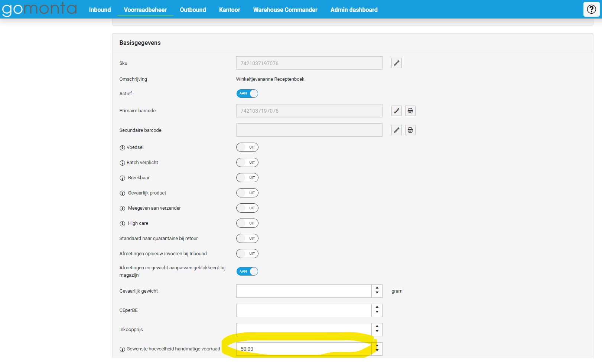
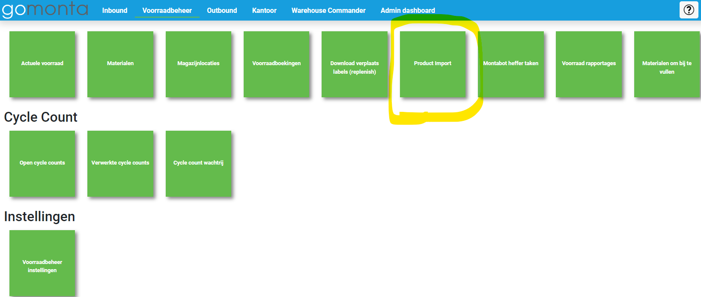
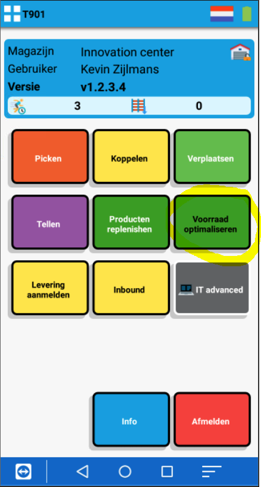
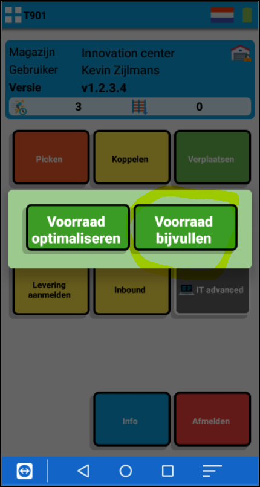
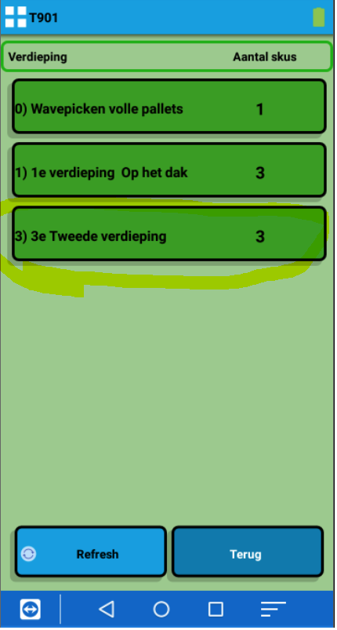

# Bijvullen

Via deze functie is het mogelijk om picklocaties tijdig aan te vullen vanaf bulklocaties via vooraf ingestelde veiligheidsvoorraad. Deze veiligheidsvoorraad werkt per SKU en is in handmatig te stellen in Gomonta. Op het moment dat het voorraadniveau van een betreffend SKU het veiligheidsniveau heeft bereikt, zal er een bijvulopdracht worden aangemaakt in de handscanner.

## De functie 'bijvullen' activeren

De functie is te activeren door middel van de onderstaande stappen:
1. Ga in Gomonta naar voorraadbeheer instellingen;
2. Activeer de functie genaamd: 'Voorraad optimaliseren met handscanners';

## De veiligheidsvoorraden instellen

Via de volgende twee manieren zijn de veiligheidsniveau's in te stellen voor de gewenste SKU's:
1. In Gomonta is er een mogelijkheid om op SKU-niveau een waarde op te geven. Deze waarde kan in het onderstaande invulvakje worden toegevoegd:

2. Als de veiligheidsniveau's liever in bulk worden ingesteld, is dit mogelijk via de product import in het tabblad voorraadbeheer in Gomonta:

## Het bijvullen

Nadat de bovenstaande stappen zijn uitgevoerd, worden de bijvulopdrachten automatisch aangemaakt zodra de voorraadstanden op handmatig bereikbare locaties onder de ingestelde waarde komt.
Deze bijvulopdrachten zijn te vinden in de handscanner onder de groene knop: 'voorraad optimaliseren' en vervolgens onder: 'voorraad bijvullen'.

**Stap 1:**

**Stap 2:**

**Stap 3:**

**Stap 4:**

Dit scherm laat alle producten zien waarbij een 'minimaal gewenste handmatig bereikbare hoeveelheid' is ingesteld.

De producten waarbij te weinig voorraad handmatig bereikbaar is zijn rood omrand en staan bovenaan de lijst.

Bij "doelwit" staat de ingestelde minimaal gewenste handmatig bereikbare hoeveelheid.

-64140aee-3188-46f9-be4b-26977e0a0f5c.png)

**Stap 5:**

Na het kiezen van een product worden de locaties getoond waar het product staat. Hier kan een locatie gekozen worden.

-fa05f68e-a097-4396-a117-633ae2adc6ab.png)

**Stap 6:**

In deze stap is er te zien waar de artikelen gepickt kunnen worden en naar welke locatie de artikelen gebracht mogen worden.

-ebb11118-bfa3-48d6-97a8-b5f2c87d8545.png)

**Stap 7:**

Na het scanne van de locatie waar de artikelen heengebracht mogen worden, wordt onderstaande bevestiging getoond.

-bfd1afad-49df-49c6-b893-0f0977cae903.png)

Zoektags: bijvullen, bijv, bijvu, bijvul, bijvull, bijvulle, bij vullen, repl, reple, replen, repleni, replenis, replenish, replenishen, minimum voorraad, voorra, voorra, voorr, voor, voo,
