# Bouwstenen warehouse inrichting

### Inleiding
​Monta heeft als ambitie om stevig te groeien, maar tegelijkertijd de individuele vestigingen relatief klein te laten zijn, zodat de positieve dingen van een kleiner persoonlijker bedrijf blijven bestaan. Om toch te kunnen doorgroeien, zal dat leiden tot meer vestigingen. De gedachte daarachter staat beschreven in deze ​inleiding.  Klik hier om naar de pagina te gaan over nieuwe vestigingen.

​Monta groeit snel. Steeds sneller onstaan nieuwe vestigingen of breiden vestigingen uit. Om die groei gemakkelijker te maken is bedacht om zoveel mogelijk bouwstenen te ontwikkelen die je kunt gebruiken in je vestiging. Steeds meer standaard bouwblokjes maken dat je snel kunt opschalen als dat nodig is en dat bouwblokjes die al in andere vestigingen ontwikkeld en geprobeerd zijn overgenomen kunnen worden zonder dat je zelf weer het wiel moet uitvinden.

## Intern transport
Voor het interne transport in magazijnen zijn allerlei hulpmiddelen beschikbaar. Degenen die in de afgelopen jaren het meest in gebruik zijn genomen worden hier beschreven.

### ​​​​Afvalvoorzieningen
​Voor het schoon en opgeruimd houden van de magazijnen zijn hulpmiddelen nodig. Een aantal hierbij zijn onderstaand beschreven.

### Krattenkar
Voor In sommige processen is er vrij veel transport van lege blauwe kratjes. Hiervoor zijn op maat gebouwde karren verkrijgbaar waar relatief veel kratjes op passen die stabiel blijven staan. De kar is goed verplaatsbaar tussen verdiepingen met een goederenlift. Voor bestellen kun je contact opnemen met techniek@monta.nl

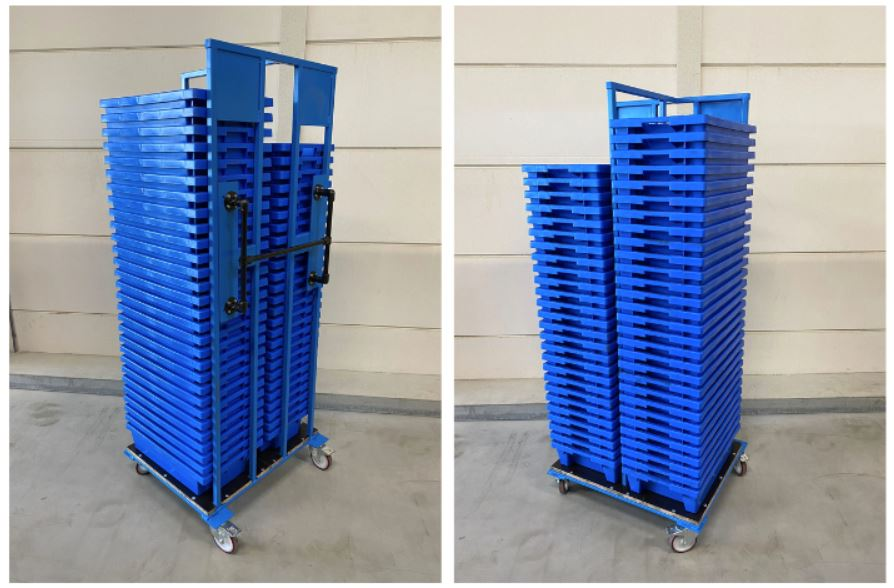

### Bezemrek
Voor het ophangen van bezems en veger&blik zijn standaard borden beschikbaar. Het voordeel van het toepassen van zulke borden is dat de bezems kunnen worden teruggehangen op een vaste plek, zodat medewerkers de bezems gemakkelijk kunnen vinden als ze hun werkplek glad willen houden.

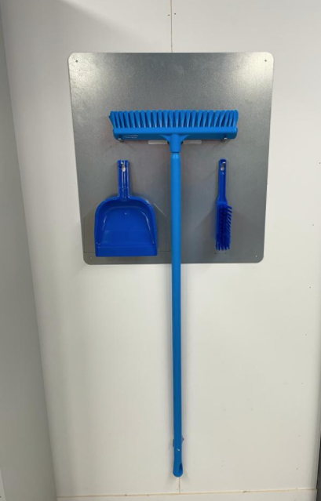

Dit bezemrek is te bestellen bij techniek@montapacking.nl​
Ophangen kan gedaan worden door de Technische Dienst, maar als gekozen wordt dat iemand van de vestiging zelf het bord ophangt, kan bij bestellen gevraagd worden om een setje schroeven en pluggen erbij. ​​​

Er zijn eventueel blauwe bezems en veger&blik te krijgen in de kleur blauw. Het handigs is om die direct bij de webshop te bestellen:

https://www.manutan.nl/nl/mnl/steel-met-schroefverbinding-o-34-mm​  (bezemsteel)
https://www.manutan.nl/nl/mnl/borstel-vikan-voor-intensief-gebruik-vloerborstel-a021245​ (bezem)
​https://www.manutan.nl/nl/mnl/set-schop-en-stoffer-haccp-manutan (veger&blik)

### Heftruck, pompwagen etc
​Heftruck, reachtruck, pompwagens worden door verschillende vestigingen bij verschillende leveranciers gehaald. Het handigst is om hierover met andere vestigingsmanagers te overleggen.

Onderstaand wat namen van leveranciers.
https://www.devriesheftrucks.nl/contact.aspx#main​
https://www.still.nl/ contactpersoon Benjam van der Waal
https://www.petim.nl/​ voor gebruikt

### Pickkarren

#### Herkenbaar maken van een pickkar
Bulkpick karren herkenbaar gemaakt door bijvoorbeeld namen van steden

Tijdens drukke dagen, als er veel orderpickers in het magazijn lopen en soms ook ondervaren mensen ingehuurd worden, komt het soms voor dat mensen tijdens het picken van bulk orders (bijvoorbeeld S-orders of PUTL orders) per ongeluk producten in elkaars karren gooien. Dit kan vooral voorkomen als karren in de brede paden blijven staan en de medewerkers de smalle paden inlopen. In Papland is daarom getest om de karren herkenbaar te maken, zodat je gemakkelijker kunt onthouden "Ik was bezig met de kar ROME of met de kar DONALD DUCK"​. In Papland is gekozen voor stickers met daarop de naam van een stad en een symbool zodat het ook herkenbaar is voor orderpickers die een andere taal spreken. Maar er kan ook worden gedacht aan bijvoorbeeld een vlaggetje met een afbeelding van een dier ofzo op een winkelwagen.

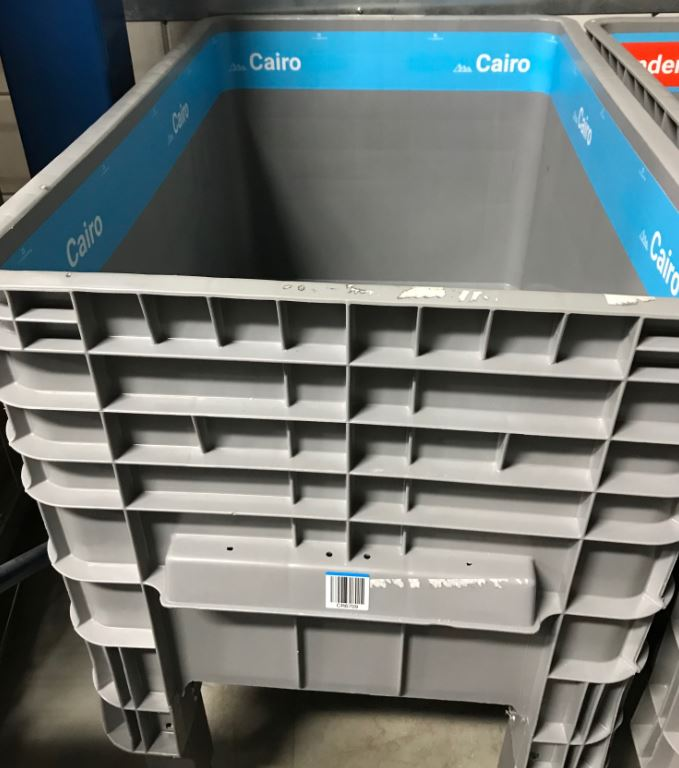

#### Bulkpickkarren verhogen​
In Papland is een expiriment gedaan om de grijze bulkpickkarren van hogere poten te voorzien, zodat mensen die aan het picken zijn minder hoeven te bukken. Dit geldt ook voor mensen bij de echeck en PutToLight.

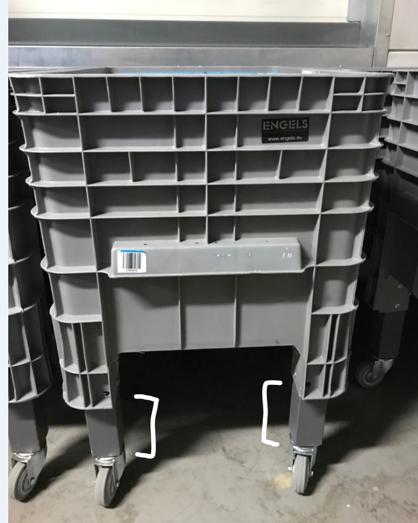

### Goederenheffer
Sinds 2020 kopen we goederenheffers vaak bij Stapro. Het proces om zo'n goederen heffer te bestellen start vaak met inmeten van de vloerhoogtes en kiezen hoe de deuropeningen van de goederenheffer moeten. Tot nu toe deed Marien den Besten (marien@montapacking.nl) dat vaak. De verwachting is dat dit door de Technische Dienst wordt gedaan in de toekomst. Bij het inmeten wordt ook gekeken of de goederenheffer goed geplaatst kan worden, omdat de goederenheffer vaak in 1 stuk binnenkomt en dus de route naar de plek waar de goederenheffer komt te staan geschikt moet zijn.
Na het meten wordt een offerte aangevraagd. Na akkoord op de offerte gaat de levertijd die vaak een maand of 4 is lopen. Akkoord op offerte wordt gegeven door de vestigingsmanager.
Vervolgens wordt een leverdatum doorgegeven. Het plaatsen wordt door de leverancier Stapro gedaan en tot nu toe was Marien daar ook altijd bij om te helpen met manouvreren met heftruck/reachtruck. ​

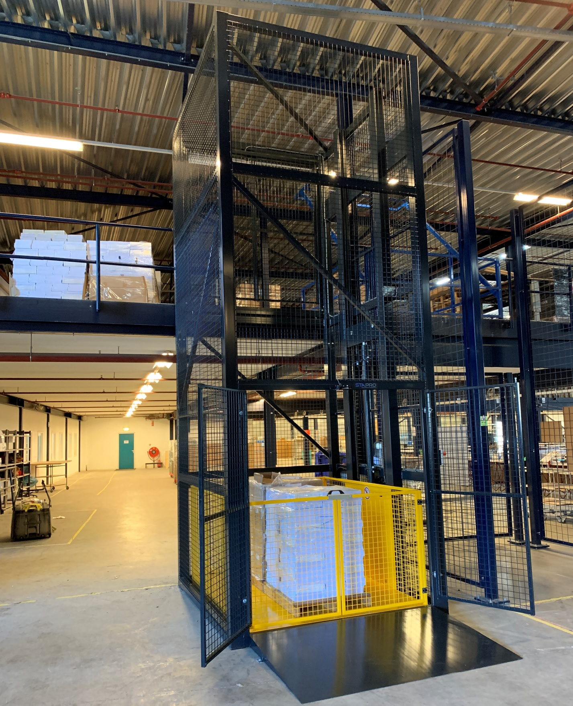

De goederenheffer staat gewoon bovenop een bestaande betonnen magazijnvloer, maar ook op een asfaltvloer is al eens een goederenheffer geplaatst. Hierdoor is het niet nodig voorz​ieningen in de vloer te maken. Wel geeft dit een oprijhoogte op de begane grond van tussen de 7 en 10 cm. ​​De goederenheffer heeft een 380/400V 16A -5 polig​e stroomaansluiting nodig als voorbereiding.

## Werkplek in het warehouse
Voor werkplekken in het warehouse zijn veel verschillende oplossingen beschikbaar. Degenen die in de afgelopen jaren het meest in gebruik zijn genomen worden hier beschreven.

### Echecktafel
​De oranje houten echecktafels met hoogteverstelling worden gemaakt door de 'huistimmerman' van Monta.
Bestellen kan door een mailtje te sturen naar Martin Wessels (TimmerbedrijfMW@hotmail.com / 06-54907398)​
De meestgebruikte tafel heeft een afmeting van 90 bij 180 cm
Levertijd is meestal ca 3 weken
Martin komt de tafels op locatie brengen in delen. De delen kunnen dan met enkele schroeven aan elkaar gezet worden op de plek waar de echecktafel moet komen te staan.

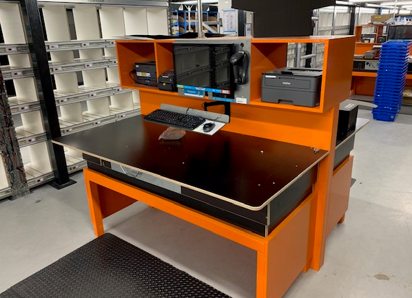

Voorbereidingen voor een echecktafel bestaan uit het beschikbaar maken van een stroomaansluiting en een netwerk aansluiting.

Bij een echecktafel zijn verschillende uitbreidingen te verkrijgen.

#### Echeck-organizer doosjes
Een opzetstuk zodat verpakkingsmateriaal boven op de echecktafel geplaatst kan worden.

(Bestellen kan door een mailtje te sturen naar Martin Wessels (TimmerbedrijfMW@hotmail.com / 06-54907398)​

Een voorbeeld van deze opzetstukken is te zien in papland.

#### Echeck-organizer zakken
Een uitbreiding op de echecktafel is een lade voor het gemakkelijker kunnen pakken van verzendzakken, maar ook een lade voor flyers als echecktoevoegproduct is denkbaar.
Bestellen kan door een mailtje te sturen naar Martin Wessels (TimmerbedrijfMW@hotmail.com / 06-54907398)
Een voorbeeld van deze echeck organizer zakken is te zien in Papland.

#### Echeck-organizer plakband
Een andere uitbreiding is een bordje waar zaken als plakbandautomaten, verzendlabels en mesjes een vaste plek hebben
bestellen kan via techniek@montapacking.nl​​​​

#### Kassa Scanner
Een nieuwe mogelijkheid om de echecktafel te versterken is de kassa scanner. Deze scanner, te zien op onderstaande afbeelding, lijkt op een variant die in supermarkten gebruikt wordt bij kassa's. De eerste scanner is enige tijd geleden geïnstalleerd in de vestiging op Papland.

**Wat zijn de voordelen van deze scanner?**
Beide handen blijven vrij tijdens het inpakken;
De scanner reageert sneller dan de gebruikelijke scanners;
Deze scanner beschikt over een grotere invalshoek voor het lezen van barcodes;
Tijdens het scannen is het makkelijk om te focussen op de interactie op de monitor.

**Wanneer komt de scanner het best tot zijn recht?**
De meeste orders bevatten minimaal drie orderlijnen;
Een hoge bezettingsgraad aan de betreffende echeck tafel;
De meeste orders bevatten relatief kleine artikelen.

Bestellen of verdere informatie opvragen kan via techniek@montapacking.nl​​​​

### ​Inbound tafel
De gelehouten inboundtafels met hoogteverstelling worden gemaakt door de 'huistimmerman' van Monta.
Bestellen kan door een mailtje te sturen naar Martin Wessels (TimmerbedrijfMW@hotmail.com / 06-54907398)​
De meestgebruikte tafel heeft een afmeting van 90 bij 180 cm
Levertijd is meestal ca 3 weken
Martin komt de tafels op locatie brengen in delen. De delen kunnen dan met enkele schroeven aan elkaar gezet worden op de plek waar de echecktafel moet komen te staan.
Op onderstaande foto zijn scanner/printer en labelprinter nod niet geplataats, maar daar is wel ruimte voor.

Voorbereidingen voor een inboundtafel bestaan uit het beschikbaar maken van een stroomaansluiting en een netwerk aansluiting.

#### Inboundmal
Bij mode klanten met wisselende assortimenten en bij nieuwe klanten met veel SKU's, is het tijdrovend om bij inbound de producten op te meten. Daarnaast is het bij kleding soms verwarrend of je het in opgevouwen toestand meten moet, of uitgevouwen.
Hiervoor is een hulp mal beschikbaar, waarmee je kunt passen of een kledingstuk in opgevouwen toestand door de brievenbus kan. Vervolgens kun je door de barcode op de mal te scannen in 1 keer de afmetingen overnemen in het inbound scherm.

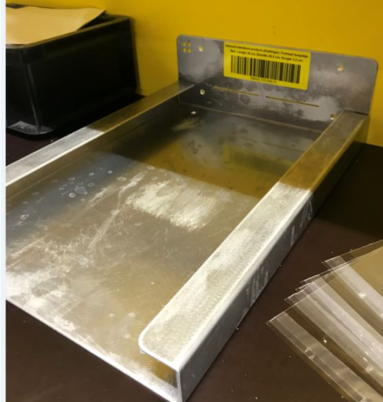

### Elektrisch laden station
Het elektrisch laden station is een standaard stelling met brandwerende platen van 2 x 2 x 0,6 meter.
In het station kunnen de opladers van elektrische transportmiddelen zoals heftruck en elektrische pompwagen veilig worden geplaatst.

Bestellen of verdere informatie opvragen kan via techniek@montapacking.nl​​​​

## Picken en consolideren
​Voor picken en consolideren zijn een aantal bouwstenen beschikbaar. Echeckwall en PutToLight zijn erop gericht zoveel mogelijk in bulk te picken en later orders samen te stellen en deze bouwstenen zijn geschikt voor een vrij diverse groep van relatief kleine producten. PickToLight is vooral geschikt voor klanten met een smal assortiment met kleine producten en veel orders.

### ​Echeckwall
​Een Echeckwall is als module beschikbaar die compleet aangeleverd wordt.
Bestellen kan bij R&D, via Kevin Zijlmans (kzijlmans@montapacking.nl​​)
Er zijn een aantal Echeckwalls met een standaard indeling uit voorraad leverbaar.
Vaak worden modules van echeckwalls aan elkaar gekoppeld, maar ze zijn ook los inzetbaar.
De vakjes van de echeckwall kunnen gekozen worden, dus heb je een hele specifieke product afmeting, kan daarvoor een speciale echeckwall samengesteld worden. Maar voor de meeste producten voldoet de standaard indeling.
Gewenste indeling van een echeckwall kan ook met Kevin doorgenomen worden.

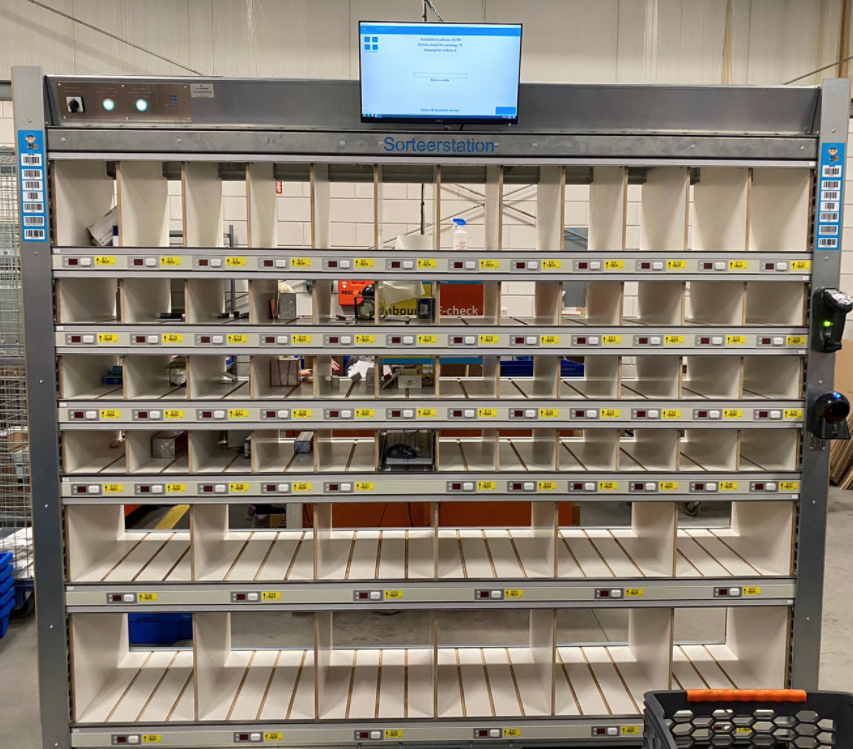

Voorbereidingen voor een echeckwall bestaan uit het beschikbaar maken van een stroomaansluiting en een netwerk aansluiting.

## IT systems
​Voor veel onderdelen van het logistieke proces zijn IT systemen nodig. Onderstaand een beginnetje welke systemen dat zijn en waar je ze kunt bestellen.

### ​Montatron
​Voor zowel de echecktafels als de inbound tafels is een standaard concept beschikbaar, de montatron. Dit is eenvoudigweg een computer, scherm, toetsenbord en barcode scanner.
Deze montatrons kunnnen besteld worden via servicedesk@montapacking.nl. Wanneer je dan aangeeft of het om een echeckstation of een inboundstation gaat, kunnen gelijk de juiste printers meegeleverd worden.​

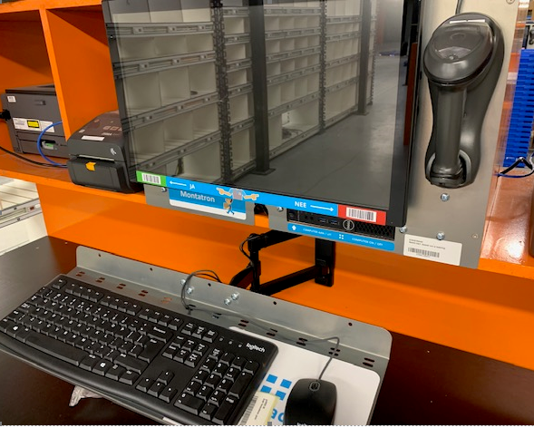

Voorbereidingen voor een montatron bestaan uit het beschikbaar maken van een stroomaansluiting en een netwerk aansluiting​.

### Laadkast scanners
Voor het opladen van de pistoolscanners is een standaard scannerkast en beheersysteem beschikbaar.
De scannerkast kan besteld worden via techniek@montapacking.nl​​​​
Via servicedesk@montapacking.nl kan gevraagd worden met hulp om de scannerkast werkend te krijgen op locatie.

Voorbereidingen die nodig zijn voor een scannerkast is 1 werkende netwerk kabel en 1 stopcontact van 230 VAC.

### Urenkloksysteem
Voor het registreren van uren van medewerkers die in een vestiging werken, zijn urenkloksystemen beschikbaar. Deze werken met dezelfde rfid badges die medewerkers ook gebruiken om in te loggen in de pistoolscanners en bijvoorbeeld de echeckapp.
Een urenkloksysteem is te bestellen via techniek@montapacking.nl​​​​

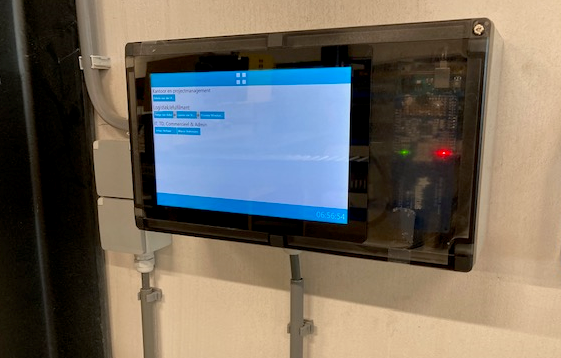

Voorbereidingen die nodig zijn voor een urenkloksysteem is 1 werkende netwerk kabel en 1 stopcontact van 230 VAC.

### Magazijnborden legbordstellingen
We hebben de mogelijkheid om goed geprijsde bordjes te kopen om een eenvoudige manier.
Uiteraard zijn magazijnborden een eenvoudige manier om meer structuur in het magazijn aan te brengen.

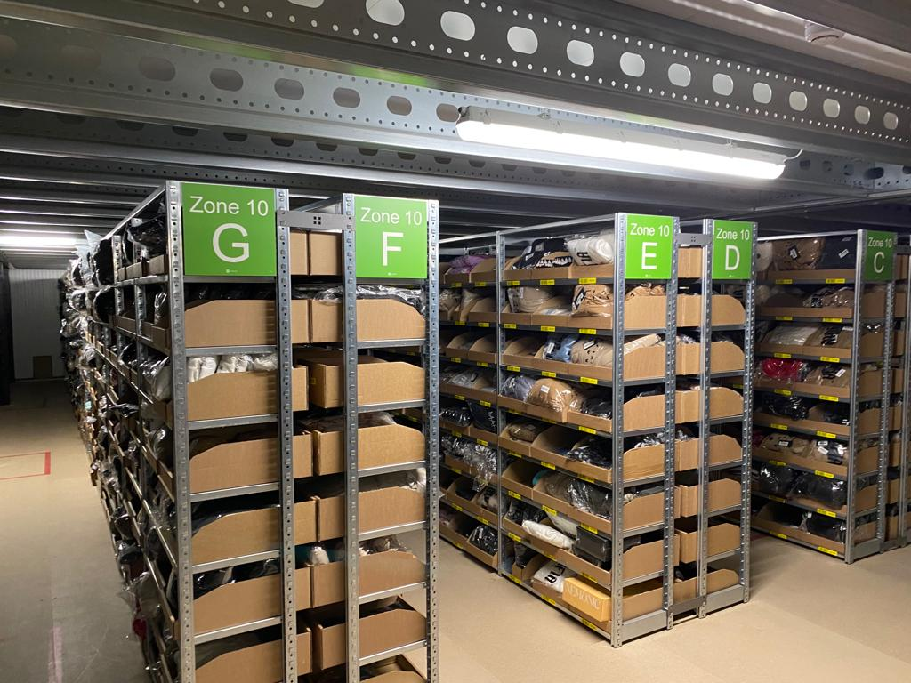

De borden inclusief bevestigingsmateriaal kosten afhankelijk van de oplage ongeveer €9,50.
Na bestelling worden de borden momenteel binnen drie weken geleverd.

De borden zijn in onderstaande vier kleuren te bestellen. Deze kleuren zijn ook instelbaar, zodat de interface in de handscanner overeen komt met de kleur van de borden:

De magazijnborden zijn te bestellen door een mail te sturen aan techniek@monta.nl om zo de bestellijst aan te vragen.

#### Strips met magazijnlocaties voor bakjeskasten

Het is via PB-services mogelijk om de locatiesnummers direct op strips te laten drukken. Deze strips kunnen direct in de bakjeskasten geschoven kunnen worden. Dit scheelt in de kostprijs en tevens in de benodigde arbeid. Verder zullen deze strips minder snel slijten dan de losse labels.

In de onderstaande afbeelding is op de linkerhelft de manier weergegeven met losse labels en op de rechter helft de manier met de voorgedrukte strips. ​​

-bc6fd2b0-6a98-4d7c-8915-7b3b9ed087f5.png)-8f9e4905-ded6-4712-9242-b8314d96a9fe.png)-395164f0-4842-4cbb-bb41-dfe6575f7fa4.png)
