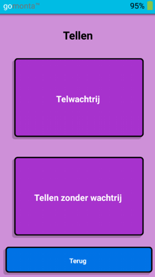
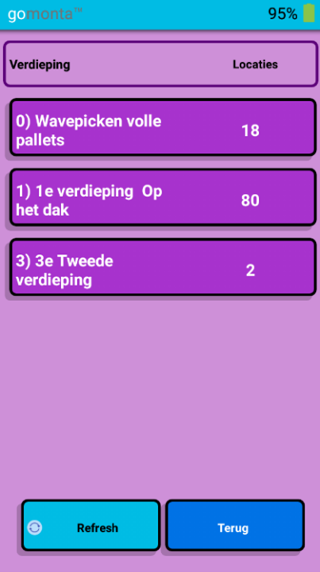
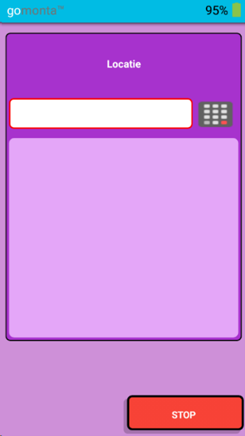
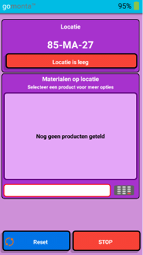
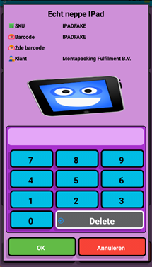
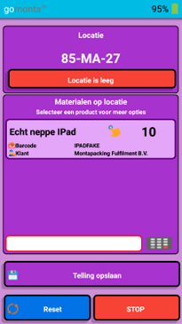
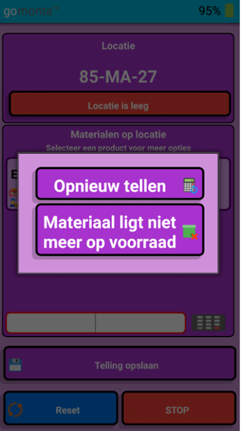
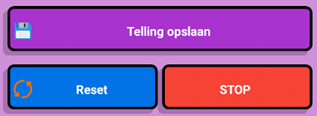

# Cycle counten

Zie ook: [Algemene informatie - Voorraadbeheer - Cycle count](../../../Algemene-informatie/Voorraadbeheer#cycle-count).

Als de gebruiker wil gaan tellen, krijgt hij/zij 2 keuzes:

- Telwachtrij – dit betekent dat er specifieke locaties geteld worden
- Tellen zonder wachtrij – de gebruiker kan elke willekeurige locatie gaan tellen

## Telwachtrij

Net als bij het picken kan er een keuze gemaakt worden op welke verdieping er geteld gaat worden. Als extra moet de gebruiker ook aangeven in welk gangpad hij/zij gaat tellen. Na het maken van deze keuze worden alle locaties uit dit gangpad toegewezen aan de gebruiker.

Deze locaties moet de gebruiker allemaal gaan tellen, maar er is ook een keuze om te stoppen met tellen. Dan worden de toegewezen locaties weer vrijgegeven.

## Tellen zonder wachtrij

Als er wordt gekozen om te tellen zonder wachtrij, krijgt de gebruiker het volgende scherm te zien. Hier kan een locatie gescand of ingetypt worden.

## Locatie tellen

De informatie van de locatie wordt opgehaald en getoond.

- Mocht de locatie leeg blijken te zijn, kan er direct op de rode knop “Locatie is leeg” geklikt worden. Er zal om een bevestiging gevraagd worden. Daarna wordt dit direct ingevoerd.
- Als er wel producten op de locatie liggen, kan er een product gescand of ingetypt worden. Het systeem gaat dan de informatie van dit product ophalen en laat vervolgens een schermpje zien waar het aantal ingevoerd kan worden. Met het blauwe toetsenbord kan het aantal producten dat op locatie ligt ingevoerd worden. Vervolgens moet er op de knop “OK” geklikt worden, zodat het aantal wordt onthouden.

Het getelde product wordt toegevoegd aan de lijst met ‘Materialen op locatie’. Rechtsboven staat het aantal dat door de gebruiker is geteld.

Mocht de gebruiker een fout gemaakt hebben tijdens het tellen, kan dit gecorrigeerd worden. Dit kan op 2 manieren:
- Het product nogmaals scannen.
- Op de regel met het product klikken.
Hierna worden er twee opties getoond: opnieuw tellen of materiaal ligt niet meer op voorraad. Met de tweede optie wordt het product weer uit de lijst met ‘Materialen op locatie’ gehaald.

### Opties om een telling af te ronden

- Telling opslaan – de telling wordt vergeleken met de administratieve voorraadstand op locatie. Als deze overeenkomen wordt de telling opgeslagen, anders wordt er aangegeven dat de locatie nogmaals geteld moet worden.
- Reset – alle getelde producten op deze locatie worden weer weggehaald, zodat de gebruiker opnieuw kan beginnen.
- Stop – de telling wordt afgebroken. Er wordt niets opgeslagen.

