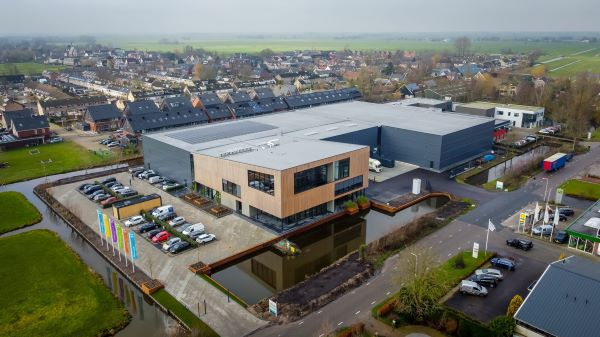
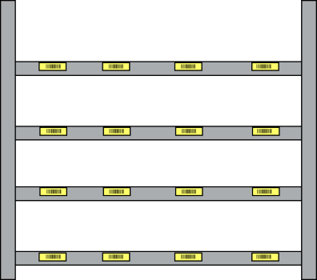

# Magazijn indeling

Op deze pagina wordt uitleg gegeven over de verschillende termen die je tegen kan komen binnen een magazijn.

## magazijn

## verdieping

## Zone

## Stelling

## Nivo

## vak

## locatie sticker

 

