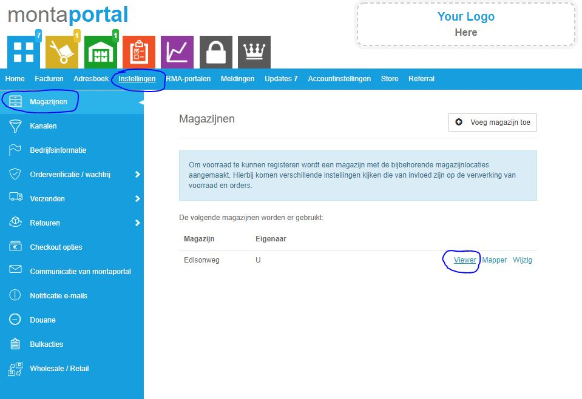
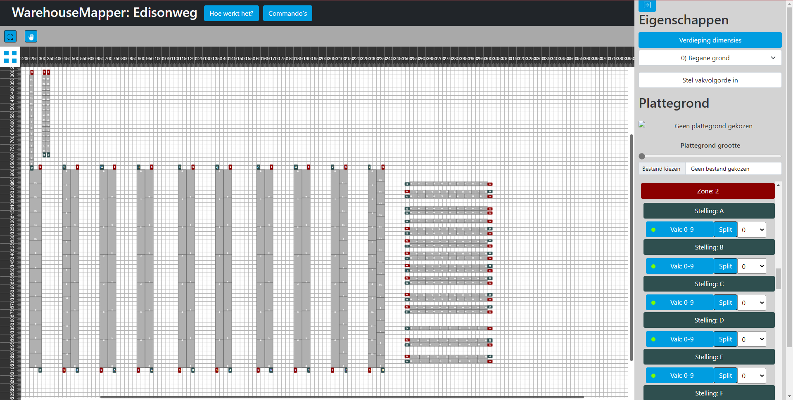
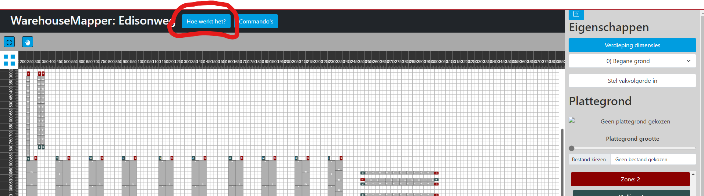

# Warehouseviewer & warehousemapper

De warehouseviewer en warehousemapper zijn twee tools die helpen bij het optimaliseren van het warehousehouse.
De warehousemapper wordt gebruikt om het magazijn inclusief stellingen en werkplekken in te tekenen. Vervolgens kunnen er verschillende analyses gedaan worden in de warehouseviewer.

De warehousemapper is te gebruiken voor onder andere:
- Het gemakkelijk deactiveren van vakken en stellingen;
- Het configureren van de looproutes.

De warehouseviewer heeft in ieder geval de volgende functionaliteiten:
- Het tonen van live activiteiten in het warehouse;
- Het tonen van de pickroutes in het warehouse;
- Het tonen van de vullingsgraad in het warehouse;
- Het tonen van een heatmap van het warehouse.

## De WarehouseViewer

De warehouseviewer wordt gebruikt om inzicht te krijgen in de magazijnprocessen. De warehouse viewer kan gezien worden als een bovenaanzicht van het magazijn, waarin verschillende processen inzichtelijk gemaakt worden. Om te starten met het gebruik van de warehouse viewer, is het nodig eerst een 'mapping' te maken van het magazijn via de warehouse mapper. Dit is eigenlijk het plaatsen van de stellingen en objecten op hun positie in de plattegrond van het magazijn. Wanneer de map gereed is, kan de warehouse viewer gebruikt worden.

#### Hoe kom ik bij de warehouse viewer

<iframe src="https://www.loom.com/embed/aa76fcc6820e4470ade23f1c4e2edf90" frameborder="0" webkitallowfullscreen mozallowfullscreen allowfullscreen style="position: absolute; top: 0; left: 0; width: 100%; height: 100%;"></iframe>

In de Montaportal is de warehouse viewer te vinden. Sommige klanten in montaportal zijn eigenaar van een magazijn en in dat geval kun je de warehouse viewer vinden. Alle Monta fulfilment vestigingen zijn bijvoorbeeld zo'n magazijn eigenaar, daarnaast zou dit ook gelden voor de WMS-klanten.

### Wat kan je met de WarehouseViewer?

<iframe src="https://www.loom.com/embed/47f389e1a2bd4b09ba868748661ea5df" frameborder="0" webkitallowfullscreen mozallowfullscreen allowfullscreen style="position: absolute; top: 0; left: 0; width: 100%; height: 100%;"></iframe>

#### Voorraad inzichten

<iframe src="https://www.loom.com/embed/4b63b32980c24c01b49dba2bacd4dae9" frameborder="0" webkitallowfullscreen mozallowfullscreen allowfullscreen style="position: absolute; top: 0; left: 0; width: 100%; height: 100%;"></iframe>

#### Pickroutes

<iframe src="https://www.loom.com/embed/8232e784d2d747a8ab2a1f0f1544ed08" frameborder="0" webkitallowfullscreen mozallowfullscreen allowfullscreen style="position: absolute; top: 0; left: 0; width: 100%; height: 100%;"></iframe>

#### Pick heatmap

<iframe src="https://www.loom.com/embed/a242c16454db4d3a8a807bfeabe9d3a2" frameborder="0" webkitallowfullscreen mozallowfullscreen allowfullscreen style="position: absolute; top: 0; left: 0; width: 100%; height: 100%;"></iframe>

#### Vullingsgraad

<iframe src="https://www.loom.com/embed/74dfa123ddbc4aadb9b432413893b3a3" frameborder="0" webkitallowfullscreen mozallowfullscreen allowfullscreen style="position: absolute; top: 0; left: 0; width: 100%; height: 100%;"></iframe>

#### Looproutes

<iframe src="https://www.loom.com/embed/dffd4a91fa8e4128b296d10bf4a532f0" frameborder="0" webkitallowfullscreen mozallowfullscreen allowfullscreen style="position: absolute; top: 0; left: 0; width: 100%; height: 100%;"></iframe>

### Wat kan je met de WarehouseMapper?
Het doel van de Mapper is het de gebruiker makkelijk maken om een opstelling van een magazijn in te kunnen stellen. De Mapper maakt het mogelijk om een verdieping te kiezen en vervolgens stellingen doormiddel van sleepacties te kunnen verplaatsen, vergroten en draaien. Hierdoor wordt het 'mapping' proces sneller, makkelijker en inzichtelijker. Verder kan je ook met de Mapper de vakvolgorde instellen. Hier onder is als voorbeeld Edisonweg te zien in de WarehouseMapper.

### Hoe werkt de WarehouseMapper?
Wat je het beste kan om te begrijpen hoe de Mapper werkt, is om de Mapper te openen en de 'Hoe werkt het?' knop boven in de navigatiebalk te drukken. Hiermee zal een 'tour' door de applicatie starten. Bij sommige punten moet je de opgelichte knop indrukken om verder te gaan met de tour, dit zal de tour zelf ook aangeven.
Hier onder zie je de locatie van deze 'Hoe werkt het?' knop

### Belangrijke informatie om te weten
Deze applicatie is nog in ontwikkeling. Een bug kan voorkomen. Verder is het belangrijk om te weten dat er geen Cross-client synchronization is ingebouwd, dit betekend dat aanpassingen in de Mapper die je hebt geopend niet direct zichtbaar zijn in een andere instantie van de Mapper, hierdoor is het niet verstandig om met meerdere instanties van de applicatie op de zelfde magazijn te werken! Zorg er dus voor dat als je werkt aan een mapping, jij de enige bent die werkt aan deze magazijn.
