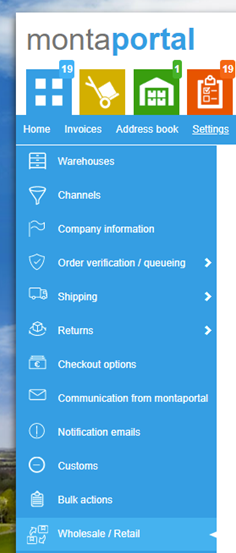
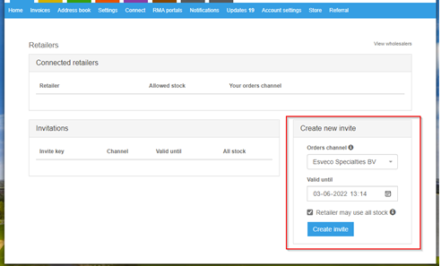
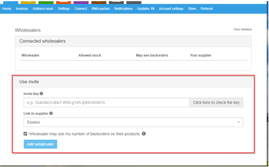

# Wholesale

De wholesale koppeling is een koppeling tussen 2 relaties binnen Monta. Hierdoor wordt het mogelijk voor een Retailer om de voorraad van de Wholesaler te verkopen. Zodra er een order binnenkomt zal de voorraad worden omgezet naar de retailer. Eenmaal per week krijgt de wholesaler een order in de Montaportal met wat de Retailer heeft verkocht.

De productassortimenten van de twee klanten moeten ook aan elkaar gekoppeld worden.

Er kan gekozen worden of een retailer alle voorraad van de wholesaler mag gebruiken, of alleen de voorraad die de wholesaler beschikbaar heeft gemaakt voor de retailer door een voorraadallocatie te maken. Zie [Outbound - voorraadallocatie](../../../Algemene-informatie/Outbound#Voorraadallocatie).

## Relaties koppelen

Het maken van een wholesale koppeling is middels de volgende stappen te doen:

1.	De Wholesaler maakt in de Montaportal een uitnodiging
2.	De wholesaler stuurt de uitnodiging naar de retailer
3.	De retailer maakt op basis van de key de koppeling aan

 

In de Montaportal onder settings is een pagina toegevoegd:

De Wholesaler gaat naar “My retailers” om daar vervolgens een uitnodiging aan te maken:

Na het maken van de uitnodiging wordt er een Invite Key aangemaakt, deze kan de Wholesaler vervolgens doorsturen naar de retailer.
De retailer kan vervolgens in zijn/haar Montaportal de ontvangen Invite key invullen op de “My Wholesalers” pagina:

## Producten linken

Dit kan gedaan worden door de retailer in de Montaportal met de knop "Match wholesale" op de supplier details pagina.

Als de wholesaler een stock allocatie maakt voor de retailer worden de producten ook automatisch gelinkt. Als dit niet lukt wordt een melding gegeven bij de stock allocation en op de Montaportal homepage bij de retailer.

### Inactieve producten

Een wholesale link tussen producten wordt inactief als één van de producten inactief gemaakt wordt. Er kan dan een nieuwe match gemaakt worden.

## Voorraad delen

Van de gelinkte producten wordt de voorraad van de wholesaler zichtbaar bij de retailer. Hoeveel voorraad er zichtbaar wordt hangt af van de gekozen instelling bij het koppelen van de relaties.

De voorraad beschikbaar van de wholesaler wordt ook doorgegeven als beschikbare voorraad naar de webshops via de voorraadkoppeling. Zie [Koppelingen - Dataflows - Stock update](../../../Algemene-informatie/Koppelingen/1.-Koppelingen-dataflow#stock-update).

## Voorraad gebruiken

Voorraad wordt omgeboekt van de wholesaler naar de retailer als een order wordt geplaatst met producten die niet op voorraad zijn bij de retailer maar wel bij de wholesaler.

Dit wordt alleen gedaan als de order uit backorder kan komen. Als de order niet uit backorder kan komen omdat een ander product niet op voorraad is, wordt er **geen** voorraad gereserveerd bij de wholesaler. Dit is bewust, omdat je niet wil dat de retailer voorraad in beslag neemt van de wholesaler terwijl dit nog niet eigendom is geworden van de retailer. Het wholesale systeem is namelijk bedoeld voor consignatie.

Bij de retailer wordt een Inbound geregisteerd (per week), zodat terug te vinden is hoeveel er is overgeboekt per wholesaler.

Bij de wholesaler wordt een order gemaakt (per week per retailer), zodat de wholesaler kan terugvinden hoeveel er is omgeboekt naar de retailer.
