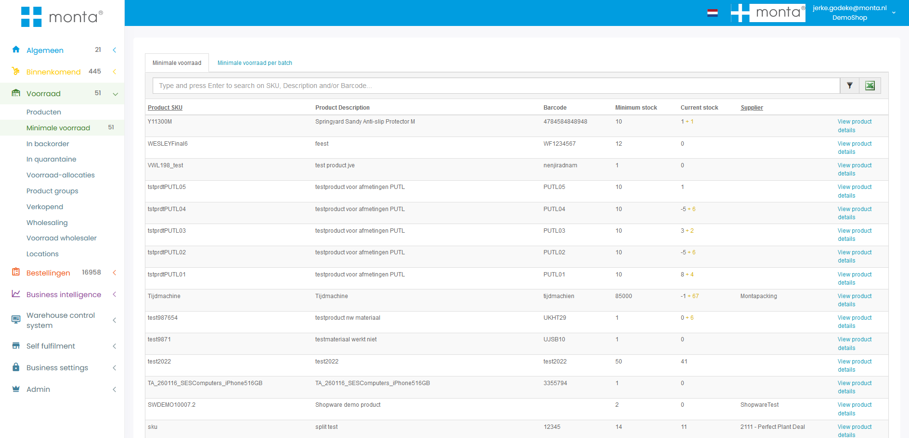

# Voorraadbeheer

Voorraadbeheer is de opslag van producten in het magazijn.

## Soorten voorraad

De volgende termen worden gebruikt voor de verschillende soorten voorraad.

<u>Financiële voorraad / in magazijn</u> 
Alle niet-quarantaine voorraad van een klant die in ons pand aanwezig is. Dit is dus 'Alle voorraad' inclusief de voorraad afgeboekt voor orders die nog niet zijn verzonden.

<u>Alle voorraad</u> 
Administratieve voorraad op alle niet-quarantaine locaties.

<u>Administratieve voorraad</u> 
Voorraad beschikbaar op een magazijnlocatie. Omdat voorraad voor orders al wordt afgeboekt als de order klaarstaat om te picken, komt deze voorraad niet overeen met het aantal daadwerkelijk op de locatie. Zie fysieke voorraad.

<u>Geblokkeerde voorraad</u> 
Voorraad op geblokkeerde magazijnlocaties.

<u>Transit voorraad</u> 
Voorraad tijdelijk niet beschikbaar omdat het wordt verplaatst in het magazijn. Ook voor voorraad die is [geinbound](../../Algemene-informatie/Inbound#inbounden) maar nog niet op een magazijnlocatie is [gekoppeld](../../Algemene-informatie/Inbound#koppelen).

<u>Quarantaine voorraad</u> 
Voorraad op quarantaine locaties. Zie [quarantaine voorraad](#quarantaine-voorraad).

<u>Fysieke voorraad</u> 
Het aantal daadwerkelijk op de locatie. De administratieve voorraad kan anders zijn omdat voorraad voor orders al wordt afgeboekt als de order klaarstaat om te picken. De fysieke voorraad wordt berekend door te kijken of een pickactie al is afgehandeld met de scanner. Papieren pickbonnen wordt niet gepickt met de scanner. Dus als een papieren pickbon geprint is, kan niet berekend wordt wat de exacte fysieke voorraad is zo lang de order niet verzonden is.

<u>Gereserveerde voorraad</u> 
Voorraad gereserveerd dmv voorraadreserveringen. Voor backorders en etransit orders. Zie [voorraadreserveringen](../../Algemene-informatie/Outbound#voorraadreserveringen).

<u>Beschikbare voorraad</u> 
Voorraad beschikbaar voor orders. Alle voorraad minus geblokkeerde minus transit minus gereserveerde voorraad.

<u>Webshop voorraad</u> 
Voorraad beschikbaar voor de webshop om te verkopen. Dit is de beschikbare voorraad. Daarbij kan de klant  ervoor kiezen voorraad uit de inbound forecasts alvast te verkopen. Dit kan per inbound forecast ingeschakeld worden. Ook wordt hier de voorraad uit split products verwerkt: de voorraad van een hoofdproduct wordt gebaseerd op de onderliggende producten. Tenslotte kunnen nog instellingen van de specifieke voorraadkoppeling van toepassing zijn. Zie [1. Koppelingen dataflow](../../Algemene-informatie/Koppelingen/1.-Koppelingen-dataflow#stock-update).

## Magazijnlocaties

De locaties in het magazijn worden gemaakt in de magazijnlocatie tool in Montaportal. Zie [Magazijnlocatie tool](../../Algemene-informatie/Voorraadbeheer/Magazijnlocatie-tool).

Op een locatie mag standaard één product of batch liggen. Meerdere producten of batches moet expliciet toegestaan worden, zie [multiproductlocaties](#multiproductlocaties).

### Multiproductlocaties

Het is mogelijk om meerdere producten of batches op een locatie te leggen. Dit moet ingeschakeld worden bij de klant van het product en bij de zone van de locatie. Ook kan per magazijn een maximaal aantal SKU's en items ingesteld worden.

Meerdere producten mogen ook op één locatie liggen als ze via het wholesale-systeem aan elkaar gekoppeld zijn. Het zijn dan namelijk fysiek dezelfde producten.

### Highcare

Dure producten kunnen in een aparte zone opgeslagen worden die beter beveiligd is. Door locaties in deze zone als highcare te markeren, worden orders van de producten op de locaties apart gehouden bij het picken via de scanner.

Een product kan ook als high care gemarkeerd worden. Zo'n product mag dan alleen op een highcare of niet-handmatig bereikbare locatie gekoppeld worden. Als een highcare product wordt ge-inbound wordt een melding getoond dat het product in de high care ruimte gekoppeld moet worden.

### Looproute

De locaties in een magazijn worden ingedeeld op een loopvolgorde. Dit bepaald in welke volgorde de orderpicker langs de verschillende locaties gestuurd wordt bij het [picken met de scanner](../../Algemene-informatie/Outbound#picken-met-de-scanner).

### Echeck locaties

Voor voorraad die bij de echeck gelegd wordt tbv [Echeck toevoegproducten](../../Algemene-informatie/Outbound#echeck-toevoegproducten).

## Verplaatsen

Met de scanner kan voorraad in het magazijn verplaatst worden van de ene naar de andere locatie.

Dit is niet mogelijk als er te picken orders op de locatie staan. Anders zou het kunnen gebeuren dat een orderpicker naar een locatie wordt gestuurd terwijl de voorraad net wordt versjouwd naar een andere locatie. Voorraad verplaatsen van een locatie met open orders is wél mogelijk met een MOVE label. De orders worden dan vastgehouden bij dat MOVE label tot de verplaatsing gereed is. Dan kunnen de orders gepickt worden van de nieuwe locatie.

Het MOVE label is bedoeld om de voorraad tijdelijk vast te houden. Als we dit niet zouden doen is de kans op foutmeldingen bij het verplaatsen hoger, omdat de voorraad inmiddels veranderd kan zijn. Zou de gebruiker deze foutmelding negeren en fysiek toch de verplaatsing doen, dan is er een voorraadverschil in het magazijn.

Zie ook [klant verhuizen](#klant-verhuizen).

## Replenishen

Dit werkt via Niet handmatig bereikbaar, zie hieronder.

## Niet handmatig bereikbaar

Locaties kunnen als niet handmatig bereikbaar worden gemarkeerd. Orders worden eerst gepickt van handmatig bereikbare locaties. Zie [outbound - locatie keuze](../../Algemene-informatie/Outbound#locatie-keuze) voor meer informatie over de locatie keuze.

Orders van niet handmatige locatie komen als aparte pickstroom in de scanner of er moet eerst geplenisht worden. Zie [Outbound - picken van niet handmatige locaties](../../Algemene-informatie/Outbound#picken-van-niet-handmatige-locaties).

Replenishen gaat altijd met hele pallets. Dus de hele locatie moet naar beneden geplaatst worden. Er kan ook een drempelwaarde ingesteld worden vanaf wanneer die het aantal laat zien. NOG TESTEN HOE DIT PRECIES ZIT.

In het replenishen in de scanner zijn de B2B order gescheiden van de gewone orders. Dmv de knop B2B kan gekozen worden om te replenishen voor B2B orders. Ook wordt in de replenish opdrachten op de scanner onderscheid gemaakt in vandaag, morgen, later.

Het kan gebeuren dat orders na het replenishen in backorder komen. Als een voorraadreservering is gemaakt nadat de orders aan de bulklocatie zijn toegewezen en voor het replenishen. Na het replenishen worden de orders opnieuw geverifieerd waardoor de voorraadreservering van toepassing wordt. Terwijl die dat eerst niet was omdat de orders al klaargezet waren om te picken.

Proactief replenishen is ook mogelijk, zie [Bijvullen](../../Algemene-informatie/Voorraadbeheer/Bijvullen).

## Cycle count

Met de scanner kan een locatie geteld worden om te controleren of de administratieve voorraad klopt met de fysieke voorraad. Zie [Cycle counten](../../Algemene-informatie/Voorraadbeheer/Cycle-counten).

Als een order gepickt wordt met een papieren pickbon is het niet mogelijk om een locatie te tellen. Het systeem kan dan namelijk niet berekenen wat de fysieke voorraad op de locatie is. Bij alle andere orders kan het systeem dit wel berekenen: orders die "queued" zijn worden nog niet gepickt, dus het systeem weet dat die voorraad er nog ligt. En bij orders die picking zijn met de scanner weet het systeem ook of het er nog ligt, omdat de locatie gescand wordt bij het picken. Alleen bij picken met een papieren bon kan het systeem het niet weten, dus dan is het niet mogelijk om de locatie te tellen.

### Cycle count wachtrij

Het is mogelijk om een wachtrij te maken van locaties die geteld moet worden.
De locaties die moeten worden geteld kunnen worden gevuld via Excel in Gomonta door een bestand te uploaden met alle locatie codes. (Voorraadbeheer > Cyclecount wachtrij)
Letop: Als je telt met een wachtrij kan een zone maar door 1 persoon tegelijkertijd worden geteld.

Locaties kunnen ook automatisch toegevoegd worden aan de wachtrij als een locatie administratief leeg zou moeten zijn maar er liggen nog producten op de locatie.
Dit kan gedaan worden door middel van een controle na het picken van een product.
Deze controle kan worden aangezet in [GoMonta > OutBound > Magazijn outbound instellingen > Algemeen pickproces > “Tijdens het picken de vraag stellen: Is de locatie nu helemaal leeg?”](https://gomonta.monta.nl/WMS/Shift/WarehouseSettings).
Door deze instelling aan te zetten krijg je de vraag ‘Is de locatie nu helemaal leeg” als een locatie leeg zou moeten zijn.
Je kan hier “ja” of “nee” antwoorden.
Als je op “ja” klikt, wordt de locatie in het systeem als leeg gemarkeerd, kies je “nee” dan wordt de locatie aan de wachtrij toegevoegd en wordt er een emailnotificatie verstuurd naar het emailadres dat is ingesteld voor magazijnnotificaties.

### Cycle counts verwerken

Als bij het tellen een verschil wordt geconstateerd, moet dit in GoMonta verwerkt worden. Bijvoorbeeld door een voorraadmutatie te maken.

### Bij picken

Het is ook mogelijk om bij het picken om een bevestiging te vragen of de locatie leeg is. Zie: [Outbound - Bevestiging lege locatie](../../Algemene-informatie/Outbound#Bevestiging-lege-locatie).

## Voorraad optimalisatie

De volgende mogelijkheden zijn beschikbaar om de voorraad in het magazijn te optimaliseren.

* Bijvullen handmatig bereikbare locaties: zie [Bijvullen](../../Algemene-informatie/Voorraadbeheer/Bijvullen).
* Voorraad optimaliseren: dit is een optie in de scanner. Hierbij wordt voorraad op handmatig bereikbare locaties die 2 maanden niet gepickt is, verplaatst naar niet-handmatig bereikbare locaties.

## Outlet voorraad

Een outlet product is een product van mindere kwaliteit, bijvoorbeeld met een lichte beschadiging. Het kan voor een lagere prijs nog verkocht worden (2de kans).

Outlet producten hebben "-o" achter het SKU en de barcode van het oorspronkelijke product. Verder is het een normaal product, zodat het op webshops verkocht kan worden.

Outlet producten kunnen gemaakt worden vanuit het [retour verwerken](../../Algemene-informatie/Retouren#outlet).

## Quarantaine voorraad

Quarantaine voorraad is voorraad waar iets mis mee is en die dus niet verkocht mag worden. Deze voorraad wordt op speciaal daarvoor aangemerkte locaties gelegd.

Quarantaine voorraad kan ontstaan vanuit:
- Retouren: als wordt geconstateerd dat geretoureerde producten niet meer verkoopbaar zijn
- Inbound: als bij de inbound meteen al wordt geconstateerd dat producten beschadigd zijn.

De klant kan quarantaine voorraad afnemen door op Montaportal een quarantaine order te maken.

### Voorraad quarantaine maken

Omdat quarantaine een apart gedeelte in het magazijn is, is het niet zomaar mogelijk van verkoopbare voorraad quarantaine voorraad te maken. Hier is een fysieke verplaatsing voor nodig van een gewone locatie naar een quarantaine locatie.

De verplaatsing kan vervolgens administratief in GoMonta gedaan worden.

Dit kan niet in de scanner, want dan is het risico te groot dat dit per ongeluk gebeurd.

## Gevaarlijke goederen

Een product kan gemarkeerd worden als gevaarlijk goed. In GoMonta kan een export gemaakt van alle locaties waar gevaarlijke goederen liggen. Daarin zijn ook totalen zichtbaar per zone, per un nummer, en per un nummer per zone.

Als een gevaarlijk goed gekoppeld is aan een UN Nummer dat een beschrijving heeft met het woord 'Battery' of 'Batteries' wordt het gemarkeerd als 'Heeft batterij'.

## Groothandel systeem / wholesale

Met het groothandelsysteem kunnen klanten elkaars voorraad gebruiken.

Zie de pagina [wholesale](../../Algemene-informatie/Voorraadbeheer/Wholesale) voor meer informatie.

## Batches/tht

Zie [Inbound - Food/THT](../../Algemene-informatie/Inbound#food/tht).

## Klant verhuizen

Een klant verhuizen kan door alle voorraad van een klant te verplaatsen naar een MOVE label en in het andere magazijn weer van het move label naar de magazijnlocatie.

## Klant uitruimen

Het kan voorkomen dat de hele voorraad van een klant moet worden afgeboekt. Het handigst is dan om op de Montaportal een order te maken van de hele voorraad van de klant. Deze order kan gepickt met een papieren pickbon en op verzonden gezet worden in GoMonta.

## Bepaalde locaties leegboeken

Dit kan met de tool Uitruimen in GoMonta. Er wordt dan een order gemaakt waarmee specifieke locaties worden leeggeboekt.

## PalletDC

Een PalletDC concept is al uitgedacht en deels ontwikkeld. Het zou als volgt werken:

- PalletDC werkt alleen met hele pallets
- Vestiging maakt MOVE labels om voorraad naar PalletDC te verhuizen
- Klanten mogen ook direct naar PalletDC leveren
- Bij het inboundstation wordt de pallet gekoppeld aan een locatie. Hierdoor is in het pand geen wifi nodig om met een scanner op locatie te koppelen.
- Systeem maakt automatisch een lijst van voorraad die vanuit het PalletDC verplaatst moet worden naar fulfilment vestigingen. Het is ook mogelijk voor vestigingsmanagers om deze lijst aan te vullen.
- De opslag in het PalletDC wordt me meegefactureerd met de fulfilmentvestiging. Zodat de klant geen aparte factuur vanuit het PalletDC krijgt.

## Magazijn als verdieping?

Een apart magazijn kan in het systeem ook als apart magazijn geregistreerd worden of als verdieping van een bestaand magazijn.

Nadelen apart magazijn:
- Twee facturen
- Je kan orders van het ene magazijn niet echecken in het andere magazijn
- Replenishen met de scanner kan niet

Nadelen verdieping:
- Benaming komt niet overeen met de werkelijkheid
- Een order waarvan de producten in twee verschillende verdiepingen liggen komt vrij als 'meerdere verdiepingen order'. Bij aparte magazijn blijft zo'n order in backorder staan.

## Minimale voorraad
Op een product kan een minimum voorraad ingesteld worden. Dit kan zowel een algemeen aantal zijn, of een aantal per magazijn.
Dit kan op de detail pagina van een product. Als de voorraad van dit product onder dit minimum, komt dit product te staan op de **Minimale voorraad** pagina in Montaportal.
Deze pagina bestaat uit twee delen: een pagina voor de produten met batch en de ander voor de producten zonder batch. De laatste staat standaard open.
Dit is uit ekaar gehaald omdat een product met een batch meerdere malen in de lijst voor kan komen als dat product meer dan 1 batch heeft.

