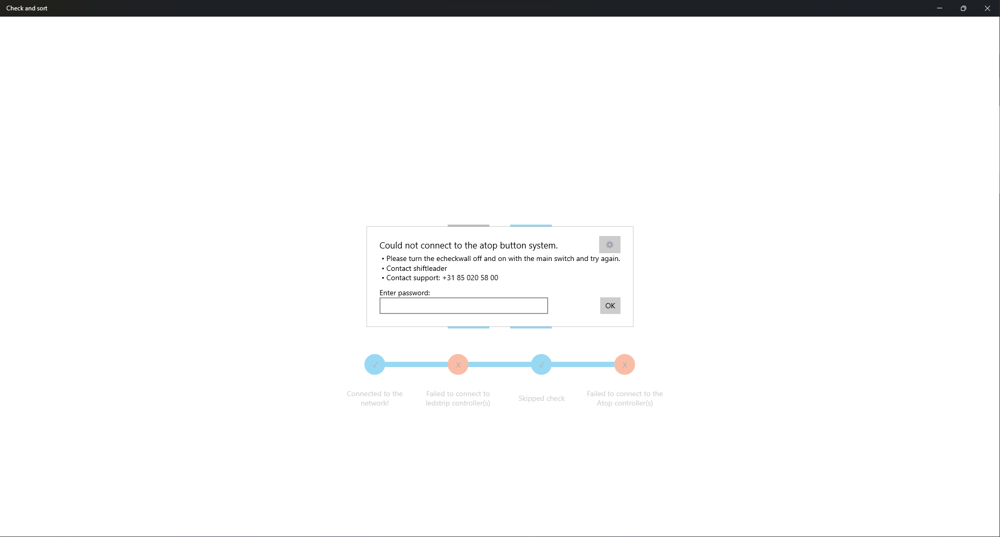

# Maintenance Mode

Om het opsporen van fouten in apparaten gemakkelijk te maken is er een Maintenance Mode gemaakt. Het doel van deze pagina is om op een eenvoudige manier de hardware aan te kunnen sturen. Ook is er te zien wat alle ip adressen van de verschillende controllers zijn.

Als een opstart check gefaald is komt er een popup tevoorschijn, rechts bovenin staat een knop voor de maintenance mode. Deze is beveilig met een wachtwoord. Het wachtwoord is **K0ffieTijd**

Een 2e manier om de Maintenance Mode pagina te bereiken is om bij het scan bulk krat scherm op de knop naast de log uit knop te drukken. (Deze knop is alleen voor IT personen te zien)

1. Hieronder is te zien wat hoe het scherm eruit ziet. Alle led-secties kunnen 1 voor 1 aangelicht worden om te checken of dat deze nog individueel bereikbaar zijn.
2. Hetzelfde kan gedaan worden met de atop lampen. Deze zullen ook het busadres laten zien op het schermpje
3. Om te zien of alle vakken goed zijn ingesteld en aangestuurd kunnen worden kan deze optie gebruikt worden. Hierbij worden alle led-secties van dat vak en de atop knop 1 voor 1 aangezet.
4. Om heel snel alles aan te zetten kan deze knop gebruikt worden. Dit zet alle ledstrips en alle atop knoppen aan.

