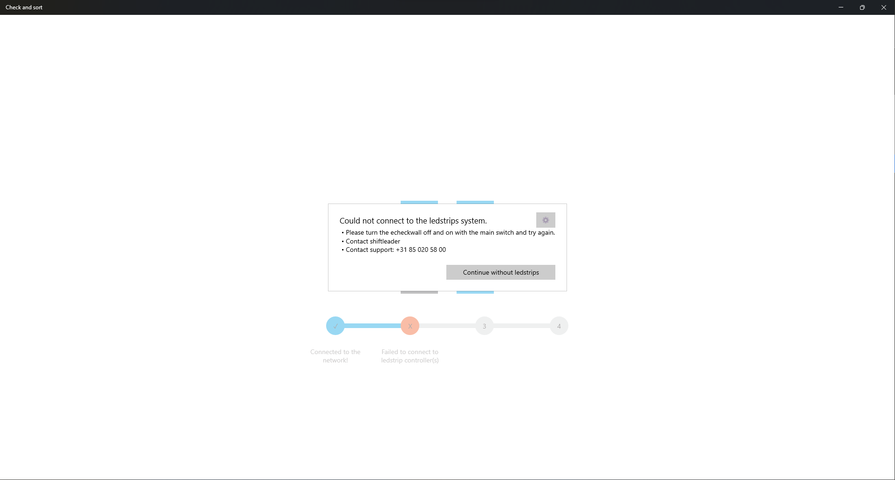

# Startup cyclus

Tijdens het opstarten van de EcheckWall worden er verschillende hardwarechecks uitgevoerd om ervoor te zorgen dat alle essentiële componenten correct functioneren. Het is een ingebouwd proces dat automatisch wordt uitgevoerd zodra het systeem wordt ingeschakeld. Hier volgt een overzicht van de hardwarechecks die tijdens het opstartproces worden uitgevoerd:

**- Netwerk**

Bij deze check wordt er gekeken of de pc is verbonden met het netwerk en of deze de monta systemen kan bereiken. Deze check wordt ook al eerder uitgevoerd. Zie kopje [OpstartProblemen](https://vragen.monta.nl/Docs/Troubleshooting/EcheckWall/#opstart-problemen)

**- Ledstrips**

Om te checken of de ledcontroller bereikbaar is worden deze gepingd, als de controller reageert gaat het systeem door naar de volgende check. Wanneer de ledcontroller niet bereikbaar is komt er een popup met onderstaande:

Omdat bij veel Echeckwalls de opstelling van het ledstrip systeem verschillent is ervoor gekozen om toch door te kunnen gaan met opstarten, maar dan zonder het de ledstrip systeem. Deze popup verdwijnt ook automatisch na 15 seconden.

**- Ledstrips (pickpoorts)**

Als er pickpoort met daarin ledstrips aanwezig zijn, (Molenaarsgraaf) worden deze op dezelfde manier gepingd als de andere ledstrips. Ook hier is er weer de keuze om door te gaan zonder de ledstrips. Als de pickpoorts niet aanwezig zijn dan wordt deze check in zijn geheel overgeslagen.

**- Atop knoppen**

Als laatste check wordt er gekeken of de Atop knoppen aangestuurd kunnen worden. Deze lichten op en het adres van de knop wordt op het schermpje afgebeeld. Omdat de atop knoppen essentieel zijn voor de werking van de Echeckwall kan deze check niet overgeslagen geworden.

