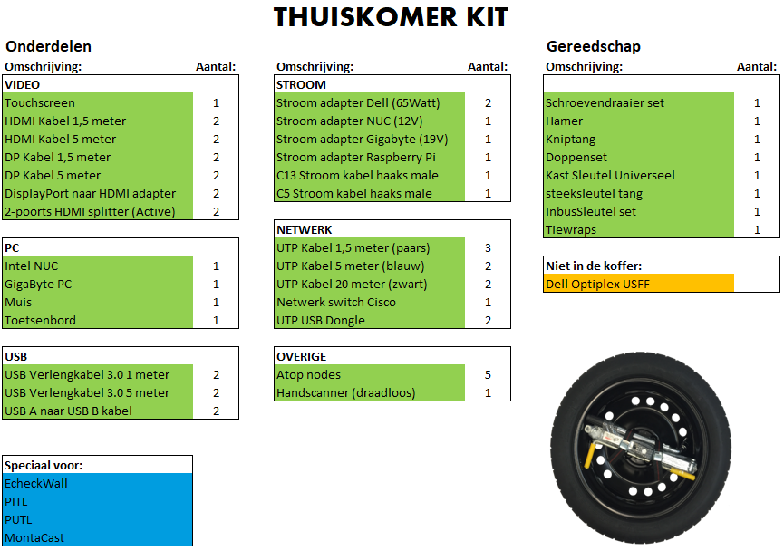
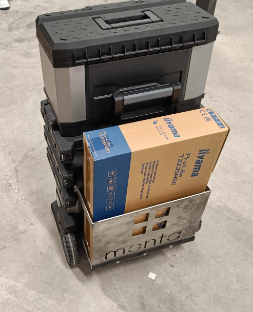
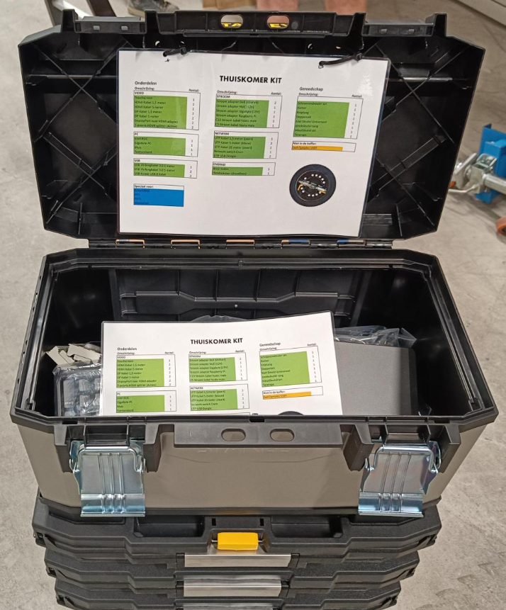
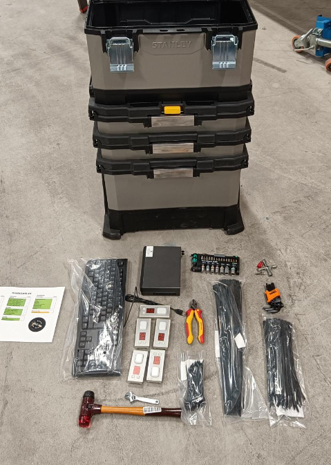
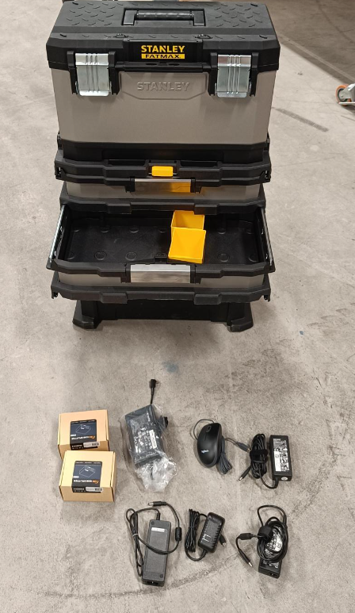
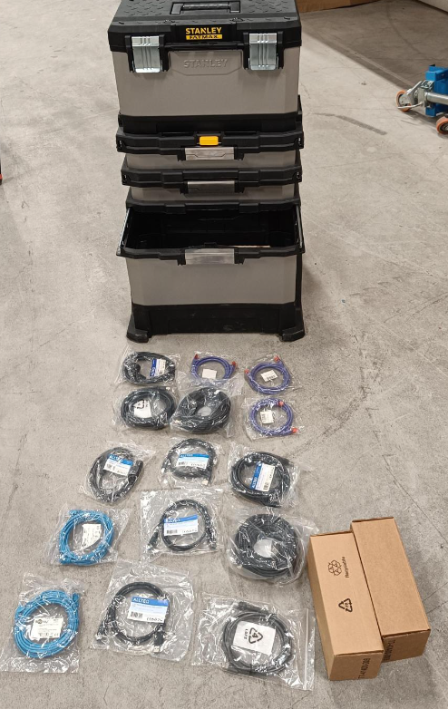
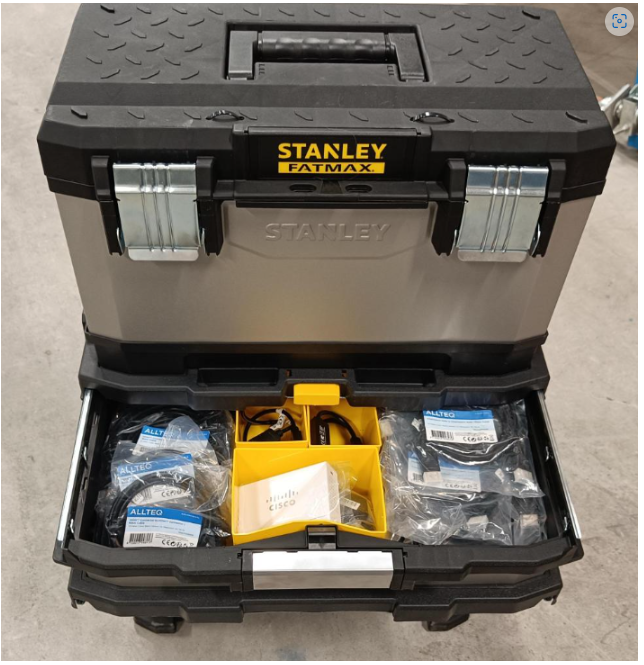

# Thuiskomer

## Thuiskomer

Thuiskomer is de naam van een trolley met spare parts en eenvoudige gereedschappen. Deze zijn in principe voldoende om kleine storingen op te lossen. Mochten materialen uit deze trolley gebruikt worden, is het een good practice om de materialen zo snel mogelijk weer aan te vullen, zodat de trolley compleet blijft.

## Stuklijst thuiskomer

## Handleidingen thuiskomer
dit wordt nog aangevuld

## Fotos thuiskomer

