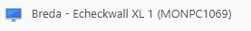
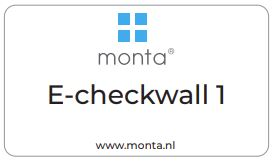
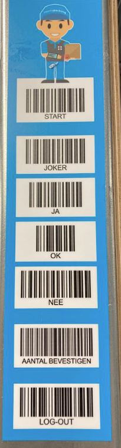
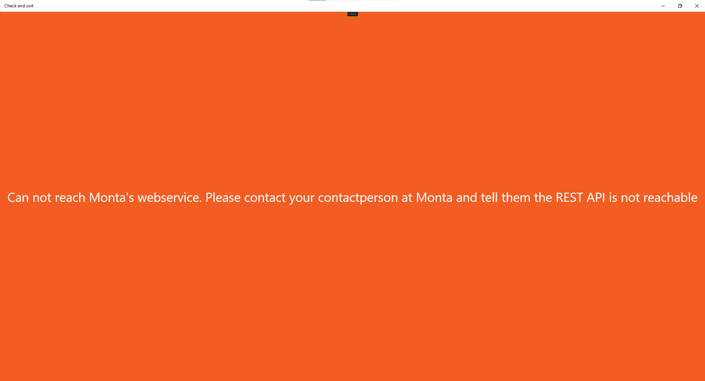

# EcheckWall

## Troubleshooting Echeckwalls

Alle Echeckwall stations hebben in teamviewer een naam waarin echeckwall voorkomt.
De naamgeving is over het algemeen {Vestiging} - Echeckwall- {Nummer} - {(MontPC nummer)}
voorbeeld:

Lijst met alle Echeckwalls

-3c3067e7-31e6-4c31-bd77-1382898d9d28.png)

Elke Put-To-Light heeft een nummer dat er ook als typeplaatje opgeplakt is.
Ongeveer zoals onderstaand voorbeeld:

## Melding over "ugly" krat

Er zitten producten in die te groot zijn. Wat moet er dan eigenlijk gebeuren?

[[Doelgroep IT: controleer of de EcheckWall service op de mp-proc02 wel draait.

## De echeck wall doet het helemaal niet meer

Is de service op de mp-proc02 wel gestart?

## Barcode scanner batterijn leeg
Een heel enkele keer komt het voor dat de draadloze barcode scanner van de echeckwall vergeten wordt in de oplader te hangen. Voor die gevallen is er bij de meeste echeckwalls een vaste bolscanner.
Maar daarmee zijn niet de barcodes te scannen die op de echeckwall vast zitten, zie onderstaand plaatje.

Wat er dan gedaan kan worden is met het toetsenbord de barcode intikken. Daarbij zijn de teksten soms net iets anders als dat op de sticker staat. (dit omdat dat beter aansluit bij barcodes die elders gebruikt worden)

START --> START

JOKER --> JOKER

JA --> JAJA

OK --> OK

NEE --> NEENEE

AANTAL BEVESTIGEN --> #_BEVESTIGEN

LOG-OUT --> LOGOUT

## Opstart problemen
Bij het opstarten kan er een melding voorkomen **"kan geen verbinding maken met Monta's webservice. Neem contact op met jouw contactpersoon bij Monta en geef door dat de REST API niet beschikbaar is"** of **"Geen internet connectie. Controleer of de WIFI of internetkabel verbonden is."**

-ac65bdd5-ea94-4229-9c8a-5aae8b6467ae.png)

## Thuiskomer
Er is een trolley beschikbaar met spare parts, deze noemen we thuiskomer. Meer info is te vinden op deze [pagina](../../Troubleshooting/EcheckWall/Thuiskomer).
