# Montabots

## Keuzeboom troubleshooting Montabots

Gebruik de keuzeboom om de correcte oplsossing te vinden voor het probleem

graph TD;
subgraph Keuzeboom troubleshooting Montabots
product_info[Er is iets mis] --ja-->open_orders[Staan er nog orders open?] --ja-->staat_planner_rood[Staat de planner op rood of is hij uitgevallen?] --ja-->instellingen[staan alle instellingen goed?] --ja-->planner_uitgevallen[is de planner uitgevallen?] --nee-->order_block[Is er een order die het proces blocked?] --ja-->L_order[L order controleren]
end
subgraph Oplossingen
open_orders_oplossing[Er is geen werk beschikbaar,   ga naar Monta Bot Cockpit extra informatie]---staat_planner_rood_oplossing[Planner opnieuw opstarten,   ga naar het uitvallen van de  Montabotplanner of Montabotheffer service]---
instellingen_oplossing[Zet de instellingen terug naar standaard,   ga naar oplossing 2 verkeerde instellingen in Monta Bot Cockpit]---
planner_uitgevallen_oplossing[Opnieuw opstarten,   ga naar oplossing 1 services]---
order_block_oplossing[Controleer supervisor op binnenkomende opdrachten,   ga naar het uitvallen van de Montabotplanner of Montabotheffer service]
end
open_orders-->open_orders_oplossing
staat_planner_rood-->staat_planner_rood_oplossing
instellingen-->instellingen_oplossing
order_block-->order_block_oplossing

De Montabots zijn Autonome Mobiele Robots (AMR's) van het merk [Lowpad](https://lowpad.com/). De Montabots worden gebruikt voor het transporteren van opslagrekken. Een Montabot is in staat een rek op te tillen, ergens heen te rijden en weer neer te zetten. De Montabots hebben sensoren waardoor ze afremmen voor obstakels. Hierdoor is het mogelijk voor Monta medewerkers om in dezelfde ruimte te werken als de Montabots. Wel is het goed de veiligheid flyer te bekijken voordat je in het Montabot gebied gaat werken.  [Deze flyer is hier te vinden](https://vragen.montapacking.nl/Docs/Algemene-informatie/Apparaten/Montabots/Veiligheid-Montabots/)  en hangt op bij de ingangen van de Montabot gebieden.

Naast deze pagina met algemene informatie is er ook een [handleiding](https://vragen.monta.nl/Docs/Handleidingen/Montabots/) en een pagina met [algemene informatie](https://vragen.monta.nl/Docs/Algemene-informatie/Apparaten/Montabots/)

## Trouble shooting videos
Onderstaand een aantal filmpjes over issues die soms optreden en hoe je die kunt oplossen

### Montabot aan en uitzetten
::: video

<iframe src="https://www.loom.com/embed/0125de9593b74843a59a085c606bdf72" frameborder="0" webkitallowfullscreen mozallowfullscreen allowfullscreen style="position: absolute; top: 0; left: 0; width: 100%; height: 100%;"></iframe>

:::

### Montabot is lokalisatie kwijt
::: video

<iframe src="https://www.loom.com/embed/637c4593bd3545b89327f617668ceee4" frameborder="0" webkitallowfullscreen mozallowfullscreen allowfullscreen style="position: absolute; top: 0; left: 0; width: 100%; height: 100%;"></iframe>

:::

### Montabot knippert blauw
::: video

<iframe src="https://www.loom.com/embed/16dc95f024874f64a8ed689fb9456965" frameborder="0" webkitallowfullscreen mozallowfullscreen allowfullscreen style="position: absolute; top: 0; left: 0; width: 100%; height: 100%;"></iframe>

:::

### Montabot knippert rood
::: video

<iframe src="https://www.loom.com/embed/2155a4a9146a4f6f95dc4d38ed199a39" frameborder="0" webkitallowfullscreen mozallowfullscreen allowfullscreen style="position: absolute; top: 0; left: 0; width: 100%; height: 100%;"></iframe>

:::

Bij een rood knipperende montabot is er sinds half 2022 ook de mogelijkheid een reset knop te gebruiken die op de montabot zit. Deze knop kan gebruikt worden als het obstakel inmiddels weg is en de montabot weer zou kunnen gaan rijden.
::: video

<iframe src="https://www.loom.com/embed/8200d2602eec41fb89fd52228330b886" frameborder="0" webkitallowfullscreen mozallowfullscreen allowfullscreen style="position: absolute; top: 0; left: 0; width: 100%; height: 100%;"></iframe>

:::

### Montabot is offline
::: video

<iframe src="https://www.loom.com/embed/d07661378e4f4754bd25796f0078eaa0" frameborder="0" webkitallowfullscreen mozallowfullscreen allowfullscreen style="position: absolute; top: 0; left: 0; width: 100%; height: 100%;"></iframe>

:::

## Stappenplan troubleshooting Lowpads

Als er geen meldingen worden gemaakt in [Elastic](#Elastic) of de [logfile](#Logfile). Dan kan er iets mis zijn met een van de Montabot instellingen of services.

### Het uitvallen van de **"MontabotPlanner"** of **"MontabotHeffer"**  service

Dit kan voorkomen bij het verwerken van een order met een hoge aantal aan artikelen (een **"L"** order). De redenen hiervoor is omdat het systeem de berekening van de hoeveelheid artikelen niet rond kan krijgen met de beschikbare capaciteit. Dit is te controleren via een stappenplan.

#### 1. Controleren van **"L"** orders

In het [outbound dashboard van GoMonta](https://gomonta.montapacking.nl/WMS/Outbound) kun je **"Picking Info"** sorteren. Kijk op de 2de en 3de verdieping  voor LXL orders. Selecteer een order ID in de lijst en controleer of het bestaat uit een groot aantal artikelen. Wanneer dit het geval is moet aan de shiftleader doorgegeven worden welke order het is, vervolgens moet deze uitgeprint worden en handmatig gepickt worden.

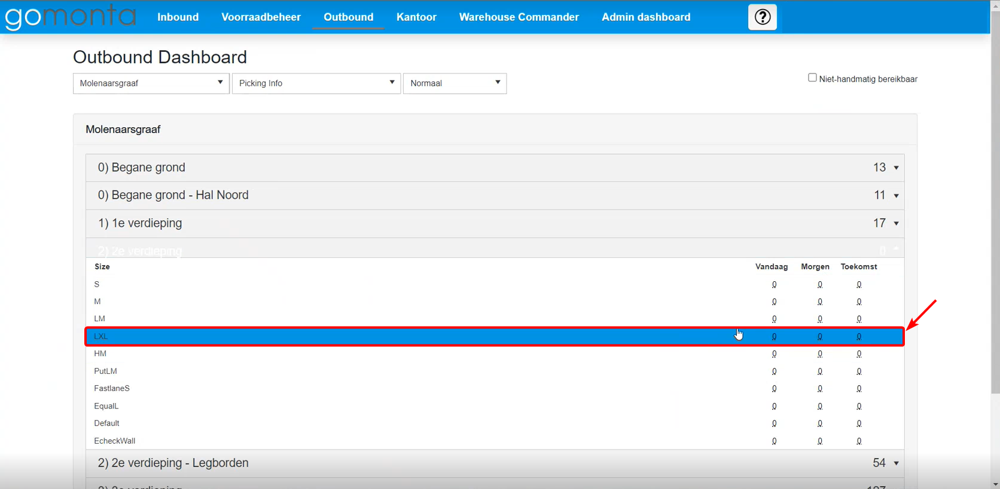
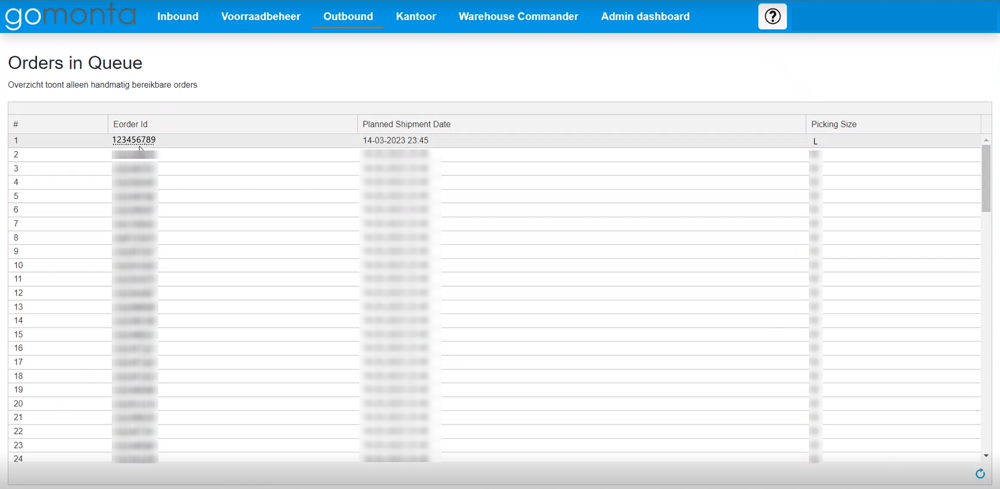
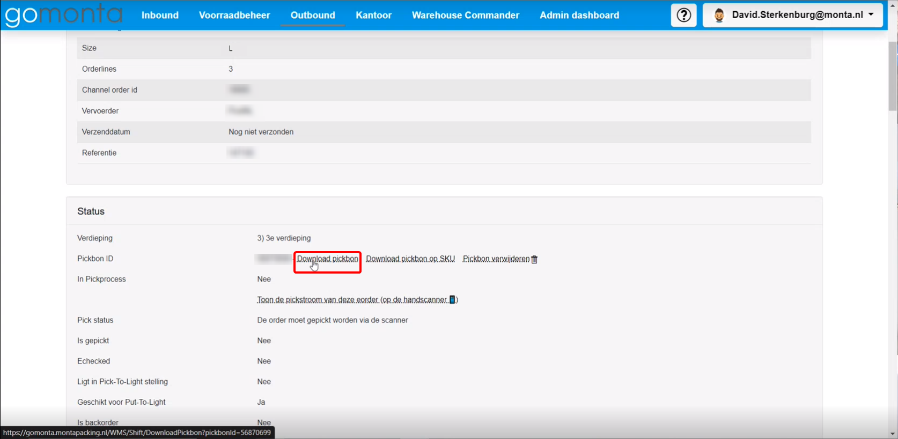

#### 1.1 Oplossing 1 "Services":

##### Stap 1 verbinden met "mp-proc03.monatpacking.nl"

Als er geen meldingen meer binnenkomen in [Elastic](#Elastic) is het altijd verstandig om  met **"mp-proc03.montapacking.nl"** te verbinden.

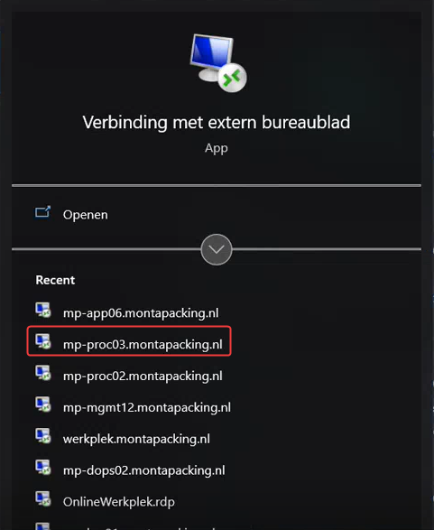

##### Stap 2 openen van services

Wanneer je ingelogd bent op **"mp-proc03.monatpacking.nl"** wil je de Windows-toets indrukken.

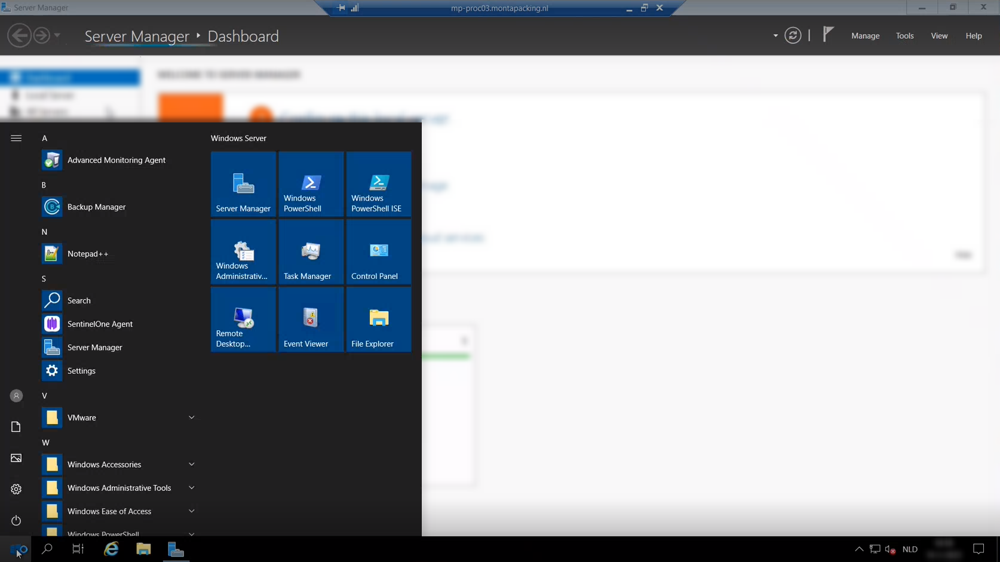

Vervolgens wil je zoeken naar **"Services"**

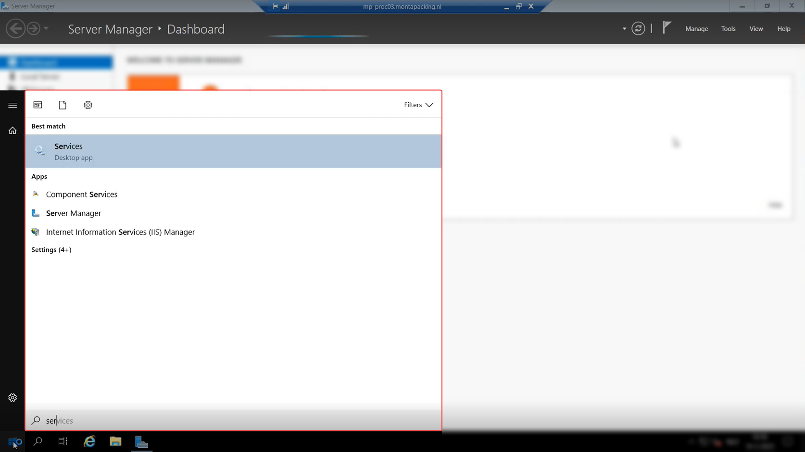

**"Services"** openen door dubbelklikken of entertoets te drukken.

##### Stap 3 starten van **_"MontabotPlanner"_** & _**"MontabotHeffer"**_

Controleer of de **_"MontabotPlanner"_** & _**"MontabotHeffer"**_ services _**running**_ zijn.
Dat kun je doen door te zoeken naar de zoekterm **_Montabot_** binnen **services**. Wanneer de **_"MontabotPlanner"_** of _**"MontabotHeffer"**_ weergegeven zijn controleer je de status. Als er bij de status geen _**running**_ wil je het proces opnieuw starten. Dit doe je door het selecteren van de services en dan rechter muisknop te klikken. Vervolgens wil je op de optie **"Start"** klikken. Hiermee start je de services opnieuw op.

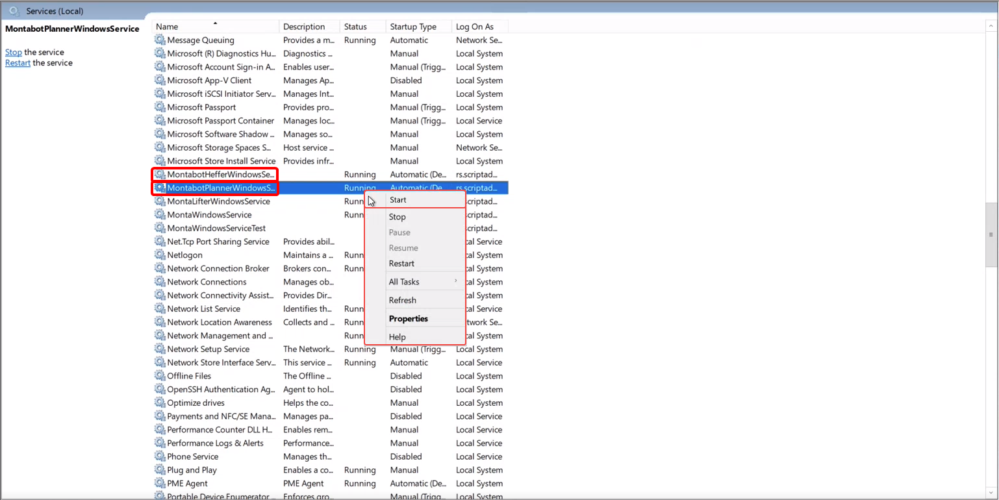

#### 1.2 Oplossing 2 Verkeerde instellingen in "Monta Bot Cockpit"

Er kunnen verkeerde instellingen in [Monta Bot Cockpit](#Monta-Bot-Cockpit) ingesteld zijn. Om deze app te open kun je applicatie [downloaden](#Monta-Bot-Cockpit) of via teamviewer connectie maken met de Lowpad outbound PC (MONPC 1197).
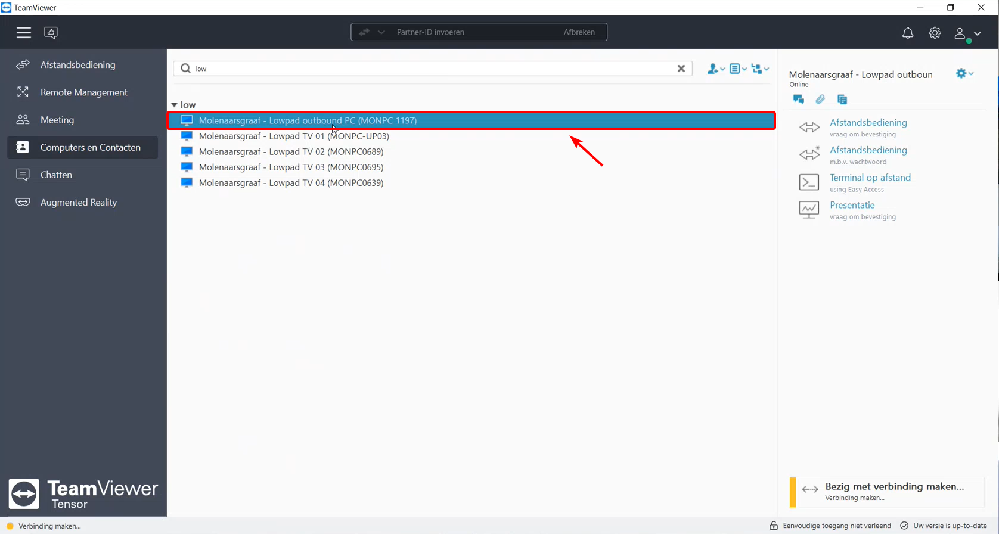

##### Stap 1 openen van de instellingen

Om dit te controleren moet in het startscherm de **tandwieloptie** gekozen worden.

##### Stap 2 Controleren van de instellingen

Nadat je op het **tandwiel** geklikt hebt worden de instellingen weergegeven.
Controleer of de volgende instellingen kloppen:

Echeckwalls:
- **Montabot Blauw** staat **aan**
- **Montabot Geel** staat **aan**

**Let op!**

**De knoppen van Algemeen, inbound, outbound, pickeiland en replenish**

**Geven de status aan waar ze naartoe veranderen als je erop klikt**

**Dus als er staat uitschakelen betekent dat het ingeschakeld is**

Algemeen: **ingeschakeld**

Inbound:    **ingeschakeld**

Outbound:   **ingeschakeld**

Pickeiland: **ingeschakeld**

Replenish:   **Uitgeschakeld**

**Hieronder een afbeelding van de correcte instellingen**

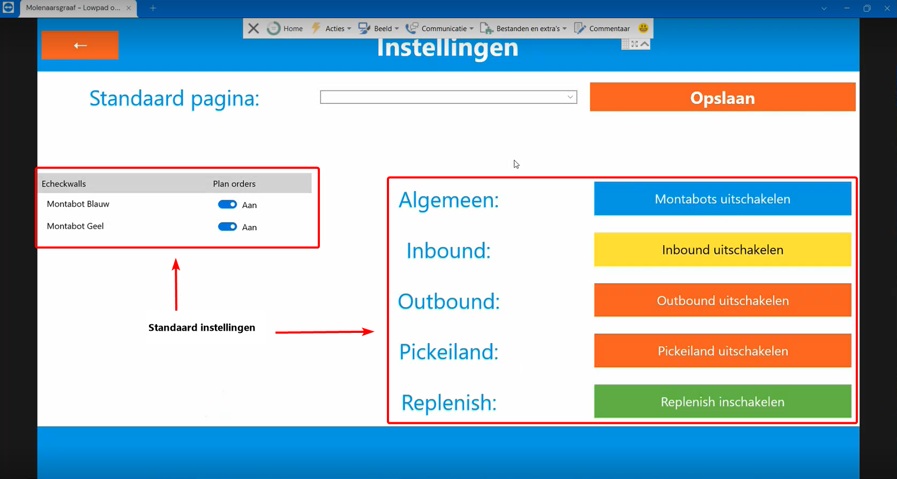

Controleer of de instellingen kloppen met de afbeelding .

#### 1.3 geen vrije posities beschikbaar

Het kan voorkomen dat de Montabots geen vrije posities beschikbaar heeft op een verdieping. Om dit te controleren moet er gekeken worden in de [**"Monta Bot Cockpit"**](#Monta-Bot-Cockpit). Om deze app te open kun je applicatie [downloaden](#Monta-Bot-Cockpit) of via teamviewer connectie maken met de Lowpad outbound PC (MONPC 1197).

##### stap 1 open "Monta Bot Cockpit"

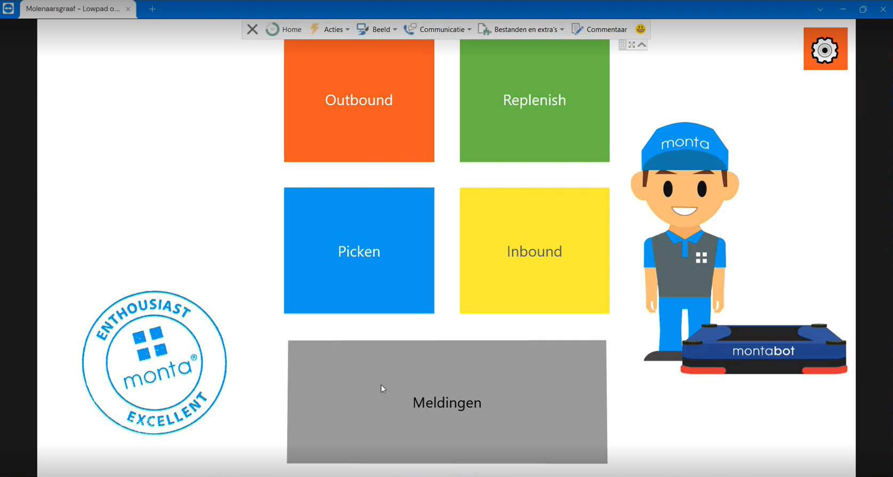

##### stap 2 Klik op "Dashboard"

##### stap 3 Bekijk vrije posities per verdieping

Kijk per verdieping of er nog vrije posities zijn, zo niet meldt dit bij de shiftleader.

##pickeiland

## Extra informatie

### Elastic

Elastic werkt als een meldingscentrum  voor de Lowpads. Wanneer er geen meldingen binnenkomen is er iets mis met de de Montabots.

### Monta Bot Cockpit

Monta Bot Cockpit is een applicatie van Monta waarmee je informatie en instellingen kan zien van de Montabots. De applicatie kan je downloaden via het bedrijfsportaal.

### Monta Bot Cockpit

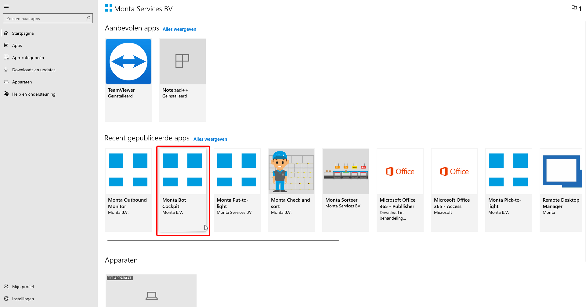

### Monta Bot Cockpit extra informatie

In "Monta Bot Cokpit" kun je meer informatie krijgen over het aantal rekken dat gehaald kan worden. Soms komt het voor dat deze op 0 staat. Dit kan betekenen dat er op het moment geen orders zijn. Wanneer er wel orders zijn en het getal is 0 kan het betekenen dat er iets mis met de Montabots in dat geval is het aangeraden om te kijken of een [service](#het-uitvallen-van-de-**"montabotplanner"**-of-**"montabotheffer"**--service) is uitgevallen.

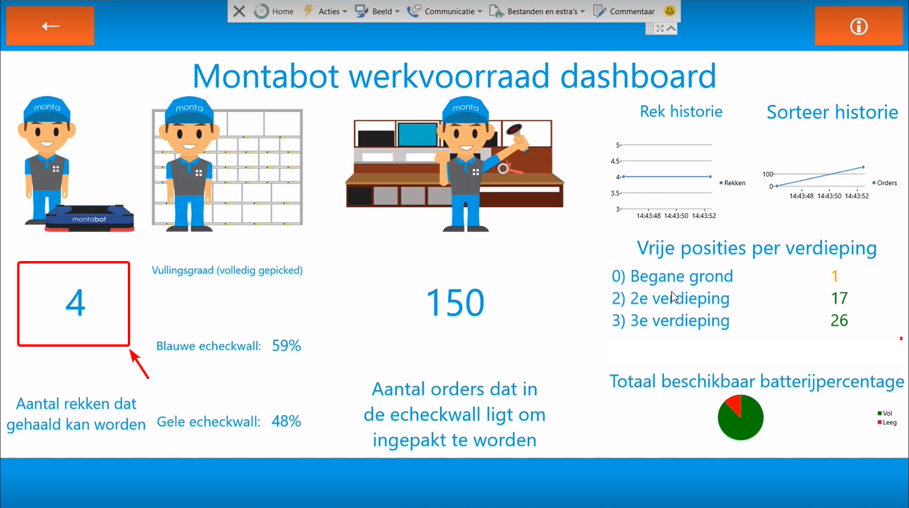

### Inloggen Lowpad supervisor via "mp-proc02.montapacking.nl"

Met Lowpad supervisor krijg je meer informatie te zien over de huidige positie van de Montabots.

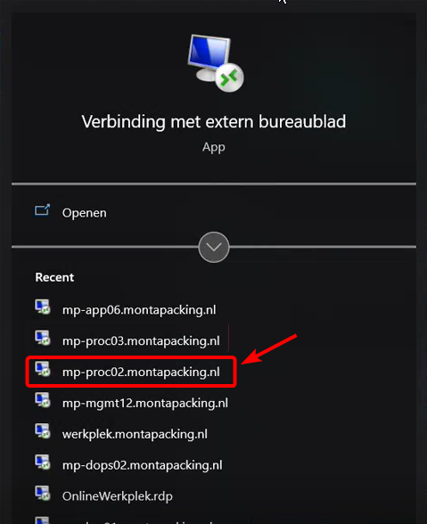

Wanneer je ingelogd bent op "mp-proc02.montapacking.nl" kun je per verdieping inloggen met de volgende links:

verdieping 1

https://lowpad01.monta.nl/account/login

verdieping 2

https://lowpad02.monta.nl/account/login

verdieping 3

https://lowpad03.monta.nl/account/login

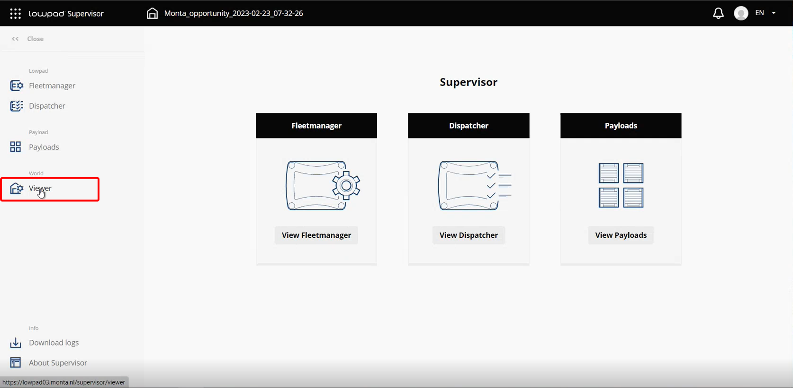

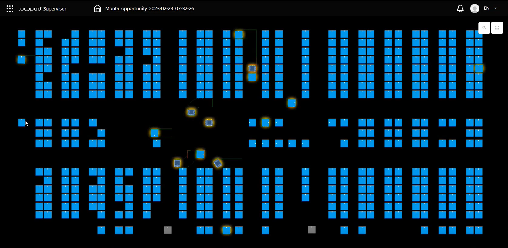

### Transportrek op de 2e verdieping met niet gepickte orders

Het kan voorkomen dat een transportrek op de 2e verdieping is geplaatst, met orders die niet gepickt zijn. Om dit op te lossen moet dit rek weer terug naar de 3e verdieping. Dan zal het tranportrek bij het pickeiland worden geplaatst om de orders te picken.

Hiervoor moet handmatig een lift opdracht worden ingeschoten. Momenteel kan dit alleen in de database worden gedaan.

Dit moet worden gedaan in tblLiftJobGroups.

