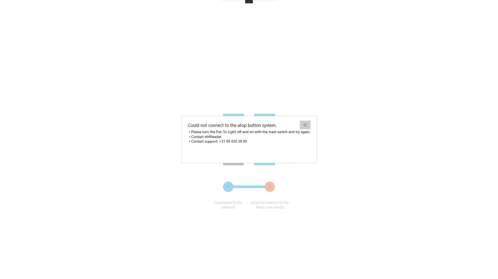

# Startup cyclus

Tijdens het opstarten van de EcheckWall worden er verschillende hardwarechecks uitgevoerd om ervoor te zorgen dat alle essentiële componenten correct functioneren. Het is een ingebouwd proces dat automatisch wordt uitgevoerd zodra het systeem wordt ingeschakeld. Hier volgt een overzicht van de hardwarechecks die tijdens het opstartproces worden uitgevoerd:

- Netwerk

Bij deze check wordt er gekeken of de pc is verbonden met het netwerk en of deze de monta systemen kan bereiken. Deze check wordt ook al eerder uitgevoerd. Zie kopje [OpstartProblemen](https://vragen.monta.nl/Docs/Troubleshooting/EcheckWall/#opstart-problemen)

- Atop knoppen

Als laatste check wordt er gekeken of de Atop knoppen aangestuurd kunnen worden. Deze lichten op en het adres van de knop wordt op het schermpje afgebeeld. Omdat de atop knoppen essentieel zijn voor de werking van de Echeckwall kan deze check niet overgeslagen geworden.

