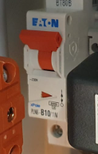
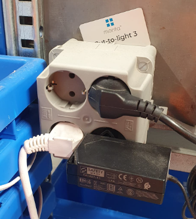
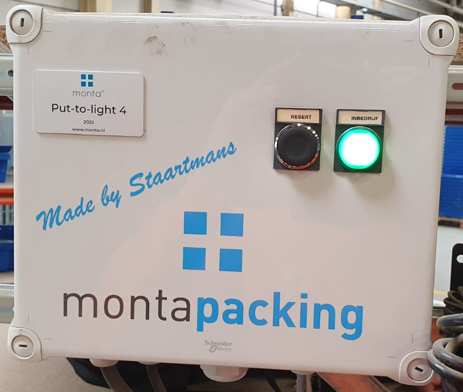
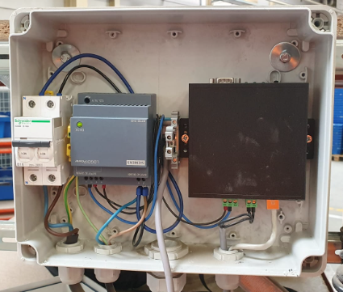
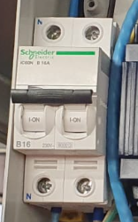
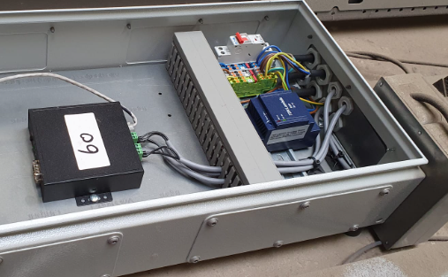
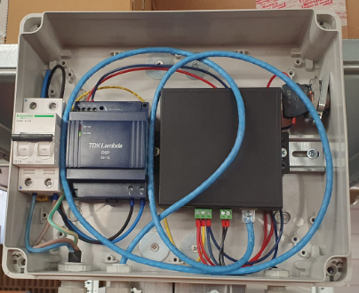
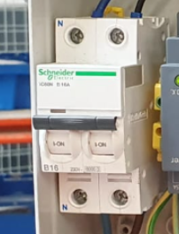
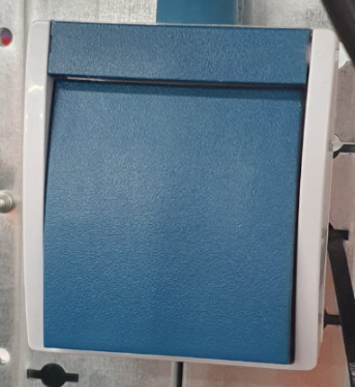

# PUTL

## Troubleshooting Put-To-Lights

Alle Put-To-Light stations hebben in teamviewer een naam waarin puttolight voorkomt.
De naamgeving is over het algemeen {Vestiging} - Puttolight - {Nummer} - {(MontPC nummer)}
voorbeeld:

Lijst met alle PUTL's:

-bc863b0e-e458-4b58-be87-7274644f8bb5.png)

Elke Put-To-Light heeft een nummer dat er ook als typeplaatje opgeplakt is.
Ongeveer zoals onderstaand voorbeeld:

### Monta Gorinchem - Weide 30

 21-Put-To-Light Weide 2
 De bovenste stekker gaat naar het beeldscherm. De onderste gaat naar de computer. Zorg ervoor dat beide kabels goed aangesloten zijn in het stekkerblok en in de bijbehorende adapter.
 

 22-Put-To-Light Weide 2
 De bovenste stekker gaat naar de computer. De onderste gaat naar het beeldscherm. Zorg ervoor dat beide kabels goed aangesloten zijn in het stekkerblok en in de bijbehorende adapter.
 

 Let erop dat de computer aanstaat.
 

 De lamp moet groen verlicht zijn, anders moet deze ingedrukt worden. De schakelaar moet op de 'ON'-positie staan.
 

### Monta Gorinchem - Papland

 Put-To-Light Papland 1 en 2 (links en rechts)
 

 Let erop dat de zekering linksboven de kast goed is ingeschakeld (zoals op deze afbeelding) en dat alle kabels juist aangesloten zijn.
 

 De stroomkabel rechtsboven gaat naar het beeldscherm. Rechtsonder gaat naar de computer (MONPC0588). Zorg dat deze kabels goed zijn aangesloten aan beide kanten, en dat de apparaten aanstaan.
 

 De stroomkabel linksboven gaat naar het beeldscherm. Linksonder gaat naar de computer (MONPC0587). Zorg dat deze kabels goed zijn aangesloten aan beide kanten, en dat de apparaten aanstaan.
 

### Monta Breda

 
 04, 05, 10, 11, 12-Put-To-Light. Let erop dat de groene lamp aanstaat.
 

 Let erop dat de zekering goed is ingeschakeld zoals op deze afbeelding.
 

 15, 16, 17-Put-To-Light 3 t/m 5 Breda Outbound Expeditie
 

 Let erop dat de zekering goed is ingeschakeld zoals op deze afbeelding.
 

### Monta Oud Gastel

 08-Put-To-Light Watermolen 3 Links
 

 09-Put-To-Light Watermolen 3 Rechts
 

 Let erop dat de zekering goed is ingeschakeld zoals op deze afbeelding.
 

 Linksonder gaat naar de computer (MONPC0749), rechtsonder gaat naar het beeldscherm.
 

 Let erop dat de blauwe knop is ingedrukt zoals op deze afbeelding.
 

## Problemen met het scannen van de barcodes

Het kan voorkomen dat de scanners op een PUTL niet alle barcodes begrijpen. Waarschijnlijk is de scanner dan nog niet volledig geconfigureerd en moeten er nog specifieke typen barcodes worden toegevoegd. Dit kan gedaan worden door de onderstaande handleidingen te volgen:

 

## Thuiskomer
## Thuiskomer
Er is een trolley beschikbaar met spare parts, deze noemen we thuiskomer. Meer info is te vinden op deze [pagina](../../Troubleshooting/EcheckWall/Thuiskomer).
