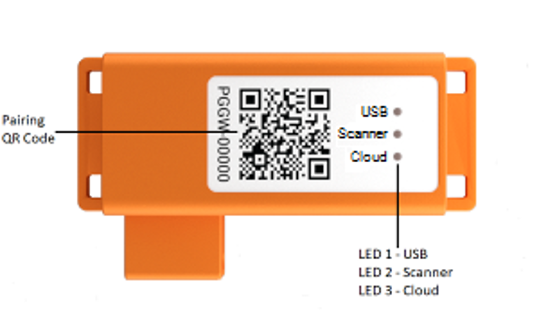
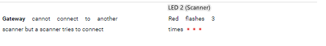
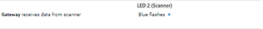
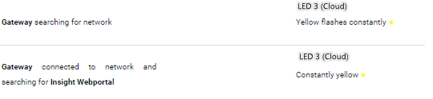

# ProGlove

## ProGlove componenten

## Indicatie lampen op de ProGlove gateway

### LED 1 USB

Controleer of deze led indicator ***groen*** brandt. Als dit niet het geval is plug de USB eruit en daarna opnieuw in.

### LED 2 Scanner

#### Constant rood

Als deze indicator brandt dan mogen er geen extra scanners verbonden worden. Zet alle gebruikte scanners in de oplader en verbind dan opnieuw.

#### Flikkert rood 3 keer

Houdt de knop van de scanner **15 seconden** lang **ingedrukt**, vervolgens loslaten en daarna weer **2 seconden ingedrukt** houden. Nu start reboot proces. De lampen op scanner gaan aan. Kijk of de scanner nu wel verbind, zo niet start de **gateway** opnieuw op.

_Als dit niet werkt neem dan contact op met de R&D afdeling_

#### Flikkert blauw

Scan een barcode met de scanner, kijk of LED 2 (scanner) blauw wordt. Hierna moet de LED 1 (USB) blauw worden.

_Wanneer dit niet het geval is neem contact op met de R&D afdeling_

### LED 3 Cloud

#### Geel

Als LED 3 (Cloud) geel brandt geeft dit aan dat het mogelijk is om de gateway op afstand te beheren.

