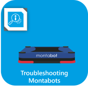

# Troubleshooting

|<center>|
|-|

Deze pagina beschrijft problemen die je kan tegenkomen.

[](../Troubleshooting/EcheckWall) [](../Troubleshooting/PUTL) [](../Troubleshooting/Montabots) [-c03bb6e9-7450-447a-8270-b48086be8e74.png)](../Troubleshooting/ProGlove)


## Koppelingen

### Er staan orders in backorder terwijl ik een voorraadkoppeling heb

Dit kan de volgorde oorzaken hebben:
1. Er zijn meerdere webshops met een voorraadkoppeling en het laatste item is ongeveer tegelijkertijd in meerdere webshops verkocht. Als een product in één webshop verkocht is, duurt het namelijk ongeveer een kwartier voordat de voorraad in de andere webshops ook bijgewerkt is. Een oplossing kan zijn om de laatste stuks maar in één webshop aan te bieden. Dit kan door het maken van een stock allocatie. Zie [Algemene informatie - Outbound - Voorraad allocatie](../Algemene-informatie/Outbound#voorraadallocatie).

2. Er is voorraad opgeboekt in de webshop door een ander proces dan de voorraadkoppeling van Monta. Veelvoorkomend is dat als een order in het webshopsysteem geannuleeerd wordt, het webshopsysteem de voorraad van de order opboekt.

## Picken

### De juiste orders worden niet als eerste gepickt!

1. Het is belangrijk dat orderpickers de juiste verdieping en pickstroom kiezen.
2. Zorg ervoor dat de juiste pickstijl gekozen is in GoMonta
2. Bij bulkpicken worden orders van verschillende afhaaltijden toegewezen. Dit kan ervoor zorgen dat die ene order net voor de afhaaltijd in een pickronde met veel orders terechtkomt. Het picken van verschillende afhaaltijden bij bulkpicken is uit te schakelen in GoMonta, evt een x aantal minuten voor de afhaaltijd.

Voor meer info zie: [Algemene informatie - Outbound - Picken - volgorde van orders picken](../Algemene-informatie/Outbound#volgorde-van-orders-picken).

### Er staan geen orders op de scanner

Controleer of de instelling "alleen overdue picken" niet is ingeschakeld.

## Voorraad

### Er staan nog te koppelen TT01 labels die niet gekoppeld of verwijderd kunnen worden

Het kan soms gebeuren dat er meerdere koppellabels zijn van hetzelfde product, en één van de koppellabels dubbel gekoppeld wordt.

Het saldo op de TT01 locatie is dan lager geworden dan het aantal op openstaande TT01 labels, waardoor de laatste labels niet gekoppeld of verwijderd kunnen worden omdat er geen voorraad is.

Met de volgende query kan gevonden worden welke labels dubbel gekoppeld zijn:


```
select tblVoorraad.VoorraadID, tblVoorraad.Hoeveelheid, tblVoorraad.Aanmaakdatum, tblVoorraad.Inslag, tblVoorraad.Referentie, sum(tblvoorraadtransitokoppeloplocatie.aantal) as gekoppeld
from tblVoorraad
left join tblVoorraadTransitoKoppelOpLocatie on tblVoorraad.VoorraadID = tblVoorraadTransitoKoppelOpLocatie.InboundVoorraadID
where Materiaal = ?
and Locatie = ?
and TypeBoeking = 1
group by tblVoorraad.VoorraadID, tblVoorraad.Hoeveelheid, tblVoorraad.Aanmaakdatum, tblVoorraad.Inslag, tblVoorraad.Referentie
having sum(tblvoorraadtransitokoppeloplocatie.aantal) > tblVoorraad.Hoeveelheid
```

In tblVoorraadTransitoOpLocatie kan dan één van de records omgehangen worden naar het TT01 label wat niet gekoppeld en verwijderd kan worden. Door het InboundVoorraadID aan te passen.

## Echeck wall
Info over Echeckwall troubleshooting is [hier](../Troubleshooting/EcheckWall) te vinden

## Put-To-Light
Info over Put-To-Light troubleshooting is [hier](../Troubleshooting/PUTL) te vinden

[Montabots](../Troubleshooting/Montabots)

## Montabots
Verschillende issues die kunnen optreden zijn uitgewerkt qua oplossingen in filmpjes
### [Montabots aan en uitzetten](../Troubleshooting/Montabots#montabot-aan-en-uitzetten)
### [Montabot is lokalisatie kwijt](../Troubleshooting/Montabots#montabot-is-lokalisatie-kwijt)
### [Montabot knippert blauw](../Troubleshooting/Montabots#montabot-knippert-blauw)
### [Montabot knippert rood](../Troubleshooting/Montabots#montabot-knippert-rood)
### [Montabot is offline](../Troubleshooting/Montabots#montabot-is-offline)

## Internetverbindingen en wifi

Zie "Emergency Monta" document in Teams: Serviceteam - IT algemeen - Algemeen. Hierin staat informatie over de verbindingen en telefoonummers van (wifi)leveranciers.

